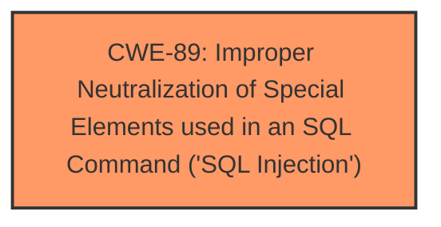

# Raw Analyzer Response for CVE-2024-10247

# Summary
| CWE ID | CWE Name | Confidence | CWE Abstraction Level | CWE Vulnerability Mapping Label | CWE-Vulnerability Mapping Notes |
|---|---|---|---|---|---|
| CWE-89 | Improper Neutralization of Special Elements used in an SQL Command ('SQL Injection') | 1.0 | Base | Allowed | Primary CWE |

## Evidence and Confidence

*   **Confidence Score:** 1.0
*   **Evidence Strength:** HIGH

## Relationship Analysis
The primary relationship is that CWE-89 [Improper Neutralization of Special Elements used in an SQL Command ('SQL Injection')] is the root cause. There are child CWEs of CWE-89 such as CWE-564 [SQL Injection: Oracle Specific], CWE-943 [ Improper Neutralization of Special Elements in a Data Query Logic] and CWE-74 [Improper Neutralization of Special Elements in Output Used by a Downstream Component ('Injection')] but none of these child CWEs describe the vulnerability any better than the parent CWE-89. There are no relevant chain relationships.

## Vulnerability Chain
The vulnerability chain starts with **insufficient escaping on the user supplied parameter and lack of sufficient preparation on the existing SQL query** (root cause), leading to **time-based SQL Injection**, which then allows attackers to extract sensitive information from the database (impact).

## Summary of Analysis
The vulnerability is a **time-based SQL Injection** due to **insufficient escaping on the user supplied parameter and lack of sufficient preparation on the existing SQL query**. This allows an attacker to extract sensitive information from the database.

The most appropriate CWE is CWE-89 [Improper Neutralization of Special Elements used in an SQL Command ('SQL Injection')], which is a Base level CWE.

The evidence supporting this decision is:

*   The vulnerability description explicitly states the presence of **SQL Injection** and describes the root cause as **insufficient escaping** and **lack of sufficient preparation** which directly aligns with CWE-89.
*   The CVE Reference Links Content Summary highlights the **SQL Injection** due to **insufficient escaping** of the `orderby` parameter.
*   The "Retriever Results" lists CWE-89 as the top match.

Other CWEs were considered but deemed less suitable:

*   CWE-116 [Improper Encoding or Escaping of Output]: While related to escaping, it is a more general class. The issue is specifically about SQL injection.
*   CWE-352 [Cross-Site Request Forgery (CSRF)]: This is not related to the vulnerability description.
*   CWE-434 [Unrestricted Upload of File with Dangerous Type]: This is not related to the vulnerability description.
*   CWE-425 [Direct Request ('Forced Browsing')]: This is not related to the vulnerability description.
*   CWE-90 [Improper Neutralization of Special Elements used in an LDAP Query ('LDAP Injection')]: This is for LDAP injection, not SQL injection.

The final decision is based on the direct evidence of SQL injection and the root cause of **insufficient escaping** in SQL queries, which aligns perfectly with CWE-89.