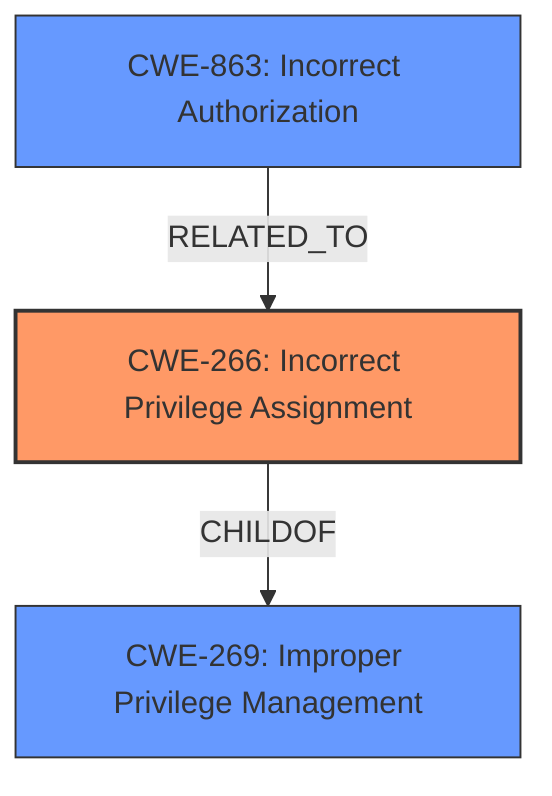

# Analysis for CVE-2024-10273

# Summary

| CWE ID  | CWE Name                                                                | Confidence | CWE Abstraction Level | CWE Vulnerability Mapping Label | CWE-Vulnerability Mapping Notes |
| :-------- | :---------------------------------------------------------------------- | :--------- | :-------------------- | :------------------------------ | :------------------------------ |
| CWE-266   | Incorrect Privilege Assignment                                          | 0.9        | Base                  | Primary                         | Allowed                         |
| CWE-863   | Incorrect Authorization                                                 | 0.7        | Class                 | Secondary                       | Allowed-with-Review             |

## Evidence and Confidence

*   **Confidence Score:** 0.8
*   **Evidence Strength:** HIGH

## Relationship Analysis

The primary CWE is CWE-266, which is a Base level CWE. CWE-266's parent is CWE-269 (Improper Privilege Management), but CWE-266 is more specific. CWE-863 is a Class-level CWE related to incorrect authorization, and while relevant, it's a more general case of the privilege assignment issue described. The relationships show that the authorization flow is flawed due to how privileges are assigned.

## Vulnerability Chain

The chain of weaknesses starts with **improper privilege management** leading to incorrect privilege assignment, then a bypass of authorization checks, and ultimately results in unauthorized modification of models.
  - **Root Cause:** CWE-266 Incorrect Privilege Assignment
  - **Weakness:** Authorization Bypass
  - **Impact:** Unauthorized Modification of Models

## Summary of Analysis

The initial analysis identified several potential CWEs, including CWE-285, CWE-863, and CWE-269. However, the key phrase "**improper privilege management**" and the fact that users with "viewer roles" can modify models owned by others suggests an **incorrect privilege assignment**, making CWE-266 the most appropriate primary CWE. The secondary CWE, CWE-863, highlights that the authorization check is present but flawed due to the incorrect privilege assignment. The evidence provided strongly supports the selection of CWE-266 as the primary cause. The relationship analysis confirms that CWE-266 is a more specific instance of the broader category of improper privilege management.

The vulnerability description states "In lunary-ai/lunary v1.5.0, **improper privilege management** in the models.ts file allows users with viewer roles to modify models owned by others. The PATCH endpoint for models does not have appropriate privilege checks, enabling low-privilege users to update models they should not have access to modify." This directly indicates a problem with how privileges are assigned to users, leading to the incorrect authorization.

CWE-269 (Improper Privilege Management) was considered but is too high-level. The vulnerability is more specifically about the assignment of privileges (CWE-266) rather than the general management of privileges. CWE-285 (Improper Authorization) was also considered but it suggests the authorization mechanism itself is flawed, whereas here the authorization fails because of the incorrect privilege assignment. CWE-862 (Missing Authorization) was not selected as the vulnerability description says that the PATCH endpoint "does not have appropriate privilege checks" meaning that authorization checks are present.

Relevant CWE Information:

# Enhanced Context (25 CWEs)
The following CWEs were identified as potentially relevant to this vulnerability:

## CWE-266: Incorrect Privilege Assignment
**Abstraction Level**: Base
**Similarity Score**: 0.77
**Source**: dense

**Description**:
A product incorrectly assigns a privilege to a particular actor, creating an unintended sphere of control for that actor.

**Mapping Guidance**:
- Usage: Allowed
- Rationale: This CWE entry is at the Base level of abstraction, which is a preferred level of abstraction for mapping to the root causes of vulnerabilities.

## CWE-863: Incorrect Authorization
**Abstraction Level**: Class
**Similarity Score**: 1378.27
**Source**: sparse

**Description**:
The product performs an authorization check when an actor attempts to access a resource or perform an action, but it does not correctly perform the check.

**Mapping Guidance**:
- Usage: Allowed-with-Review
- Rationale: This CWE entry is a Class and might have Base-level children that would be more appropriate

## CWE-269: Improper Privilege Management
**Abstraction Level**: Class
**Similarity Score**: 1336.33
**Source**: sparse

**Description**:
The product does not properly assign, modify, track, or check privileges for an actor, creating an unintended sphere of control for that actor.

**Mapping Guidance**:
- Usage: Discouraged
- Rationale: CWE-269 is commonly misused. It can be conflated with "privilege escalation," which is a technical impact that is listed in many low-information vulnerability reports [REF-1287]. It is not useful for trend analysis.