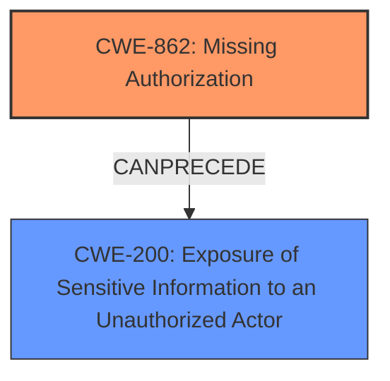

# Enhanced Analysis for CVE-2024-10357

# Summary
| CWE ID | CWE Name | Confidence | CWE Abstraction Level | CWE Vulnerability Mapping Label | CWE-Vulnerability Mapping Notes |
|---|---|---|---|---|---|
| CWE-862 | Missing Authorization | 0.9 | Class | Primary | Allowed-with-Review |
| CWE-200 | Exposure of Sensitive Information to an Unauthorized Actor | 0.8 | Class | Secondary | Discouraged |

## Evidence and Confidence

*   **Confidence Score:** 0.85
*   **Evidence Strength:** HIGH

## Relationship Analysis
The primary relationship influencing the decision is that CWE-862 (Missing Authorization) can lead to CWE-200 (Exposure of Sensitive Information to an Unauthorized Actor). CWE-862 is a Class-level CWE, and while more specific Base-level CWEs exist, the provided description strongly indicates a complete **lack of authorization** rather than an incorrect implementation. CWE-200 is a Class-level CWE, and is secondary because the root cause is the **missing authorization** check.



## Vulnerability Chain
The vulnerability chain starts with **Missing Authorization** (CWE-862) in the `getTemplateContent` function. This **missing authorization** allows authenticated attackers with Contributor-level access to bypass intended access restrictions. The consequence of this is **Sensitive Information Exposure** (CWE-200), enabling the extraction of private, pending, and draft template data.

## Summary of Analysis
The initial analysis focused on identifying the root cause of the vulnerability and the resulting impact. The evidence clearly indicates that the `getTemplateContent` function **lacks proper authorization checks**, leading to the exposure of sensitive template data.

The selection of CWE-862 as the primary CWE is based on the evidence from the vulnerability description and CVE reference, which emphasizes the **absence of authorization checks**. The **Vulnerability Description Key Phrases** section highlights **Sensitive Information Exposure**, but this is a consequence of the **missing authorization**, not the root cause itself.

CWE-200 is included as a secondary CWE to represent the impact of the vulnerability. While CWE-200 is discouraged when a more specific root cause can be identified, it is appropriate here to highlight the exposure of sensitive information resulting from the **missing authorization**.

The retriever results and relationship analysis further support the selection of CWE-862 and CWE-200. The top combined results include CWE-862 and CWE-200, indicating their relevance to the vulnerability. The relationship analysis shows that CWE-862 can precede CWE-200, reflecting the vulnerability chain.

Relevant CWE Information:

# Enhanced Context (25 CWEs)
The following CWEs were identified as potentially relevant to this vulnerability:

## CWE-425: Direct Request ('Forced Browsing')
**Abstraction Level**: Base
**Similarity Score**: 0.71
**Source**: dense

**Description**:
The web application does not adequately enforce appropriate authorization on all restricted URLs, scripts, or files.

**Mapping Guidance**:
- Usage: Allowed
- Rationale: This CWE entry is at the Base level of abstraction, which is a preferred level of abstraction for mapping to the root causes of vulnerabilities.

CWE-425 was considered but not chosen because while it involves inadequate authorization, it specifically relates to directly accessing restricted URLs, whereas this vulnerability involves a function that **lacks authorization checks** for retrieving template content.

## CWE-352: Cross-Site Request Forgery (CSRF)
**Abstraction Level**: Compound
**Similarity Score**: 0.70
**Source**: dense

**Description**:
The web application does not, or can not, sufficiently verify whether a well-formed, valid, consistent request was intentionally provided by the user who submitted the request.

**Mapping Guidance**:
- Usage: Allowed
- Rationale: This is a well-known Composite of multiple weaknesses that must all occur simultaneously, although it is attack-oriented in nature.

CWE-352 was considered but not chosen because the vulnerability is not related to CSRF. The issue is about **missing authorization**, not about verifying the origin of the request.

## CWE-538: Insertion of Sensitive Information into Externally-Accessible File or Directory
**Abstraction Level**: Base
**Similarity Score**: 0.70
**Source**: dense

**Description**:
The product places sensitive information into files or directories that are accessible to actors who are allowed to have access to the files, but not to the sensitive information.

**Mapping Guidance**:
- Usage: Allowed
- Rationale: This CWE entry is at the Base level of abstraction, which is a preferred level of abstraction for mapping to the root causes of vulnerabilities.

CWE-538 was considered but not chosen because the vulnerability is not about placing sensitive information into externally accessible files or directories. It is about **missing authorization** to access existing template data.

## CWE-1336: Improper Neutralization of Special Elements Used in a Template Engine
**Abstraction Level**: Base
**Similarity Score**: 0.69
**Source**: dense

**Description**:
The product uses a template engine to insert or process externally-influenced input, but it does not neutralize or incorrectly neutralizes special elements or syntax that can be interpreted as template expressions or other code directives when processed by the engine.

**Mapping Guidance**:
- Usage: Allowed
- Rationale: This CWE entry is at the Base level of abstraction, which is a preferred level of abstraction for mapping to the root causes of vulnerabilities.

CWE-1336 was considered but not chosen because the vulnerability is not related to improper neutralization of special elements in a template engine. The issue is the **lack of authorization** to access template content.

## CWE-639: Authorization Bypass Through User-Controlled Key
**Abstraction Level**: Base
**Similarity Score**: 0.69
**Source**: dense

**Description**:
The system's authorization functionality does not prevent one user from gaining access to another user's data or record by modifying the key value identifying the data.

**Mapping Guidance**:
- Usage: Allowed
- Rationale: This CWE entry is at the Base level of abstraction, which is a preferred level of abstraction for mapping to the root causes of vulnerabilities.

CWE-639 was considered but not chosen because the vulnerability is not specifically about bypassing authorization through user-controlled keys. The core issue is a **missing authorization** check.

## CWE-472: External Control of Assumed-Immutable Web Parameter
**Abstraction Level**: Base
**Similarity Score**: 0.69
**Source**: dense

**Description**:
The web application does not sufficiently verify inputs that are assumed to be immutable but are actually externally controllable, such as hidden form fields.

**Mapping Guidance**:
- Usage: Allowed
- Rationale: This CWE entry is at the Base level of abstraction, which is a preferred level of abstraction for mapping to the root causes of vulnerabilities.

CWE-472 was considered but not chosen because the vulnerability is not related to externally controlled immutable parameters. The issue is the **lack of authorization** to access template content.

## CWE-434: Unrestricted Upload of File with Dangerous Type
**Abstraction Level**: Base
**Similarity Score**: 0.69
**Source**: dense

**Description**:
The product allows the upload or transfer of dangerous file types that are automatically processed within its environment.

**Mapping Guidance**:
- Usage: Allowed
- Rationale: This CWE entry is at the Base level of abstraction, which is a preferred level of abstraction for mapping to the root causes of vulnerabilities.

CWE-434 was considered but not chosen because the vulnerability is not related to unrestricted file uploads. The issue is the **lack of authorization** to access template content.

## CWE-497: Exposure of Sensitive System Information to an Unauthorized Control Sphere
**Abstraction Level**: Base
**Similarity Score**: 0.68
**Source**: dense

**Description**:
The product does not properly prevent sensitive system-level information from being accessed by unauthorized actors who do not have the same level of access to the underlying system as the product does.

**Mapping Guidance**:
- Usage: Allowed
- Rationale: This CWE entry is at the Base level of abstraction, which is a preferred level of abstraction for mapping to the root causes of vulnerabilities.

CWE-497 was considered but not chosen because it's less specific than CWE-200. The vulnerability in question is about **exposure of sensitive template information**, which is well-captured by CWE-200.

## CWE-319: Cleartext Transmission of Sensitive Information
**Abstraction Level**: Base
**Similarity Score**: 0.68
**Source**: dense

**Description**:
The product transmits sensitive or security-critical data in cleartext in a communication channel that can be sniffed by unauthorized actors.

**Mapping Guidance**:
- Usage: Allowed
- Rationale:


## CWE Relationship Analysis

Current CWEs represent these abstraction levels: .


### Vulnerability Chain Analysis

**Chain starting from CWE-862:**
- 862 (Missing Authorization) - ROOT


**Chain starting from CWE-639:**
- 639 (Authorization Bypass Through User-Controlled Key) - ROOT


### CWE Relationship Diagram

```mermaid
graph TD
    classDef primary fill:#f96,stroke:#333,stroke-width:2px
    classDef secondary fill:#69f,stroke:#333
    classDef tertiary fill:#9e9,stroke:#333
```