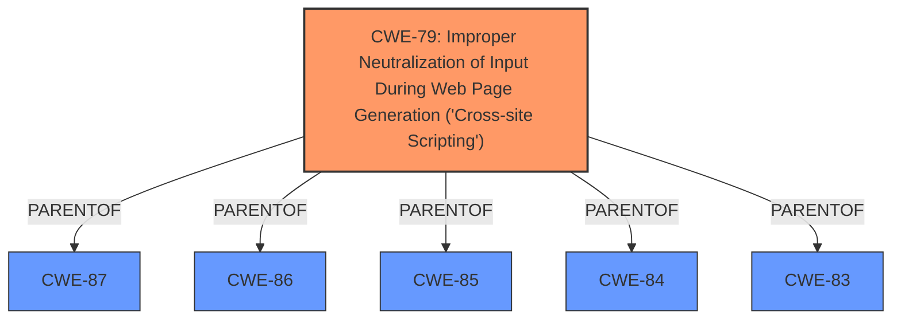

# Raw Analyzer Response for CVE-2024-10362

# Summary
| CWE ID | CWE Name | Confidence | CWE Abstraction Level | CWE Vulnerability Mapping Label | CWE-Vulnerability Mapping Notes |
|---|---|---|---|---|---|
| CWE-79 | Improper Neutralization of Input During Web Page Generation ('Cross-site Scripting') | 1.0 | Base | Allowed | Primary CWE. The plugin **does not sanitize and escape some of its settings**, allowing for **Stored Cross-Site Scripting** attacks. |

## Evidence and Confidence

*   **Confidence Score:** 1.0
*   **Evidence Strength:** HIGH

## Relationship Analysis
The primary relationship to consider is that CWE-79 is a base-level CWE, which is preferred. There are several parent CWEs, but they are too abstract. There are also child CWEs, but they are too specific and don't apply to the generalized case described here.

## Vulnerability Chain
The vulnerability chain is straightforward:
1.  **Root Cause:** The plugin **does not sanitize and escape some of its settings** (CWE-79).
2.  **Weakness:** This leads to a **Stored Cross-Site Scripting** vulnerability.
3.  **Impact:** Allows high-privilege users to perform XSS attacks.

## Summary of Analysis
The analysis is based on the provided evidence, specifically the vulnerability description and the CVE reference summary. The key point is the **lack of sanitization and escaping of settings**, which directly leads to the possibility of Stored Cross-Site Scripting.

The graph relationships confirm that CWE-79 is the appropriate level of specificity. It's a base CWE, and the description aligns perfectly with the vulnerability.

The selected CWE is at the optimal level of specificity because it directly addresses the root cause of the vulnerability, which is the **improper neutralization of input during web page generation**. The evidence clearly states that the plugin **does not sanitize and escape some of its settings**, leading to XSS attacks.

Relevant CWE Information:
*   **CWE-79: Improper Neutralization of Input During Web Page Generation ('Cross-site Scripting')**
    *   **Description:** The product receives input from an upstream component, but it does not neutralize or incorrectly neutralizes special characters such as "<", ">", and "&" that could be interpreted as web-scripting elements when they are sent to a downstream component that processes web pages.
    *   This aligns precisely with the description of the vulnerability, where the plugin **does not sanitize and escape some of its settings**, allowing for the injection of malicious scripts.