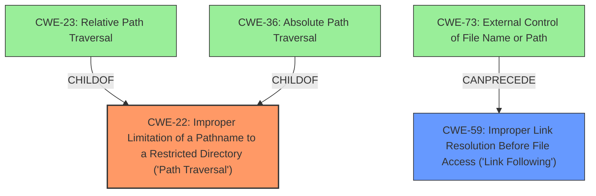

# Enhanced Analysis for CVE-2024-10389

# Summary
| CWE ID | CWE Name | Confidence | CWE Abstraction Level | CWE Vulnerability Mapping Label | CWE-Vulnerability Mapping Notes |
|---|---|---|---|---|---|
| CWE-22 | Improper Limitation of a Pathname to a Restricted Directory ('Path Traversal') | 1.0 | Base | Allowed | Primary CWE |
| CWE-59 | Improper Link Resolution Before File Access ('Link Following') | 0.8 | Base | Allowed | Secondary Candidate |

## Evidence and Confidence

*   **Confidence Score:** 0.9
*   **Evidence Strength:** HIGH

## Relationship Analysis
The primary CWE is CWE-22, which represents a **Path Traversal vulnerability** due to **improper limitation of pathname to a restricted directory**. CWE-59, **Improper Link Resolution Before File Access ('Link Following')**, is a related weakness because the vulnerability involves symbolic links within the archive. CWE-22 is a parent of CWE-23 (**Relative Path Traversal**) and CWE-36 (**Absolute Path Traversal**), but those are not as good a fit as CWE-22. CWE-73 (**External Control of File Name or Path**) can precede CWE-59, but is not as directly related to the **path traversal** as CWE-22.



## Vulnerability Chain
The vulnerability chain starts with the **improper handling of pathnames** within archive files, leading to a **Path Traversal** issue. Attackers can then **write arbitrary files** by exploiting symbolic links within the archive. The root cause is the **failure to properly sanitize paths**, especially concerning Windows short filenames.

CWE-22 (Improper Limitation of a Pathname to a Restricted Directory ('Path Traversal')) -> Write Arbitrary Files

## Summary of Analysis
The initial analysis indicated a **Path Traversal vulnerability**, and the evidence confirms this. The vulnerability is due to the **lack of proper sanitization** of archive paths, especially concerning Windows short filenames. This allows attackers to write arbitrary files via archive extraction containing symbolic links.

The primary CWE is CWE-22 because the core issue is the ability to traverse outside the intended directory. The secondary CWE is CWE-59 as the exploit uses symbolic links to achieve this.

The retriever results strongly support CWE-22, which is at the optimal level of specificity (Base).

Relevant CWE Information:
# Enhanced Context (25 CWEs)
The following CWEs were identified as potentially relevant to this vulnerability:

## CWE-59: Improper Link Resolution Before File Access ('Link Following')
**Abstraction Level**: Base
**Similarity Score**: 0.78
**Source**: dense

**Description**:
The product attempts to access a file based on the filename, but it does not properly prevent that filename from identifying a link or shortcut that resolves to an unintended resource.

**Mapping Guidance**:
- Usage: Allowed
- Rationale: This CWE entry is at the Base level of abstraction, which is a preferred level of abstraction for mapping to the root causes of vulnerabilities.

## CWE-22: Improper Limitation of a Pathname to a Restricted Directory ('Path Traversal')
**Abstraction Level**: Base
**Similarity Score**: 0.74
**Source**: dense

**Description**:
The product uses external input to construct a pathname that is intended to identify a file or directory that is located underneath a restricted parent directory, but the product does not properly neutralize special elements within the pathname that can cause the pathname to resolve to a location that is outside of the restricted directory.

**Mapping Guidance**:
- Usage: Allowed
- Rationale: This CWE entry is at the Base level of abstraction, which is a preferred level of abstraction for mapping to the root causes of vulnerabilities.


## CWE Relationship Analysis

Current CWEs represent these abstraction levels: .


### Vulnerability Chain Analysis

**Chain starting from CWE-22:**
- 22 (Improper Limitation of a Pathname to a Restricted Directory ('Path Traversal')) - ROOT


**Chain starting from CWE-59:**
- 59 (Improper Link Resolution Before File Access ('Link Following')) - ROOT


### CWE Relationship Diagram

```mermaid
graph TD
    classDef primary fill:#f96,stroke:#333,stroke-width:2px
    classDef secondary fill:#69f,stroke:#333
    classDef tertiary fill:#9e9,stroke:#333
```