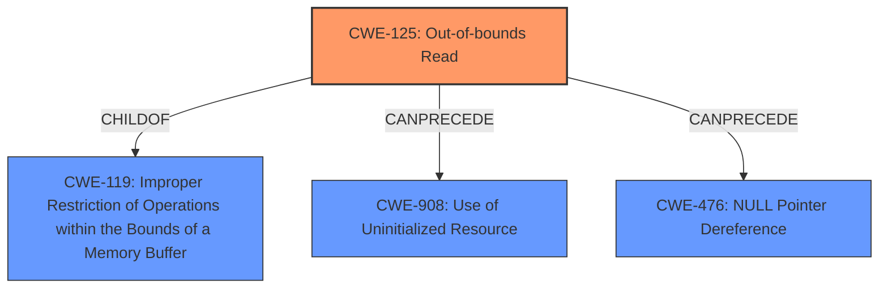

# Analysis for CVE-2024-10396

# Summary
| CWE ID  | CWE Name                                           | Confidence | CWE Abstraction Level | CWE Vulnerability Mapping Label | CWE-Vulnerability Mapping Notes |
| :-------- | :------------------------------------------------- | :--------- | :---------------------- | :------------------------------ | :------------------------------ |
| CWE-125   | Out-of-bounds Read                                | 0.9        | Base                    | Primary CWE                    | Allowed                       |
| CWE-908   | Use of Uninitialized Resource                      | 0.7        | Base                    | Secondary Candidate            | Allowed                       |
| CWE-476   | NULL Pointer Dereference                           | 0.6        | Base                    | Secondary Candidate            | Allowed                       |

## Evidence and Confidence

*   **Confidence Score:** 0.8
*   **Evidence Strength:** HIGH

## Relationship Analysis
The primary weakness is an out-of-bounds read (CWE-125). This can lead to the use of uninitialized resources (CWE-908) and potentially a null pointer dereference (CWE-476) if the out-of-bounds read accesses a null pointer. CWE-125 is a base level CWE and child of CWE-119 (Improper Restriction of Operations within the Bounds of a Memory Buffer). These relationships influenced the decision to prioritize the more specific CWE-125.

## Vulnerability Chain
The vulnerability chain starts with a **malformed ACL** provided by an authenticated user. This leads to an **out-of-bounds read**, which in turn could expose **uninitialized memory** and potentially cause a **null pointer dereference**, ultimately resulting in a crash. The chain highlights how an initial input validation issue can lead to a cascade of errors.

## Summary of Analysis
The initial assessment focused on the **uninitialized memory** and **malformed ACL**. However, after reviewing the CVE Reference Links Content Summary, it became clear that the root cause is the **out-of-bounds read** due to the parsing logic's failure to handle malformed ACL strings with missing null terminators. The `RXAFS_StoreACL` and `RXAFS_FetchACL` RPCs parse ACL strings using `sscanf()` and manual string examination, which is **vulnerable** to malformed ACL strings.

The evidence for the **out-of-bounds read** is explicitly mentioned in the content summary: "The fileserver can read beyond the allocated buffer for the ACL string if it's missing a null terminator. This can happen when searching for newlines."

The other CWEs were considered, but deemed secondary. **Use of uninitialized resource** (CWE-908) and **NULL Pointer Dereference** (CWE-476) are potential consequences of the **out-of-bounds read**, but not the root cause.

The chosen CWEs are at the optimal level of specificity because CWE-125 directly addresses the reading of data beyond the buffer boundaries, which is the core issue.

Relevant CWE Information:

# Enhanced Context (25 CWEs)
The following CWEs were identified as potentially relevant to this vulnerability:

## CWE-918: Server-Side Request Forgery (SSRF)
**Abstraction Level**: Base
**Similarity Score**: 0.70
**Source**: dense

**Description**:
The web server receives a URL or similar request from an upstream component and retrieves the contents of this URL, but it does not sufficiently ensure that the request is being sent to the expected destination.

**Mapping Guidance**:
- Usage: Allowed
- Rationale: This CWE entry is at the Base level of abstraction, which is a preferred level of abstraction for mapping to the root causes of vulnerabilities.

*Not applicable.* This vulnerability doesn't involve server-side requests.

## CWE-129: Improper Validation of Array Index
**Abstraction Level**: Variant
**Similarity Score**: 0.70
**Source**: dense

**Description**:
The product uses untrusted input when calculating or using an array index, but the product does not validate or incorrectly validates the index to ensure the index references a valid position within the array.

**Mapping Guidance**:
- Usage: Allowed
- Rationale: This CWE entry is at the Variant level of abstraction, which is a preferred level of abstraction for mapping to the root causes of vulnerabilities.

*Not applicable.* While there might be array indexing involved, the primary issue is reading beyond the buffer, not the index validation itself.

## CWE-617: Reachable Assertion
**Abstraction Level**: Base
**Similarity Score**: 0.70
**Source**: dense

**Description**:
The product contains an assert() or similar statement that can be triggered by an attacker, which leads to an application exit or other behavior that is more severe than necessary.

**Mapping Guidance**:
- Usage: Allowed
- Rationale: This CWE entry is at the Base level of abstraction, which is a preferred level of abstraction for mapping to the root causes of vulnerabilities.

*Not applicable.* There's no mention of assertions in the vulnerability description.

## CWE-178: Improper Handling of Case Sensitivity
**Abstraction Level**: Base
**Similarity Score**: 0.70
**Source**: dense

**Description**:
The product does not properly account for differences in case sensitivity when accessing or determining the properties of a resource, leading to inconsistent results.

**Mapping Guidance**:
- Usage: Allowed
- Rationale: This CWE entry is at the Base level of abstraction, which is a preferred level of abstraction for mapping to the root causes of vulnerabilities.

*Not applicable.* Case sensitivity is not relevant to this vulnerability.

## CWE-212: Improper Removal of Sensitive Information Before Storage or Transfer
**Abstraction Level**: Base
**Similarity Score**: 0.70
**Source**: dense

**Description**:
The product stores, transfers, or shares a resource that contains sensitive information, but it does not properly remove that information before the product makes the resource available to unauthorized actors.

**Mapping Guidance**:
- Usage: Allowed
- Rationale: This CWE entry is at the Base level of abstraction, which is a preferred level of abstraction for mapping to the root causes of vulnerabilities.

*Not applicable.* While the vulnerability can expose uninitialized memory, the core issue is not about sensitive information removal.

## CWE-303: Incorrect Implementation of Authentication Algorithm
**Abstraction Level**: Base
**Similarity Score**: 0.70
**Source**: dense

**Description**:
The requirements for the product dictate the use of an established authentication algorithm, but the implementation of the algorithm is incorrect.

**Mapping Guidance**:
- Usage: Allowed
- Rationale: This CWE entry is at the Base level of abstraction, which is a preferred level of abstraction for mapping to the root causes of vulnerabilities.

*Not applicable.* The vulnerability is not related to authentication algorithms.

## CWE-23: Relative Path Traversal
**Abstraction Level**: Base
**Similarity Score**: 0.69
**Source**: dense

**Description**:
The product uses external input to construct a pathname that should be within a restricted directory, but it does not properly neutralize sequences such as ".." that can resolve to a location that is outside of that directory.

**Mapping Guidance**:
- Usage: Allowed
- Rationale: This CWE entry is at the Base level of abstraction, which is a preferred level of abstraction for mapping to the root causes of vulnerabilities.

*Not applicable.* Path traversal is not involved in this vulnerability.

## CWE-908: Use of Uninitialized Resource
**Abstraction Level**: Base
**Similarity Score**: 0.69
**Source**: dense

**Description**:
The product uses or accesses a resource that has not been initialized.

**Mapping Guidance**:
- Usage: Allowed
- Rationale: This CWE entry is at the Base level of abstraction, which is a preferred level of abstraction for mapping to the root causes of vulnerabilities.

*Applicable, but secondary.* This is a potential consequence of the **out-of-bounds read**. The fileserver may expose **uninitialized memory**. It is listed as a secondary candidate.

## CWE-346: Origin Validation Error
**Abstraction Level**: Class
**Similarity Score**: 0.69
**Source**: dense

**Description**:
The product does not properly verify that the source of data or communication is valid.

**Mapping Guidance**:
- Usage: Allowed-with-Review
- Rationale: This CWE entry is a Class and might have Base-level children that would be more appropriate

*Not