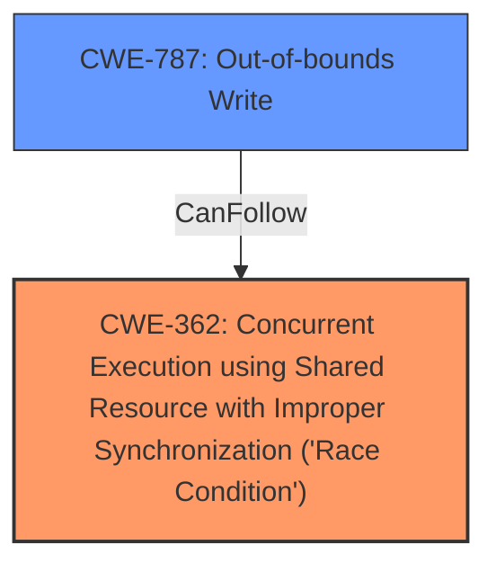

# Analysis Report for CVE-2024-10468

# Vulnerability Analysis Report: CVE-2024-10468

## Description

Potential **race conditions** in IndexedDB could have caused **memory corruption**, leading to a potentially exploitable crash. This vulnerability affects Firefox < 132 and Thunderbird < 132.

## Vulnerability Description Key Phrases

- **Rootcause:** race conditions
- **Weakness:** memory corruption
- **Impact:** ['memory corruption', 'potentially exploitable crash']
- **Product:** ["['Firefox'", "'Thunderbird']"]
- **Version:** under 132
- **Component:** IndexedDB

## Analysis (with Relationship Data)

# Summary
| CWE ID | CWE Name | Confidence | CWE Abstraction Level | CWE Vulnerability Mapping Label | CWE-Vulnerability Mapping Notes |
|---|---|---|---|---|---|
| CWE-362 | Concurrent Execution using Shared Resource with Improper Synchronization ('Race Condition') | 0.9 | Class | Allowed-with-Review | Primary CWE. The vulnerability is caused by **race conditions** within the IndexedDB implementation.|
| CWE-787 | Out-of-bounds Write | 0.7 | Base | Allowed | Secondary Candidate. **Memory corruption** could be caused by out-of-bounds write. |

## Evidence and Confidence

*   **Confidence Score:** 0.8
*   **Evidence Strength:** MEDIUM

## Relationship Analysis
The primary CWE is CWE-362, which is a class-level CWE. While more specific Base-level CWEs related to race conditions exist (e.g., CWE-367, CWE-366, CWE-364), CWE-362 is the most appropriate high-level classification given the information available, as it captures the general nature of the **race condition** vulnerability. CWE-787 is a potential consequence of the race condition, which could lead to **memory corruption** through out-of-bounds writes.



## Vulnerability Chain
The vulnerability chain starts with **race conditions** in IndexedDB (CWE-362), which can lead to **memory corruption**. This **memory corruption** could potentially be caused by an out-of-bounds write (CWE-787). The final impact is a potentially exploitable crash.

## Summary of Analysis
The primary weakness is a **race condition** in IndexedDB, which is best represented by CWE-362. The description mentions **memory corruption** as a result of the **race condition**, which could be due to CWE-787.

The evidence supporting CWE-362 is:
"Potential **race conditions** in IndexedDB could have caused **memory corruption**"
"The vulnerability is caused by potential race conditions within the IndexedDB implementation."

CWE-362 is at the class level, but without more detailed information about the specific type of race condition, it is the most appropriate choice.

I considered other CWEs such as CWE-416 (Use After Free), CWE-125 (Out-of-bounds Read), and CWE-843 (Access of Resource Using Incompatible Type ('Type Confusion')) but these are not as directly linked to the description of the vulnerability as CWE-362 and CWE-787.


## CWE Relationship Analysis

Current CWEs represent these abstraction levels: .


### Vulnerability Chain Analysis

**Chain starting from CWE-416:**
- 416 (Use After Free) - ROOT


**Chain starting from CWE-125:**
- 125 (Out-of-bounds Read) - ROOT


### CWE Relationship Diagram

```mermaid
graph TD
    classDef primary fill:#f96,stroke:#333,stroke-width:2px
    classDef secondary fill:#69f,stroke:#333
    classDef tertiary fill:#9e9,stroke:#333
```


*Report generated on 2025-07-13 00:11:23*
