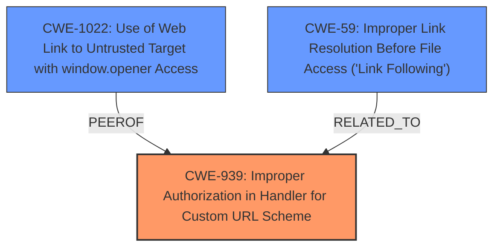

# Analysis for CVE-2024-10474

# Summary
| CWE ID | CWE Name | Confidence | CWE Abstraction Level | CWE Vulnerability Mapping Label | CWE-Vulnerability Mapping Notes |
|---|---|---|---|---|---|
| CWE-939 | Improper Authorization in Handler for Custom URL Scheme | 0.8 | Base | Allowed | Primary CWE. The application **incorrectly allows internal links to utilize the app scheme** used for deeplinking, leading to potential circumvention of URL safety checks. This aligns with the CWE description, which focuses on the **improper restriction of actors** who can invoke a custom URL scheme handler. |
| CWE-1022 | Use of Web Link to Untrusted Target with window.opener Access | 0.6 | Variant | Allowed | Secondary Candidate. Since the vulnerability allows the use of internal links to untrusted targets, which could bypass URL safety checks, this CWE might be applicable. |
| CWE-59 | Improper Link Resolution Before File Access ('Link Following') | 0.5 | Base | Allowed | Secondary Candidate. While not a direct fit, the circumvention of URL safety checks could be seen as a form of improper link resolution. |

## Evidence and Confidence

*   **Confidence Score:** 0.7
*   **Evidence Strength:** MEDIUM

## Relationship Analysis
The primary relationship influencing the decision is the direct match between the vulnerability description and CWE-939, which focuses on improper authorization in custom URL scheme handlers. While other CWEs were considered, they represent related but less direct aspects of the vulnerability, such as the use of web links to untrusted targets (CWE-1022) or improper link resolution (CWE-59). The abstraction levels of the selected CWEs (Base and Variant) provide a good level of specificity.

## Vulnerability Chain
The vulnerability chain starts with **incorrectly allowing internal links to utilize the app scheme**. This **weakness** then allows those links to potentially circumvent URL safety checks.

## Summary of Analysis
The analysis is primarily based on the vulnerability description and the CVE Reference Links Content Summary, which explicitly mentions that "Focus for iOS was **incorrectly allowing internal links to utilize the app scheme** used for deeplinking." This directly supports the selection of CWE-939 (Improper Authorization in Handler for Custom URL Scheme) as the primary CWE. The relationship graph shows the connections between the selected CWEs and other potentially relevant CWEs. While other CWEs like CWE-1022 and CWE-59 were considered, they are less specific to the root cause of the vulnerability. The selected CWEs are at an appropriate level of specificity, with CWE-939 being a Base-level CWE.

Relevant CWE Information:

# Enhanced Context (25 CWEs)
The following CWEs were identified as potentially relevant to this vulnerability:

## CWE-451: User Interface (UI) Misrepresentation of Critical Information
**Abstraction Level**: Class
**Similarity Score**: 0.75
**Source**: dense

**Description**:
The user interface (UI) does not properly represent critical information to the user, allowing the information - or its source - to be obscured or spoofed. This is often a component in phishing attacks.

**Mapping Guidance**:
- Usage: Allowed-with-Review
- Rationale: This CWE entry is a Class and might have Base-level children that would be more appropriate

*NOT USED* There is no User Interface information provided, so this is not appropriate.

## CWE-610: Externally Controlled Reference to a Resource in Another Sphere
**Abstraction Level**: Class
**Similarity Score**: 0.72
**Source**: dense

**Description**:
The product uses an externally controlled name or reference that resolves to a resource that is outside of the intended control sphere.

**Mapping Guidance**:
- Usage: Discouraged
- Rationale: This CWE entry is a level-1 Class (i.e., a child of a Pillar). It might have lower-level children that would be more appropriate

*NOT USED* There is no externally controlled resource.

## CWE-939: Improper Authorization in Handler for Custom URL Scheme
**Abstraction Level**: Base
**Similarity Score**: 0.72
**Source**: dense

**Description**:
The product uses a handler for a custom URL scheme, but it does not properly restrict which actors can invoke the handler using the scheme.

**Mapping Guidance**:
- Usage: Allowed
- Rationale: This CWE entry is at the Base level of abstraction, which is a preferred level of abstraction for mapping to the root causes of vulnerabilities.

*USED* The application **incorrectly allows internal links to utilize the app scheme** used for deeplinking, leading to potential circumvention of URL safety checks. This aligns with the CWE description, which focuses on the **improper restriction of actors** who can invoke a custom URL scheme handler.

## CWE-346: Origin Validation Error
**Abstraction Level**: Class
**Similarity Score**: 0.72
**Source**: dense

**Description**:
The product does not properly verify that the source of data or communication is valid.

**Mapping Guidance**:
- Usage: Allowed-with-Review
- Rationale: This CWE entry is a Class and might have Base-level children that would be more appropriate

*NOT USED* While URL safety checks are related to origin validation, the root cause is more directly related to improper authorization, making CWE-939 a better fit.

## CWE-668: Exposure of Resource to Wrong Sphere
**Abstraction Level**: Class
**Similarity Score**: 0.72
**Source**: dense

**Description**:
The product exposes a resource to the wrong control sphere, providing unintended actors with inappropriate access to the resource.

**Mapping Guidance**:
- Usage: Discouraged
- Rationale: CWE-668 is high-level and is often misused as a catch-all when lower-level CWE IDs might be applicable. It is sometimes used for low-information vulnerability reports [REF-1287]. It is a level-1 Class (i.e., a child of a Pillar). It is not useful for trend analysis.

*NOT USED* This is too general and does not directly address the root cause.

## CWE-59: Improper Link Resolution Before File Access ('Link Following')
**Abstraction Level**: Base
**Similarity Score**: 0.71
**Source**: dense

**Description**:
The product attempts to access a file based on the filename, but it does not properly prevent that filename from identifying a link or shortcut that resolves to an unintended resource.

**Mapping Guidance**:
- Usage: Allowed
- Rationale: This CWE entry is at the Base level of abstraction, which is a preferred level of abstraction for mapping to the root causes of vulnerabilities.

*CONSIDERED* While not a direct fit, the circumvention of URL safety checks could be seen as a form of improper link resolution.

## CWE-116: Improper Encoding or Escaping of Output
**Abstraction Level**: Class
**Similarity Score**: 0.71
**Source**: dense

**Description**:
The product prepares a structured message for communication with another component, but encoding or escaping of the data is either missing or done incorrectly. As a result, the intended structure of the message is not preserved.

**Mapping Guidance**:
- Usage: Allowed-with-Review
- Rationale: This CWE entry is a Class and might have Base-level children that would be more appropriate

*NOT USED* This is not about encoding or escaping.

## CWE-1021: Improper Restriction of Rendered UI Layers or Frames
**Abstraction Level**: Base
**Similarity Score**: 0.71
**Source**: dense

**Description**:
The web application does not restrict or incorrectly restricts frame objects or UI layers that belong to another application or domain, which can lead to user confusion about which interface the user is interacting with.

**Mapping Guidance**:
- Usage: Allowed
- Rationale: This CWE entry is at the Base level of abstraction, which is a preferred level of abstraction for mapping to the root causes of vulnerabilities.

*NOT USED* This is not about UI layers.

## CWE-203: Observable Discrepancy
**Abstraction Level**: Base
**Similarity Score**: 0.71
**Source**: dense

**Description**:
The product behaves differently or sends different responses under different circumstances in a way that is observable to an unauthorized actor, which exposes security-relevant information about the state of the product, such as whether a particular operation was successful or not.

**Mapping Guidance**:
- Usage: Allowed
- Rationale: This CWE