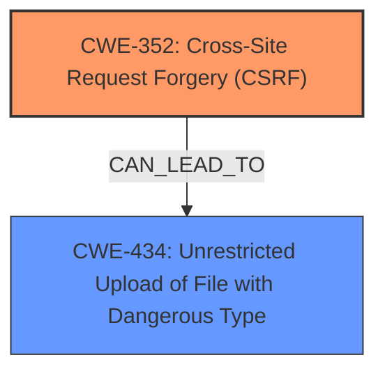

# Analysis for CVE-2024-10481

# Summary
| CWE ID | CWE Name | Confidence | CWE Abstraction Level | CWE Vulnerability Mapping Label | CWE-Vulnerability Mapping Notes |
|---|---|---|---|---|---|
| CWE-352 | Cross-Site Request Forgery (CSRF) | 1.0 | Compound | Primary | Allowed |
| CWE-434 | Unrestricted Upload of File with Dangerous Type | 0.7 | Base | Secondary | Allowed |

## Evidence and Confidence

*   **Confidence Score:** 0.9
*   **Evidence Strength:** HIGH

## Relationship Analysis
The primary CWE is CWE-352, which is a compound weakness. The vulnerability description explicitly mentions the **lack of CSRF protections**, making this a direct match. CWE-434 is considered as a secondary weakness since the impact allows attackers to upload arbitrary files via the `/upload/image` endpoint, although this is a consequence of the CSRF vulnerability, not the root cause itself. There are no direct parent-child or peer relationships that significantly alter the mapping.

## Vulnerability Chain
The vulnerability chain starts with the **lack of CSRF protections** (CWE-352). This allows an attacker to craft malicious websites that, when visited by an authenticated user, can perform arbitrary API requests. A specific example is the ability to upload arbitrary files (CWE-434) due to the unprotected `/upload/image` endpoint.

## Summary of Analysis
The analysis is heavily based on the provided vulnerability description, which explicitly mentions the **CSRF vulnerability** and the **lack of CSRF protections**. The retriever results also strongly suggest CWE-352 as a primary candidate.

The evidence directly supports the selection of CWE-352. The ability to upload arbitrary files (CWE-434) is a direct consequence of the **CSRF vulnerability**, further solidifying the mapping.

The selected CWEs are at the optimal level of specificity, with CWE-352 being a compound weakness that accurately captures the essence of the vulnerability. CWE-434 highlights a specific attack vector enabled by the primary weakness.

Relevant CWE Information:

**CWE-352: Cross-Site Request Forgery (CSRF)**
The web application does not, or can not, sufficiently verify whether a well-formed, valid, consistent request was intentionally provided by the user who submitted the request. The **lack of CSRF protections** allows attackers to perform unauthorized actions on behalf of the user, such as uploading arbitrary files, as stated in the vulnerability description: "The **lack of CSRF protections** on API endpoints like `/upload/image`, `/prompt`, and `/history` leaves users vulnerable to unauthorized actions".

**CWE-434: Unrestricted Upload of File with Dangerous Type**
The product allows the upload or transfer of dangerous file types that are automatically processed within its environment. The vulnerability description states that the attack can be exploited to perform actions such as uploading arbitrary files via the `/upload/image` endpoint.

Other CWEs Considered but Not Used:

*   CWE-79: Improper Neutralization of Input During Web Page Generation ('Cross-site Scripting') - While the description mentions the possibility of combining the **CSRF vulnerability** with stored XSS, there's no direct evidence of input neutralization issues.
*   CWE-425: Direct Request ('Forced Browsing') - This is related to authorization issues, but the primary issue here is the **lack of CSRF protection**, not necessarily direct access to resources.
*   CWE-306: Missing Authentication for Critical Function - While related to authorization, the core problem is the **lack of CSRF protection**, which allows actions to be performed on behalf of an authenticated user without their consent.
*   CWE-23: Relative Path Traversal - There is no evidence of path traversal vulnerabilities in the description.