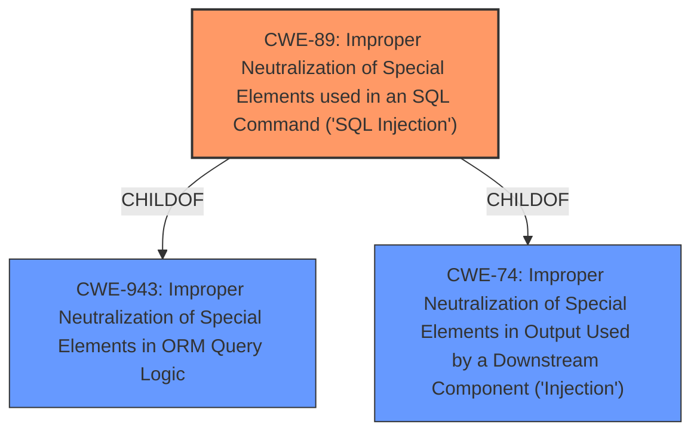

# Analysis for CVE-2024-10540

# Summary
| CWE ID | CWE Name | Confidence | CWE Abstraction Level | CWE Vulnerability Mapping Label | CWE-Vulnerability Mapping Notes |
|---|---|---|---|---|---|
| CWE-89 | Improper Neutralization of Special Elements used in an SQL Command ('SQL Injection') | 1.0 | Base | Primary | Allowed |

## Evidence and Confidence

*   **Confidence Score:** 1.0
*   **Evidence Strength:** HIGH

## Relationship Analysis
The primary relationship that impacted my decision was the parent-child relationship between CWE-89 and higher-level classes like CWE-138 (Improper Neutralization of Special Elements). While the general class could apply, CWE-89 is a specific type of injection and is most relevant given the vulnerability description mentions "SQL Injection".

## Vulnerability Chain
The chain of events for this vulnerability is as follows:
1.  **Improper Neutralization of Special Elements used in an SQL Command ('SQL Injection')** due to **insufficient escaping on the user supplied parameter and lack of sufficient preparation on the existing SQL query**.
2.  Extraction of sensitive information from the database.

## Summary of Analysis
The analysis is based on the vulnerability description provided, which clearly states that the "Appointment Booking Calendar Plugin and Scheduling Plugin - BookingPress plugin for WordPress is vulnerable to SQL Injection via the service parameter of the bookingpress_form shortcode in all versions up to, and including, 1.1.16 due to **insufficient escaping on the user supplied parameter and lack of sufficient preparation on the existing SQL query**." This statement directly implies **Improper Neutralization of Special Elements used in an SQL Command ('SQL Injection')**.

The retriever results and similar CVE descriptions also point to CWE-89 as the primary weakness. I have selected CWE-89 as it is the most specific and accurate representation of the vulnerability described, and it is at the recommended Base level of abstraction.

Relevant CWE Information:

# Enhanced Context (25 CWEs)
The following CWEs were identified as potentially relevant to this vulnerability:

## CWE-352: Cross-Site Request Forgery (CSRF)
**Abstraction Level**: Compound
**Similarity Score**: 0.73
**Source**: dense

**Description**:
The web application does not, or can not, sufficiently verify whether a well-formed, valid, consistent request was intentionally provided by the user who submitted the request.

**Mapping Guidance**:
- Usage: Allowed
- Rationale: This is a well-known Composite of multiple weaknesses that must all occur simultaneously, although it is attack-oriented in nature.

*Not Selected:* This vulnerability is caused by **insufficient escaping on the user supplied parameter and lack of sufficient preparation on the existing SQL query** leading to SQL Injection. CSRF is not part of this vulnerability.

## CWE-472: External Control of Assumed-Immutable Web Parameter
**Abstraction Level**: Base
**Similarity Score**: 0.71
**Source**: dense

**Description**:
The web application does not sufficiently verify inputs that are assumed to be immutable but are actually externally controllable, such as hidden form fields.

**Mapping Guidance**:
- Usage: Allowed
- Rationale: This CWE entry is at the Base level of abstraction, which is a preferred level of abstraction for mapping to the root causes of vulnerabilities.

*Not Selected:* This vulnerability is caused by **insufficient escaping on the user supplied parameter and lack of sufficient preparation on the existing SQL query** leading to SQL Injection. External Control of Assumed-Immutable Web Parameter is not part of this vulnerability.

## CWE-89: Improper Neutralization of Special Elements used in an SQL Command ('SQL Injection')
**Abstraction Level**: Base
**Similarity Score**: 0.70
**Source**: dense

**Description**:
The product constructs all or part of an SQL command using externally-influenced input from an upstream component, but it does not neutralize or incorrectly neutralizes special elements that could modify the intended SQL command when it is sent to a downstream component. Without sufficient removal or quoting of SQL syntax in user-controllable inputs, the generated SQL query can cause those inputs to be interpreted as SQL instead of ordinary user data.

**Mapping Guidance**:
- Usage: Allowed
- Rationale: This CWE entry is at the Base level of abstraction, which is a preferred level of abstraction for mapping to the root causes of vulnerabilities.

*Selected:* The vulnerability description clearly indicates an SQL Injection vulnerability due to **insufficient escaping on the user supplied parameter and lack of sufficient preparation on the existing SQL query**, which perfectly matches the description of CWE-89.

## CWE-116: Improper Encoding or Escaping of Output
**Abstraction Level**: Class
**Similarity Score**: 0.69
**Source**: dense

**Description**:
The product prepares a structured message for communication with another component, but encoding or escaping of the data is either missing or done incorrectly. As a result, the intended structure of the message is not preserved.

**Mapping Guidance**:
- Usage: Allowed-with-Review
- Rationale: This CWE entry is a Class and might have Base-level children that would be more appropriate

*Not Selected:* The vulnerability is caused by **insufficient escaping on the user supplied parameter and lack of sufficient preparation on the existing SQL query** which leads to SQL injection, not necessarily improper encoding or escaping of output. While escaping might be a form of encoding, the root cause is more specifically related to the lack of proper SQL command construction, making CWE-89 a more fitting choice.

## CWE-425: Direct Request ('Forced Browsing')
**Abstraction Level**: Base
**Similarity Score**: 0.69
**Source**: dense

**Description**:
The web application does not adequately enforce appropriate authorization on all restricted URLs, scripts, or files.

**Mapping Guidance**:
- Usage: Allowed
- Rationale: This CWE entry is at the Base level of abstraction, which is a preferred level of abstraction for mapping to the root causes of vulnerabilities.

*Not Selected:* The vulnerability is caused by **insufficient escaping on the user supplied parameter and lack of sufficient preparation on the existing SQL query** leading to SQL Injection. It's not related to direct request or forced browsing.

## CWE-79: Improper Neutralization of Input During Web Page Generation ('Cross-site Scripting')
**Abstraction Level**: Base
**Similarity Score**: 0.68
**Source**: dense

**Description**:
The product does not neutralize or incorrectly neutralizes user-controllable input before it is placed in output that is used as a web page that is served to other users.

*Not Selected:* The vulnerability is caused by **insufficient escaping on the user supplied parameter and lack of sufficient preparation on the existing SQL query** leading to SQL Injection. This is not a Cross-site Scripting vulnerability.

## CWE-80: Improper Neutralization of Script-Related HTML Tags in a Web Page (Basic XSS)
**Abstraction Level**: Variant
**Similarity Score**: 0.68
**Source**: dense

**Description**:
The product receives input from an upstream component, but it does not neutralize or incorrectly neutralizes special characters such as "<", ">", and "&" that could be interpreted as web-scripting elements when they are sent to a downstream component that processes web pages.

*Not Selected:* The vulnerability is caused by **insufficient escaping on the user supplied parameter and lack of sufficient preparation on the existing SQL query** leading to SQL Injection. This is not a Cross-site Scripting vulnerability.

## CWE-639: Authorization Bypass Through User-Controlled Key
**Abstraction Level**: Base
**Similarity Score**: 0.67
**Source**: dense

**Description**:
The system's authorization functionality does not prevent one user from gaining access to another user's data or record by modifying the key value identifying the data.

*Not Selected:* The vulnerability is caused by **insufficient escaping on the user supplied parameter and lack of sufficient preparation on the existing SQL query** leading to SQL Injection. Authorization Bypass Through User-Controlled Key is not part of this vulnerability.

## CWE-93: Improper Neutralization of CRLF Sequences ('CRLF Injection')
**Abstraction Level**: Base
**Similarity Score**: 0.67
**Source**: dense

**Description**:
The product uses CRLF (carriage return line feeds) as a special element, e.g. to separate lines or records, but it does not neutralize or incorrectly neutralizes CRLF sequences from inputs.

*Not Selected:* The vulnerability is caused by **insufficient escaping on the user supplied parameter and lack of sufficient preparation on the existing SQL query** leading to SQL Injection. CRLF Injection is not part of this vulnerability