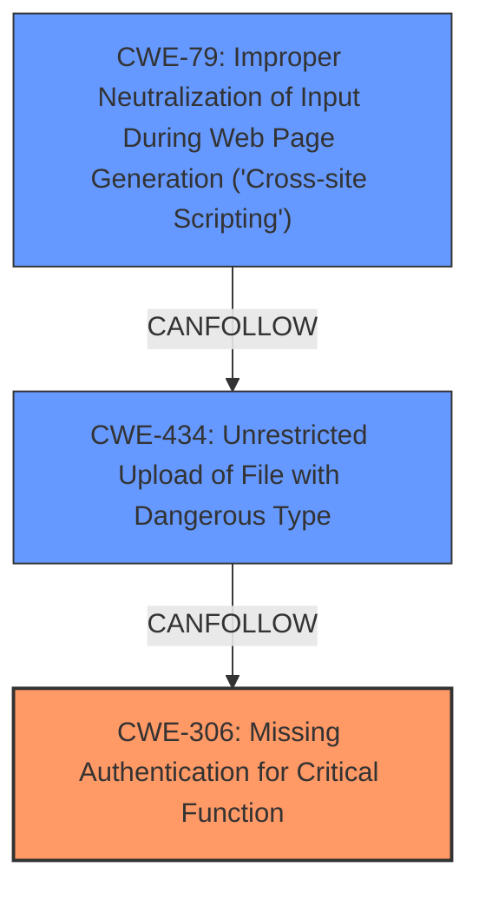

# Analysis Report for CVE-2024-10649

# Vulnerability Analysis Report: CVE-2024-10649

## Description

wandb/openui latest commit c945bb859979659add5f490a874140ad17c56a5d contains a vulnerability where **unauthenticated endpoints** allow **file uploads and downloads from an AWS S3 bucket**. This can lead to **multiple security issues** including denial of service, stored XSS, and information disclosure. The affected endpoints are /v1/share/{idstr} for uploading and /v1/share/{idstr} for downloading JSON files. The **lack of authentication** allows any user to upload and overwrite files, potentially causing the S3 bucket to run out of space, injecting malicious scripts, and accessing sensitive information.

## Vulnerability Description Key Phrases

- **Rootcause:** ['unauthenticated endpoints', 'lack of authentication']
- **Weakness:** ['file uploads and downloads from an AWS S3 bucket', 'multiple security issues']
- **Impact:** ['information disclosure', 'denial of service', 'overwrite files', 'stored XSS']
- **Product:** wandb/openui
- **Version:** latest commit c945bb859979659add5f490a874140ad17c56a5d
- **Component:** /v1/share/{idstr}

## Analysis (with Relationship Data)

# Summary
| CWE ID  | CWE Name                                                                | Confidence | CWE Abstraction Level | CWE Vulnerability Mapping Label | CWE-Vulnerability Mapping Notes |
| :-------- | :---------------------------------------------------------------------- | :--------- | :-------------------- | :------------------------------ | :------------------------------ |
| CWE-306 | Missing Authentication for Critical Function | 0.95      | Base                 | Primary                     | Allowed                      |
| CWE-434 | Unrestricted Upload of File with Dangerous Type | 0.7      | Base                 | Secondary                     | Allowed                      |
| CWE-79  | Improper Neutralization of Input During Web Page Generation ('Cross-site Scripting') | 0.6      | Base                  | Secondary                     | Allowed                      |

## Evidence and Confidence

*   **Confidence Score:** 0.85
*   **Evidence Strength:** HIGH

## Relationship Analysis
The primary weakness is the **lack of authentication** which leads to **unrestricted file uploads**, making **stored XSS** possible.
  - CWE-306 is the root cause: the **missing authentication**.
  - CWE-434 can result from CWE-306 because without authentication, anyone can upload any file type.
  - CWE-79 can result from CWE-434 since a malicious file uploaded can contain XSS payloads.
  - There is a clear chain from authentication to impact.mermaid



## Vulnerability Chain
The chain of events is:
  1. **Missing Authentication (CWE-306)** on the upload endpoint.
  2. **Unrestricted File Upload (CWE-434)** due to the missing authentication.
  3. **Stored XSS (CWE-79)** due to the ability to upload malicious files and the lack of sanitization.
  4. **Information Disclosure** due to ability to download the JSON files.
  5. **Denial of Service** due to the possibility of filling up the S3 bucket.

## Summary of Analysis
The primary CWE is CWE-306 because the **lack of authentication** is the root cause. The ability to upload any file type without authentication is a direct consequence of this **missing authentication**. The possibility of **stored XSS** is another consequence that can be achieved if the uploaded files are not sanitized and served to other users.

The vulnerability description explicitly states the **lack of authentication** on the affected endpoints. This allows for **unauthenticated** file uploads and downloads, leading to **multiple security issues**. The description highlights the potential for denial of service, **stored XSS**, and information disclosure, all stemming from the **lack of authentication**.

The retriever results consistently point to CWE-668, CWE-732, and CWE-284. However, these are too general. CWE-306 is more specific to the **missing authentication** issue.

Relevant CWE Information:

# Enhanced Context (25 CWEs)
The following CWEs were identified as potentially relevant to this vulnerability:

## CWE-668: Exposure of Resource to Wrong Sphere
**Abstraction Level**: Class
**Similarity Score**: 0.79
**Source**: dense

**Description**:
The product exposes a resource to the wrong control sphere, providing unintended actors with inappropriate access to the resource.

**Mapping Guidance**:
- Usage: Discouraged
- Rationale: CWE-668 is high-level and is often misused as a catch-all when lower-level CWE IDs might be applicable. It is sometimes used for low-information vulnerability reports [REF-1287]. It is a level-1 Class (i.e., a child of a Pillar). It is not useful for trend analysis.


## CWE-41: Improper Resolution of Path Equivalence
**Abstraction Level**: Base
**Similarity Score**: 0.78
**Source**: dense

**Description**:
The product is vulnerable to file system contents disclosure through path equivalence. Path equivalence involves the use of special characters in file and directory names. The associated manipulations are intended to generate multiple names for the same object.

**Mapping Guidance**:
- Usage: Allowed
- Rationale: This CWE entry is at the Base level of abstraction, which is a preferred level of abstraction for mapping to the root causes of vulnerabilities.


## CWE-497: Exposure of Sensitive System Information to an Unauthorized Control Sphere
**Abstraction Level**: Base
**Similarity Score**: 0.78
**Source**: dense

**Description**:
The product does not properly prevent sensitive system-level information from being accessed by unauthorized actors who do not have the same level of access to the underlying system as the product does.

**Mapping Guidance**:
- Usage: Allowed
- Rationale: This CWE entry is at the Base level of abstraction, which is a preferred level of abstraction for mapping to the root causes of vulnerabilities.


## CWE-212: Improper Removal of Sensitive Information Before Storage or Transfer
**Abstraction Level**: Base
**Similarity Score**: 0.78
**Source**: dense

**Description**:
The product stores, transfers, or shares a resource that contains sensitive information, but it does not properly remove that information before the product makes the resource available to unauthorized actors.

**Mapping Guidance**:
- Usage: Allowed
- Rationale: This CWE entry is at the Base level of abstraction, which is a preferred level of abstraction for mapping to the root causes of vulnerabilities.


## CWE-1391: Use of Weak Credentials
**Abstraction Level**: Class
**Similarity Score**: 0.77
**Source**: dense

**Description**:
The product uses weak credentials (such as a default key or hard-coded password) that can be calculated, derived, reused, or guessed by an attacker.

**Mapping Guidance**:
- Usage: Allowed-with-Review
- Rationale: This CWE entry is a Class and might have Base-level children that would be more appropriate


## CWE-303: Incorrect Implementation of Authentication Algorithm
**Abstraction Level**: Base
**Similarity Score**: 0.77
**Source**: dense

**Description**:
The requirements for the product dictate the use of an established authentication algorithm, but the implementation of the algorithm is incorrect.

**Mapping Guidance**:
- Usage: Allowed
- Rationale: This CWE entry is at the Base level of abstraction, which is a preferred level of abstraction for mapping to the root causes of vulnerabilities.


## CWE-345: Insufficient Verification of Data Authenticity
**Abstraction Level**: Class
**Similarity Score**: 0.77
**Source**: dense

**Description**:
The product does not sufficiently verify the origin or authenticity of data, in a way that causes it to accept invalid data.

**Mapping Guidance**:
- Usage: Discouraged
- Rationale: This CWE entry is a level-1 Class (i.e., a child of a Pillar). It might have lower-level children that would be more appropriate


## CWE-923: Improper Restriction of Communication Channel to Intended Endpoints
**Abstraction Level**: Class
**Similarity Score**: 0.77
**Source**: dense

**Description**:
The product establishes a communication channel to (or from) an endpoint for privileged or protected operations, but it does not properly ensure that it is communicating with the correct endpoint.

**Mapping Guidance**:
- Usage: Allowed-with-Review
- Rationale: This CWE entry is a Class and might have Base-level children that would be more appropriate


## CWE-138: Improper Neutralization of Special Elements
**Abstraction Level**: Class
**Similarity Score**: 0.76
**Source**: dense

**Description**:
The product receives input from an upstream component, but it does not neutralize or incorrectly neutralizes special elements that could be interpreted as control elements or syntactic markers when they are sent to a downstream component.

**Mapping Guidance**:
- Usage: Discouraged
- Rationale: This CWE entry is a level-1 Class (i.e., a child of a Pillar). It might have lower-level children that would be more appropriate


## CWE-425: Direct Request ('Forced Browsing')
**Abstraction Level**: Base
**Similarity Score**: 0.76
**Source**: dense

**Description**:
The web application does not adequately enforce appropriate authorization on all restricted URLs, scripts, or files.

**Mapping Guidance**:
- Usage: Allowed
- Rationale: This CWE entry is at the Base level of abstraction, which is a preferred level of abstraction for mapping to the root causes of vulnerabilities.


## CWE-668: Exposure of Resource to Wrong Sphere
**Abstraction Level**:


## CWE Relationship Analysis

Current CWEs represent these abstraction levels: .


### Vulnerability Chain Analysis

**Chain starting from CWE-732:**
- 732 (Incorrect Permission Assignment for Critical Resource) - ROOT


**Chain starting from CWE-41:**
- 41 (Improper Resolution of Path Equivalence) - ROOT


### CWE Relationship Diagram

```mermaid
graph TD
    classDef primary fill:#f96,stroke:#333,stroke-width:2px
    classDef secondary fill:#69f,stroke:#333
    classDef tertiary fill:#9e9,stroke:#333
```


*Report generated on 2025-07-13 00:20:13*
