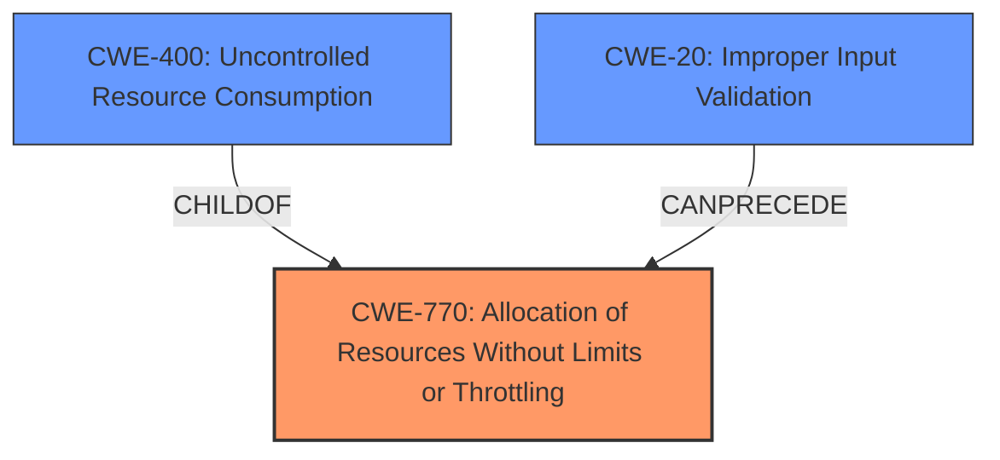

# Enhanced Analysis for CVE-2024-10650

# Summary
| CWE ID | CWE Name | Confidence | CWE Abstraction Level | CWE Vulnerability Mapping Label | CWE-Vulnerability Mapping Notes |
|---|---|---|---|---|---|
| CWE-770 | Allocation of Resources Without Limits or Throttling | 0.8 | Base | Allowed | Primary CWE |
| CWE-400 | Uncontrolled Resource Consumption | 0.6 | Class | Discouraged | Secondary Candidate |
| CWE-20 | Improper Input Validation | 0.5 | Class | Discouraged | Secondary Candidate |

## Evidence and Confidence

*   **Confidence Score:** 0.7
*   **Evidence Strength:** MEDIUM

## Relationship Analysis
The primary CWE, CWE-770, is a base-level weakness describing the **allocation of resources without limits or throttling**. It is related to CWE-400 (Uncontrolled Resource Consumption) as a child. CWE-20 (Improper Input Validation) can precede CWE-770 as a means to control resource allocation. The relationships indicate that the **lack of limits or throttling** (CWE-770) leads to **uncontrolled resource consumption** (CWE-400) possibly due to **improper input validation** (CWE-20).



## Vulnerability Chain
The vulnerability chain starts with the **lack of resource limits and throttling** (CWE-770). This leads to the system being overwhelmed by large data payloads, causing **uncontrolled resource consumption** (CWE-400). The large data payloads are possible because of a **vector** of "large data payloads using a multipart boundary". **Improper Input Validation** (CWE-20) could be a contributing factor, though not explicitly stated.
The root cause is the **allocation of resources without limits**.

## Summary of Analysis
The analysis identifies CWE-770 as the primary weakness due to the **lack of limits or throttling** on resource allocation, which aligns directly with the vulnerability description. The vulnerability description mentions that the vulnerability can be exploited by "sending large data payloads using a multipart boundary."
The selection of CWE-770 is supported by its Base abstraction level and ALLOWED usage. CWE-400 is a related impact of the weakness which is the service becoming unavailable. CWE-20 is added as a secondary weakness, since it could be an exploitable vector.

Relevant CWE Information:

# Enhanced Context (25 CWEs)
The following CWEs were identified as potentially relevant to this vulnerability:

## CWE-770: Allocation of Resources Without Limits or Throttling
**Abstraction Level**: base
**Similarity Score**: 4.33
**Source**: graph

**Description**:
CWE-770: Allocation of Resources Without Limits or Throttling

**Mapping Guidance**:
- Usage: Allowed
- Rationale: This CWE entry is at the Base level of abstraction, which is a preferred level of abstraction for mapping to the root causes of vulnerabilities.

**Relationships**:
- PARENTOF -> CWE-789
- PARENTOF -> CWE-774
- CANFOLLOW -> CWE-20
- PARENTOF -> CWE-1325
- CHILDOF -> CWE-400

### Detailed Analysis and Justification for CWE Selection:

1.  **CWE-770: Allocation of Resources Without Limits or Throttling**
    *   **Explanation:** This CWE accurately describes the root cause of the vulnerability. The system **allocates resources without proper limits or throttling**, allowing an attacker to exhaust resources and cause a denial of service.
    *   **Evidence:** The vulnerability description states that the DoS can be exploited by "sending large data payloads using a multipart boundary," indicating a **lack of limits** on the size or number of requests that the system processes.
    *   **Abstraction Level:** Base
    *   **Usage:** Allowed
    *   **Relationship:** It is a child of CWE-400, but CWE-770 is more specific to the **allocation** issue itself.
    *   **Confidence:** 0.8

2.  **CWE-400: Uncontrolled Resource Consumption**
    *   **Explanation:** This CWE represents the impact of the vulnerability. The **uncontrolled consumption of resources** leads to the denial of service.
    *   **Evidence:** The vulnerability description explicitly mentions "Denial of Service" and "unavailability of the service," indicating that the system's resources are being exhausted.
    *   **Abstraction Level:** Class
    *   **Usage:** Discouraged due to its high-level nature. However, it is still relevant as it describes the impact.
    *   **Relationship:** It is a parent of CWE-770, but CWE-770 is a better fit for the root cause.
    *   **Confidence:** 0.6

3.  **CWE-20: Improper Input Validation**
    *   **Explanation:** Although not explicitly stated, **improper input validation** could contribute to the vulnerability. The system might not be properly validating the size or format of the incoming data payloads, which allows the attacker to send large amounts of data.
    *   **Evidence:** The "large data payloads using a multipart boundary" suggest the lack of proper input validation.
    *   **Abstraction Level:** Class
    *   **Usage:** Discouraged, but relevant because the **lack of proper input validation** can contribute to the problem.
    *   **Relationship:** Can precede CWE-770 as a means to control resource allocation.
    *   **Confidence:** 0.5

### CWEs Considered But Not Used:

*   **CWE-306: Missing Authentication for Critical Function** - While the description mentions the exploitation now requires low privilege if authentication is enabled, the main vulnerability is the resource allocation issue.
*   **CWE-1284: Improper Validation of Specified Quantity in Input** - This is similar to CWE-20, but less general and requires more specific evidence about quantity validation, which is lacking.
*   **CWE-287: Improper Authentication** - Authentication is mentioned as a factor for privilege, but the primary issue is resource exhaustion.
*   **CWE-401: Missing Release of Memory after Effective Lifetime** - Not directly relevant as the issue is resource allocation, not memory leaks.
*   **CWE-367: Time-of-check Time-of-use (TOCTOU) Race Condition** - No evidence of race conditions.
*   **CWE-121: Stack-based Buffer Overflow** - No evidence of buffer overflows.
*   **CWE-1325: Improperly Controlled Sequential Memory Allocation** - Too specific to memory allocation, while the issue is broader resource allocation.


## CWE Relationship Analysis

Current CWEs represent these abstraction levels: .


### Vulnerability Chain Analysis

**Chain starting from CWE-1284:**
- 1284 (Improper Validation of Specified Quantity in Input) - ROOT


**Chain starting from CWE-400:**
- 400 (Uncontrolled Resource Consumption) - ROOT


### CWE Relationship Diagram

```mermaid
graph TD
    classDef primary fill:#f96,stroke:#333,stroke-width:2px
    classDef secondary fill:#69f,stroke:#333
    classDef tertiary fill:#9e9,stroke:#333
```