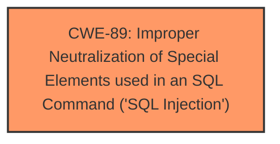

# Raw Analyzer Response for CVE-2024-10700

# Summary
| CWE ID | CWE Name | Confidence | CWE Abstraction Level | CWE Vulnerability Mapping Label | CWE-Vulnerability Mapping Notes |
|---|---|---|---|---|---|
| CWE-89 | Improper Neutralization of Special Elements used in an SQL Command ('SQL Injection') | 1.0 | Base | Primary | Allowed |

## Evidence and Confidence

*   **Confidence Score:** 1.0
*   **Evidence Strength:** HIGH

## Relationship Analysis
The primary relationship considered was the direct match of the vulnerability description to the definition and examples of CWE-89. The retriever results strongly supported this selection. No other relationships significantly influenced the decision.

## Vulnerability Chain
The vulnerability chain is simple: **Improper Neutralization of Special Elements used in an SQL Command** leads directly to SQL Injection, allowing for database compromise.

## Summary of Analysis
The analysis is based strongly on the evidence provided within the vulnerability description, which clearly states the presence of **SQL Injection** due to the **improper neutralization** of input. The "CVE Reference Links Content Summary" confirms this by highlighting the lack of proper sanitization of the `name` parameter when constructing SQL queries.

The retriever results also strongly suggest CWE-89 as the most appropriate mapping. The evidence is direct and compelling, leading to high confidence in the assessment.

CWE-79, CWE-434, CWE-1336, CWE-352, CWE-1391, CWE-99, CWE-78, CWE-472, and CWE-73 were considered but not selected. CWE-79 was not selected because the vulnerability is specifically related to SQL injection, not cross-site scripting. CWE-434 was not selected because it relates to unrestricted file uploads, which is not mentioned in the description. CWE-1336 was not selected since the vulnerability doesn't use a template engine. CWE-352 was not selected because it relates to Cross-Site Request Forgery (CSRF), and that is not indicated in the vulnerability description. CWE-1391 was not selected since there is no mention of weak credentials. CWE-99 was not selected because the vulnerability does not directly involve the improper control of resource identifiers. CWE-78 was not selected because the vulnerability relates to SQL commands, not OS commands. CWE-472 and CWE-73 were not selected because the vulnerability does not involve external control of assumed-immutable web parameters or external control of file names or paths, respectively. All of these other candidates were less specific and less relevant than CWE-89.