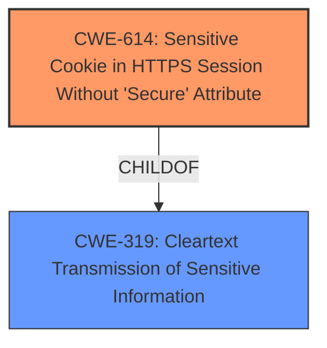

# Raw Analyzer Response for CVE-2024-10718

# Summary
| CWE ID | CWE Name | Confidence | CWE Abstraction Level | CWE Vulnerability Mapping Label | CWE-Vulnerability Mapping Notes |
|---|---|---|---|---|---|
| CWE-614 | Sensitive Cookie in HTTPS Session Without 'Secure' Attribute | 1.0 | Variant | Allowed | Primary CWE. The **missing Secure attribute for sensitive cookies** is the root cause. |
| CWE-319 | Cleartext Transmission of Sensitive Information | 0.7 | Base | Allowed | Secondary candidate. The impact of the missing attribute is transmitting sensitive information in cleartext. |

## Evidence and Confidence

*   **Confidence Score:** 0.9
*   **Evidence Strength:** HIGH

## Relationship Analysis
The primary relationship that influenced my decision was the parent-child relationship between CWE-319 (Cleartext Transmission of Sensitive Information) and CWE-614 (Sensitive Cookie in HTTPS Session Without 'Secure' Attribute). CWE-614 is a specific variant of CWE-319, focusing on the case where sensitive cookies are transmitted without the Secure attribute. The vulnerability description explicitly mentions the **missing Secure attribute for sensitive cookies**, making CWE-614 the more specific and appropriate choice as the primary CWE.

## Vulnerability Chain
The vulnerability chain starts with the **missing Secure attribute for sensitive cookies** (CWE-614), which leads to the potential **exposure of sensitive information** and **transmission of cookies in plaintext over an HTTP session** (CWE-319). The root cause is the **missing Secure attribute**, and the impact is the potential for cleartext transmission and interception of sensitive data.

## Summary of Analysis
My analysis is primarily based on the provided evidence, which includes the vulnerability description and CVE Reference Links Content Summary. The vulnerability description explicitly mentions the **missing Secure attribute for sensitive cookies**, making CWE-614 a direct and accurate match. The CVE Reference Links Content Summary confirms this, stating that "Cookies were being set without the `Secure` attribute." The provided code changes, specifically adding `$this->isHttps()` to the `setcookie_samesite` function calls, further support this classification.

The hierarchical relationship between CWE-614 and CWE-319 reinforces the selection of CWE-614 as the primary CWE. While CWE-319 describes the general problem of cleartext transmission, CWE-614 provides a more specific and relevant classification for this vulnerability. The retriever scores also support this decision, with CWE-614 having the highest score.

I considered other CWEs from the Retriever Results, such as CWE-1004 (Sensitive Cookie Without 'HttpOnly' Flag), but this CWE is not applicable since the vulnerability description does not mention the HttpOnly flag. Similarly, CWE-201 (Insertion of Sensitive Information Into Sent Data) and CWE-312 (Cleartext Storage of Sensitive Information) are not as relevant as CWE-614, as they do not specifically address the issue of **missing Secure attribute for cookies**. CWE-327 (Use of a Broken or Risky Cryptographic Algorithm) is also not applicable, as the vulnerability does not involve any cryptographic algorithms.

My selected CWEs are at the optimal level of specificity because they accurately capture the root cause and potential impact of the vulnerability. CWE-614 directly addresses the **missing Secure attribute for sensitive cookies**, and CWE-319 describes the potential consequence of cleartext transmission.

Relevant CWE Information:

*   **CWE-614: Sensitive Cookie in HTTPS Session Without 'Secure' Attribute**
    *   Technical Explanation: This CWE occurs when a web application sets a cookie containing sensitive information but fails to set the "Secure" attribute. As a result, the cookie can be transmitted over insecure HTTP connections, making it vulnerable to interception by attackers.
    *   Security Implications: Attackers can intercept the cookie and potentially hijack a user's session, gaining unauthorized access to sensitive data and functionality.
    *   Relationship Analysis: CWE-614 is a variant of CWE-319 (Cleartext Transmission of Sensitive Information), representing a specific case where sensitive cookies are transmitted in cleartext due to the **missing Secure attribute**.
    *   Mapping Guidance: The MITRE mapping guidance ALLOWED for this CWE, since it is at the Variant level of abstraction, which is a preferred level of abstraction for mapping to the root causes of vulnerabilities.
*   **CWE-319: Cleartext Transmission of Sensitive Information**
    *   Technical Explanation: This CWE occurs when a product transmits sensitive data in cleartext over a communication channel that can be sniffed by unauthorized actors.
    *   Security Implications: Attackers can intercept the sensitive data, potentially gaining access to confidential information, user credentials, or other sensitive resources.
    *   Relationship Analysis: CWE-319 is a parent of CWE-614 (Sensitive Cookie in HTTPS Session Without 'Secure' Attribute), representing a more general case of cleartext transmission.
    *   Mapping Guidance: The MITRE mapping guidance ALLOWED for this CWE, since it is at the Base level of abstraction, which is a preferred level of abstraction for mapping to the root causes of vulnerabilities.