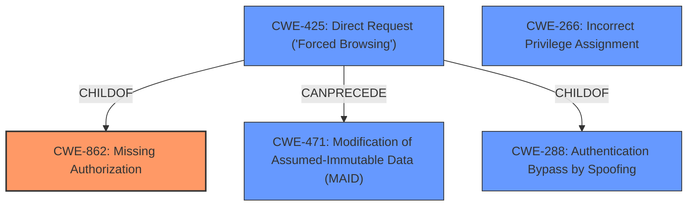

# Raw Analyzer Response for CVE-2024-10729

# Summary

| CWE ID  | CWE Name                                                                    | Confidence | CWE Abstraction Level | CWE Vulnerability Mapping Label | CWE-Vulnerability Mapping Notes |
| :-------- | :-------------------------------------------------------------------------- | :--------- | :-------------------- | :------------------------------ | :------------------------------ |
| CWE-862   | Missing Authorization                                                       | 1          | Class                 | Primary                         | Allowed-with-Review           |
| CWE-266   | Incorrect Privilege Assignment                                              | 0.6        | Base                  | Secondary                       | Allowed                       |
| CWE-425   | Direct Request ('Forced Browsing')                                          | 0.5        | Base                  | Secondary                       | Allowed                       |

## Evidence and Confidence

*   **Confidence Score:** 0.8
*   **Evidence Strength:** HIGH

## Relationship Analysis

The primary weakness is CWE-862, Missing Authorization, because the `save_google_calendar_data` function lacks any authorization checks. The relationship analysis reveals that CWE-862 is a Class-level CWE, and its child CWE, CWE-425 Direct Request ('Forced Browsing'), is considered. CWE-425 is also related to CWE-288 and CWE-471. The privilege and permission guidance suggests that CWE-266 Incorrect Privilege Assignment could also apply if the root cause was due to misconfigured roles.

## Vulnerability Chain

The vulnerability chain starts with the **missing capability check** (CWE-862), leading to unauthorized modification of data. An authenticated attacker with subscriber-level permissions can then update site options arbitrarily, potentially leading to complete compromise, data exposure, or denial of service.

## Summary of Analysis

The primary assessment is based on the explicit statement in the vulnerability description: "missing capability check on the save_google_calendar_data function". This directly corresponds to CWE-862, Missing Authorization. The retriever results also list CWE-862 as the top candidate. While other CWEs like CWE-266 and CWE-425 were considered, CWE-862 is the most direct representation of the root cause. CWE-862 is at the Class level, which is higher than ideal, but no more specific CWE is present that describes the root cause.

Relevant CWE Information:

# Enhanced Context (25 CWEs)
The following CWEs were identified as potentially relevant to this vulnerability:

## CWE-472: External Control of Assumed-Immutable Web Parameter
**Abstraction Level**: Base
**Similarity Score**: 0.79
**Source**: dense

**Description**:
The web application does not sufficiently verify inputs that are assumed to be immutable but are actually externally controllable, such as hidden form fields.

**Mapping Guidance**:
- Usage: Allowed
- Rationale: This CWE entry is at the Base level of abstraction, which is a preferred level of abstraction for mapping to the root causes of vulnerabilities.

## Complete CWE Specifications

CWE-862: Missing Authorization
The product does not perform an authorization check when an actor attempts to access a resource or perform an action.

CWE-266: Incorrect Privilege Assignment
A product incorrectly assigns a privilege to a particular actor, creating an unintended sphere of control for that actor.

CWE-425: Direct Request ('Forced Browsing')
The web application does not adequately enforce appropriate authorization on all restricted URLs, scripts, or files.