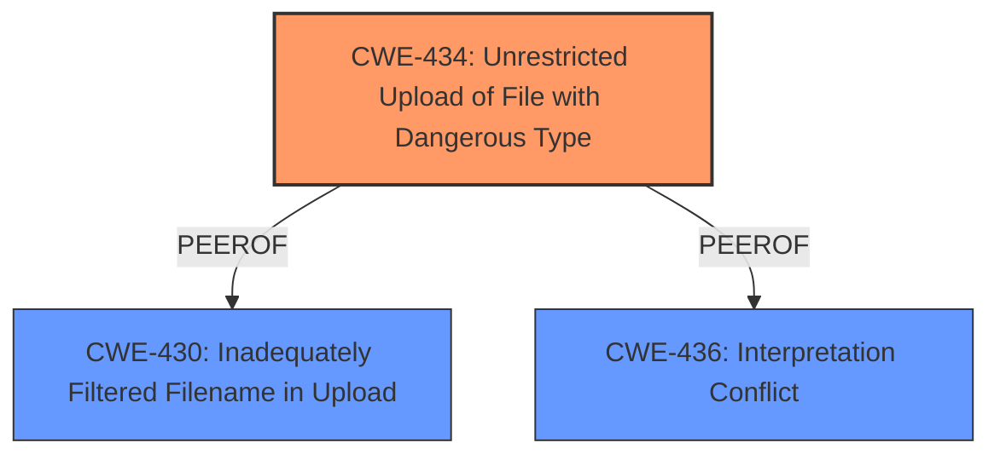

# Analysis Report for CVE-2024-10764

# Vulnerability Analysis Report: CVE-2024-10764

## Description

A vulnerability classified as critical has been found in Codezips Online Institute Management System 1.0. This affects an unknown part of the file /pages/save_user.php. The manipulation of the argument image leads to **unrestricted upload**. It is possible to initiate the attack remotely. The exploit has been disclosed to the public and may be used.

## Vulnerability Description Key Phrases

- **Weakness:** unrestricted upload
- **Vector:** manipulation of image argument
- **Product:** Codezips Online Institute Management System
- **Version:** 1
- **Component:** /pages/save_user.php

## Analysis (with Relationship Data)

# Summary
| CWE ID | CWE Name | Confidence | CWE Abstraction Level | CWE Vulnerability Mapping Label | CWE-Vulnerability Mapping Notes |
|---|---|---|---|---|---|
| CWE-434 | Unrestricted Upload of File with Dangerous Type | 1 | Base | Allowed | Primary CWE |

## Evidence and Confidence

*   **Confidence Score:** 1
*   **Evidence Strength:** HIGH

## Relationship Analysis
The primary relationship considered was the direct match of the vulnerability description to the CWE-434 description. There are peer and chain relationships for CWE-434, however those did not influence the decision for this particular vulnerability description. The Abstraction Level is Base which is the preferred level.



## Vulnerability Chain
The vulnerability chain starts with the **unrestricted upload** (**CWE-434**) due to lack of input validation and sanitization of file uploads. This leads to file overwrite, file injection, directory traversal attacks, denial of service attacks, and potential remote code execution (RCE).

## Summary of Analysis
The primary CWE selected is based on the clear description of **unrestricted upload** of files. The evidence from the vulnerability description and the CVE reference links content summary directly supports this classification. The retriever results also list CWE-434 as a highly relevant candidate.

The vulnerability description states that the manipulation of the 'image' argument leads to **unrestricted upload**. The CVE reference summary details the **root cause** as a lack of input validation and sanitization for file uploads. This aligns precisely with the definition of CWE-434 (Unrestricted Upload of File with Dangerous Type).

CWE-434 is at the Base level of abstraction, which is preferred for root cause analysis. The mapping guidance for CWE-434 states that its usage is "Allowed" and the rationale is that it's at the Base level of abstraction.

I considered other CWEs such as CWE-22 (Path Traversal), CWE-79 (Cross-Site Scripting), CWE-89 (SQL Injection), and CWE-96 (Static Code Injection) but they are not as directly relevant as CWE-434. The vulnerability's **root cause** is the ability to upload dangerous file types without restrictions, not necessarily path manipulation, script injection, SQL injection, or static code injection although those could be impacts if the attacker uploaded the correct files.

Relevant CWE Information:

# Enhanced Context (25 CWEs)
The following CWEs were identified as potentially relevant to this vulnerability:

## CWE-434: Unrestricted Upload of File with Dangerous Type
**Abstraction Level**: Base
**Similarity Score**: 0.83
**Source**: dense

**Description**:
The product allows the upload or transfer of dangerous file types that are automatically processed within its environment.

**Mapping Guidance**:
- Usage: Allowed
- Rationale: This CWE entry is at the Base level of abstraction, which is a preferred level of abstraction for mapping to the root causes of vulnerabilities.


## CWE Relationship Analysis

Current CWEs represent these abstraction levels: .


### Vulnerability Chain Analysis

**Chain starting from CWE-89:**
- 89 (Improper Neutralization of Special Elements used in an SQL Command ('SQL Injection')) - ROOT


**Chain starting from CWE-22:**
- 22 (Improper Limitation of a Pathname to a Restricted Directory ('Path Traversal')) - ROOT


### CWE Relationship Diagram

```mermaid
graph TD
    classDef primary fill:#f96,stroke:#333,stroke-width:2px
    classDef secondary fill:#69f,stroke:#333
    classDef tertiary fill:#9e9,stroke:#333
```


*Report generated on 2025-07-13 00:24:14*
