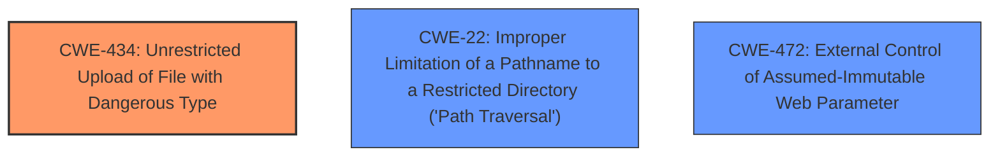

# Raw Analyzer Response for CVE-2024-10765

# Summary
| CWE ID  | CWE Name                                                                        | Confidence | CWE Abstraction Level | CWE Vulnerability Mapping Label | CWE-Vulnerability Mapping Notes |
|---------|---------------------------------------------------------------------------------|------------|-----------------------|---------------------------------|-----------------------------------|
| CWE-434 | Unrestricted Upload of File with Dangerous Type                                 | 1          | Base                  | Primary                           | Allowed                           |
| CWE-22  | Improper Limitation of a Pathname to a Restricted Directory ('Path Traversal') | 0.6        | Base                  | Secondary                         | Allowed                           |
| CWE-472 | External Control of Assumed-Immutable Web Parameter                             | 0.5        | Base                  | Secondary                         | Allowed                           |

## Evidence and Confidence

*   **Confidence Score:** 0.8
*   **Evidence Strength:** HIGH

## Relationship Analysis
The primary CWE is CWE-434 (Unrestricted Upload of File with Dangerous Type), which directly addresses the **unrestricted upload** vulnerability. CWE-22 (Improper Limitation of a Pathname to a Restricted Directory) and CWE-472 (External Control of Assumed-Immutable Web Parameter) are considered as secondary CWEs due to the potential for path traversal and the external control of the old_image parameter, respectively. The abstraction levels are all Base, providing a good level of specificity.

## Vulnerability Chain
The vulnerability chain starts with the **unrestricted upload** (**CWE-434**). Due to the lack of input validation, an attacker can manipulate the old_image argument in `/profile.php`. This can then lead to file overwrite, file injection, directory traversal (**CWE-22**), denial of service, or remote code execution. The external control of the old_image parameter (**CWE-472**) enables these attacks by allowing manipulation of the file storage location.

## Summary of Analysis
The primary weakness identified is **CWE-434 (Unrestricted Upload of File with Dangerous Type)**. The description explicitly mentions an **unrestricted upload** vulnerability, and the CVE Reference Links Content Summary confirms this by stating, "The system allows users to upload files without proper validation, making it vulnerable to various attacks." This aligns directly with CWE-434's description: "The product allows the upload or transfer of dangerous file types that are automatically processed within its environment."

Secondary considerations include **CWE-22 (Improper Limitation of a Pathname to a Restricted Directory ('Path Traversal'))** because the CVE Reference Links Content Summary mentions that an attacker could potentially traverse the directory structure. Additionally, **CWE-472 (External Control of Assumed-Immutable Web Parameter)** is considered because the vulnerability description mentions the manipulation of the `old_image` argument, indicating external control over a parameter that should ideally be immutable.

The selection of CWE-434 as the primary CWE is well-supported by the evidence and is at the appropriate base level of specificity. The additional CWEs (22 and 472) capture the potential for directory traversal and external parameter control, respectively, which are further consequences of the **unrestricted upload**.

The Retriever Results also supports **CWE-434** as a strong candidate.
The other CWEs listed in the Retriever Results such as CWE-89, CWE-79, CWE-96, and CWE-1336 represent different types of injection or neutralization issues, which are not the primary root cause in this scenario. The core issue is the **unrestricted upload** itself, rather than a failure to neutralize specific elements.

Relevant CWE Information:

# Enhanced Context (25 CWEs)
The following CWEs were identified as potentially relevant to this vulnerability:

## CWE-434: Unrestricted Upload of File with Dangerous Type
**Abstraction Level**: Base
**Similarity Score**: 0.83
**Source**: dense

**Description**:
The product allows the upload or transfer of dangerous file types that are automatically processed within its environment.

**Mapping Guidance**:
- Usage: Allowed
- Rationale: This CWE entry is at the Base level of abstraction, which is a preferred level of abstraction for mapping to the root causes of vulnerabilities.

## CWE-425: Direct Request ('Forced Browsing')
**Abstraction Level**: Base
**Similarity Score**: 0.77
**Source**: dense

**Description**:
The web application does not adequately enforce appropriate authorization on all restricted URLs, scripts, or files.

**Mapping Guidance**:
- Usage: Allowed
- Rationale: This CWE entry is at the Base level of abstraction, which is a preferred level of abstraction for mapping to the root causes of vulnerabilities.

## CWE-472: External Control of Assumed-Immutable Web Parameter
**Abstraction Level**: Base
**Similarity Score**: 0.76
**Source**: dense

**Description**:
The web application does not sufficiently verify inputs that are assumed to be immutable but are actually externally controllable, such as hidden form fields.

**Mapping Guidance**:
- Usage: Allowed
- Rationale: This CWE entry is at the Base level of abstraction, which is a preferred level of abstraction for mapping to the root causes of vulnerabilities.

## CWE-96: Improper Neutralization of Directives in Statically Saved Code ('Static Code Injection')
**Abstraction Level**: Base
**Similarity Score**: 0.76
**Source**: dense

**Description**:
The product receives input from an upstream component, but it does not neutralize or incorrectly neutralizes code syntax before inserting the input into an executable resource, such as a library, configuration file, or template.

**Mapping Guidance**:
- Usage: Allowed
- Rationale: This CWE entry is at the Base level of abstraction, which is a preferred level of abstraction for mapping to the root causes of vulnerabilities.

## CWE-89: Improper Neutralization of Special Elements used in an SQL Command ('SQL Injection')
**Abstraction Level**: Base
**Similarity Score**: 0.75
**Source**: dense

**Description**:
The product constructs all or part of an SQL command using externally-influenced input from an upstream component, but it does not neutralize or incorrectly neutralizes special elements that could modify the intended SQL command when it is sent to a downstream component. Without sufficient removal or quoting of SQL syntax in user-controllable inputs, the generated SQL query can cause those inputs to be interpreted as SQL instead of ordinary user data.

**Mapping Guidance**:
- Usage: Allowed
- Rationale: This CWE entry is at the Base level of abstraction, which is a preferred level of abstraction for mapping to the root causes of vulnerabilities.

## CWE-95: Improper Neutralization of Directives in Dynamically Evaluated Code ('Eval Injection')
**Abstraction Level**: Variant
**Similarity Score**: 0.75
**Source**: dense

**Description**:
The product receives input from an upstream component, but it does not neutralize or incorrectly neutralizes code syntax before using the input in a dynamic evaluation call (e.g. "eval").

**Mapping Guidance**:
- Usage: Allowed
- Rationale: This CWE entry is at the Variant level of abstraction, which is a preferred level of abstraction for mapping to the root causes of vulnerabilities.

## CWE-497: Exposure of Sensitive System Information to an Unauthorized Control Sphere
**Abstraction Level**: Base
**Similarity Score**: 0.74
**Source**: dense

**Description**:
The product does not properly prevent sensitive system-level information from being accessed by unauthorized actors who do not have the same level of access to the underlying system as the product does.

**Mapping Guidance**:
- Usage: Allowed
- Rationale: This CWE entry is at the Base level of abstraction, which is a preferred level of abstraction for mapping to the root causes of vulnerabilities.

## CWE-80: Improper Neutralization of Script-Related HTML Tags in a Web Page (Basic XSS)
**Abstraction Level**: Variant
**Similarity Score**: 0.74
**Source**: dense

**Description**:
The product receives input from an upstream component, but it does not neutralize or incorrectly neutralizes special characters such as "<", ">", and "&" that could be interpreted as web-scripting elements when they are sent to a downstream component that processes web pages.

**Mapping Guidance**:
- Usage: Allowed
- Rationale: This CWE entry is at the Variant level of abstraction, which is a preferred level of abstraction for mapping to the root causes of vulnerabilities.

## CWE-639: Authorization Bypass Through User-Controlled Key
**Abstraction Level**: Base
**Similarity Score**: 0.74
**Source**: dense

**Description**:
The system's authorization functionality does not prevent one user from gaining access to another user's data or record by modifying the key value identifying the data.

**Mapping Guidance**:
- Usage: Allowed
- Rationale: This CWE entry is at the Base