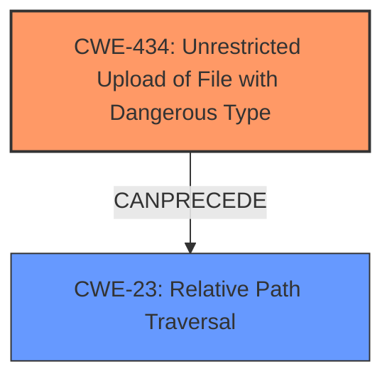

# Analysis Report for CVE-2024-10766

# Vulnerability Analysis Report: CVE-2024-10766

## Description

A vulnerability, which was classified as critical, has been found in Codezips Free Exam Hall Seating Management System 1.0. This issue affects some unknown processing of the file /pages/save_user.php. The manipulation of the argument image leads to **unrestricted upload**. The attack may be initiated remotely. The exploit has been disclosed to the public and may be used. The initial researcher disclosure contains confusing vulnerability classes and file names.

## Vulnerability Description Key Phrases

- **Weakness:** unrestricted upload
- **Product:** Codezips Free Exam Hall Seating Management System
- **Version:** 1
- **Component:** /pages/save_user.php

## Analysis (with Relationship Data)

# Summary
| CWE ID | CWE Name | Confidence | CWE Abstraction Level | CWE Vulnerability Mapping Label | CWE-Vulnerability Mapping Notes |
|---|---|---|---|---|---|
| CWE-434 | Unrestricted Upload of File with Dangerous Type | 1.0 | Base | Allowed | Primary CWE: The vulnerability is caused by the lack of restrictions on the type, size, or content of uploaded files. |
| CWE-23 | Relative Path Traversal | 0.7 | Base | Allowed | Secondary CWE: The lack of sanitization of the file path and filename allows attackers to perform directory traversal attacks. |

## Evidence and Confidence

*   **Confidence Score:** 0.9
*   **Evidence Strength:** HIGH

## Relationship Analysis
The primary CWE is CWE-434, which directly reflects the **unrestricted upload** vulnerability. CWE-23 is a potential consequence of the lack of input sanitization related to file paths, indicating a chain relationship where **improper upload** practices can lead to directory traversal. Both CWEs are at the Base abstraction level, providing specific details about the weaknesses.



## Vulnerability Chain
The vulnerability chain starts with the **unrestricted file upload** (CWE-434), which allows an attacker to upload arbitrary files. Due to the **lack of input sanitization**, this can lead to directory traversal (CWE-23), allowing the attacker to write files outside the intended directory. The ultimate impact can range from file overwrite to remote code execution.

## Summary of Analysis
The analysis is based on the provided vulnerability description and the CVE Reference Links Content Summary, which clearly states the **unrestricted file upload** vulnerability in `/pages/save_user.php` due to the direct usage of the `$_FILES` input without any validation or sanitization.

The primary CWE, CWE-434, is a direct match for the identified vulnerability. The retriever results also listed CWE-434 as a top candidate.

CWE-23 is a relevant secondary weakness, because the **lack of sanitization** of the file path and filename allows attackers to perform directory traversal attacks.

The selected CWEs are at the optimal level of specificity (Base), accurately representing the weaknesses identified in the vulnerability description.

Relevant CWE Information:

# Enhanced Context (25 CWEs)
The following CWEs were identified as potentially relevant to this vulnerability:

## CWE-434: Unrestricted Upload of File with Dangerous Type
**Abstraction Level**: Base
**Similarity Score**: 0.83
**Source**: dense

**Description**:
The product allows the upload or transfer of dangerous file types that are automatically processed within its environment.

**Mapping Guidance**:
- Usage: Allowed
- Rationale: This CWE entry is at the Base level of abstraction, which is a preferred level of abstraction for mapping to the root causes of vulnerabilities.

## CWE-23: Relative Path Traversal
**Abstraction Level**: Base
**Similarity Score**: 0.75
**Source**: dense

**Description**:
The product uses external input to construct a pathname that should be within a restricted directory, but it does not properly neutralize sequences such as ".." that can resolve to a location that is outside of that directory.

**Mapping Guidance**:
- Usage: Allowed
- Rationale: This CWE entry is at the Base level of abstraction, which is a preferred level of abstraction for mapping to the root causes of vulnerabilities.


## CWE Relationship Analysis

Current CWEs represent these abstraction levels: .


### Vulnerability Chain Analysis

**Chain starting from CWE-23:**
- 23 (Relative Path Traversal) - ROOT


**Chain starting from CWE-434:**
- 434 (Unrestricted Upload of File with Dangerous Type) - ROOT


### CWE Relationship Diagram

```mermaid
graph TD
    classDef primary fill:#f96,stroke:#333,stroke-width:2px
    classDef secondary fill:#69f,stroke:#333
    classDef tertiary fill:#9e9,stroke:#333
```


*Report generated on 2025-07-13 00:24:47*
