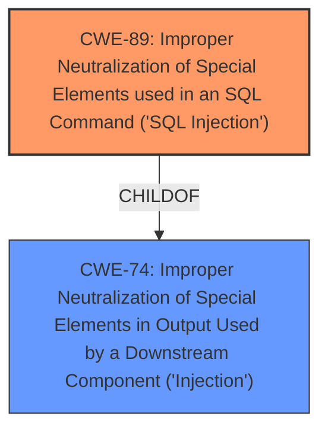

# Analysis Report for CVE-2024-10805

# Vulnerability Analysis Report: CVE-2024-10805

## Description

A vulnerability was found in code-projects University Event Management System 1.0. It has been classified as critical. This affects an unknown part of the file doedit.php. The manipulation of the argument id leads to **sql injection**. It is possible to initiate the attack remotely. The exploit has been disclosed to the public and may be used. The initial researcher advisory mentions a confusing product name to be affected. Other parameters might be affected as well.

## Vulnerability Description Key Phrases

- **Weakness:** sql injection
- **Product:** code-projects University Event Management System
- **Version:** 1
- **Component:** doedit.php

## Analysis (with Relationship Data)

# Summary
| CWE ID | CWE Name | Confidence | CWE Abstraction Level | CWE Vulnerability Mapping Label | CWE-Vulnerability Mapping Notes |
|---|---|---|---|---|---|
| CWE-89 | Improper Neutralization of Special Elements used in an SQL Command ('SQL Injection') | 1.0 | Base | Primary | Allowed |
| CWE-74 | Improper Neutralization of Special Elements in Output Used by a Downstream Component ('Injection') | 0.3 | Class | Secondary | Discouraged |

## Evidence and Confidence

*   **Confidence Score:** 1.0
*   **Evidence Strength:** HIGH

## Relationship Analysis
The primary relationship influencing the decision is the parent-child relationship between CWE-74 and CWE-89. CWE-89 is a specific type of CWE-74. Given that the vulnerability is explicitly identified as **SQL Injection**, CWE-89 is the more appropriate and specific choice. The Retriever Results also shows the highest score for CWE-89 with a score of 1.0.



## Vulnerability Chain
The vulnerability chain begins with the lack of input validation on the `id` parameter in `doedit.php`. This **missing** input validation leads directly to **SQL Injection** (CWE-89). The **SQL Injection** then allows for sensitive information disclosure, database manipulation, and potentially full system compromise.

## Summary of Analysis
The initial assessment strongly pointed to CWE-89 due to the explicit mention of **SQL Injection** in the vulnerability description and the CVE Reference Links Content Summary, which details the **lack of sanitization** of the `id` parameter. The Retriever results further supported this by giving the highest score for CWE-89.
The evidence is clear and directly supports the selection of CWE-89 as the primary weakness. The other CWEs were considered but ultimately deemed less relevant as they represent either broader categories (like CWE-74) or different types of vulnerabilities (like CWE-79, CWE-434).
CWE-89 is at the optimal level of specificity as it accurately captures the nature of the vulnerability.

Relevant CWE Information:

# Enhanced Context (25 CWEs)
The following CWEs were identified as potentially relevant to this vulnerability:

## CWE-89: Improper Neutralization of Special Elements used in an SQL Command ('SQL Injection')
**Abstraction Level**: Base
**Similarity Score**: 0.78
**Source**: dense

**Description**:
The product constructs all or part of an SQL command using externally-influenced input from an upstream component, but it does not neutralize or incorrectly neutralizes special elements that could modify the intended SQL command when it is sent to a downstream component. Without sufficient removal or quoting of SQL syntax in user-controllable inputs, the generated SQL query can cause those inputs to be interpreted as SQL instead of ordinary user data.

**Mapping Guidance**:
- Usage: Allowed
- Rationale: This CWE entry is at the Base level of abstraction, which is a preferred level of abstraction for mapping to the root causes of vulnerabilities.

**Technical Explanation**: The vulnerability description explicitly mentions "**sql injection**" resulting from manipulating the `id` argument in `doedit.php`. The CVE Reference Links Content Summary further details the **lack of input sanitization** of the `id` parameter before being used in an SQL query. This perfectly aligns with CWE-89, which describes the **improper neutralization** of special elements used in an SQL command.
**Security Implications**: An attacker can inject malicious SQL code to extract sensitive information, modify data, or potentially compromise the entire system.
**Relationship**: CWE-89 is a child of CWE-74 (Improper Neutralization of Special Elements in Output Used by a Downstream Component ('Injection')), but CWE-89 is much more specific.
**Mapping Guidance**: The Usage is "Allowed" for CWE-89.

## CWE-74: Improper Neutralization of Special Elements in Output Used by a Downstream Component ('Injection')
**Abstraction Level**: Class
**Similarity Score**: 0.76
**Source**: dense

**Description**:
The product constructs all or part of a command, data structure, or record using externally-influenced input from an upstream component, but it does not neutralize or incorrectly neutralizes special elements that could modify how it is parsed or interpreted when it is sent to a downstream component.

**Mapping Guidance**:
- Usage: Discouraged
- Rationale: CWE-74 is high-level and often misused when lower-level weaknesses are more appropriate.

**Technical Explanation**: CWE-74 is a more general case of injection vulnerabilities. While **SQL Injection** falls under this category, the specific nature of the vulnerability being an **SQL Injection** makes CWE-89 a better fit.
**Security Implications**: Similar to CWE-89, but less specific.
**Relationship**: CWE-89 is a child of CWE-74.
**Mapping Guidance**: The Usage is "Discouraged" for CWE-74.

## CWE-79: Improper Neutralization of Input During Web Page Generation ('Cross-site Scripting')
**Abstraction Level**: Base
**Similarity Score**: 0.76
**Source**: dense

**Description**:
The product does not neutralize or incorrectly neutralizes user-controllable input before it is placed in output that is used as a web page that is served to other users.

**Mapping Guidance**:
- Usage: Allowed
- Rationale: This CWE entry is at the Base level of abstraction, which is a preferred level of abstraction for mapping to the root causes of vulnerabilities.

**Technical Explanation**: This is not applicable because the vulnerability is **SQL Injection**, not Cross-Site Scripting.
**Security Implications**: N/A
**Relationship**: N/A
**Mapping Guidance**: N/A

## CWE-434: Unrestricted Upload of File with Dangerous Type
**Abstraction Level**: Base
**Similarity Score**: 0.77
**Source**: dense

**Description**:
The product allows the upload or transfer of dangerous file types that are automatically processed within its environment.

**Mapping Guidance**:
- Usage: Allowed
- Rationale: This CWE entry is at the Base level of abstraction, which is a preferred level of abstraction for mapping to the root causes of vulnerabilities.

**Technical Explanation**: This is not applicable because the vulnerability is **SQL Injection**, not an unrestricted file upload.
**Security Implications**: N/A
**Relationship**: N/A
**Mapping Guidance**: N/A

## CWE-1336: Improper Neutralization of Special Elements Used in a Template Engine
**Abstraction Level**: base
**Similarity Score**: 2.33
**Source**: graph

**Description**:
CWE-1336: Improper Neutralization of Special Elements Used in a Template Engine

**Mapping Guidance**:
- Usage: Allowed
- Rationale: This CWE entry is at the Base level of abstraction, which is a preferred level of abstraction for mapping to the root causes of vulnerabilities.

**Technical Explanation**: This is not applicable because the vulnerability is **SQL Injection**, not an issue with a template engine.
**Security Implications**: N/A
**Relationship**: N/A
**Mapping Guidance**: N/A

## CWE-352: Cross-Site Request Forgery (CSRF)
**Abstraction Level**: compound
**Similarity Score**: 2.63
**Source**: graph

**Description**:
CWE-352: Cross-Site Request Forgery (CSRF)

**Mapping Guidance**:
- Usage: Allowed
- Rationale: This is a well-known Composite of multiple weaknesses that must all occur simultaneously, although it is attack-oriented in nature.

**Technical Explanation**: This is not applicable because the vulnerability is **SQL Injection**, not a CSRF issue.
**Security Implications**: N/A
**Relationship**: N/A
**Mapping Guidance**: N/A


## CWE Relationship Analysis

Current CWEs represent these abstraction levels: .


### Vulnerability Chain Analysis

**Chain starting from CWE-89:**
- 89 (Improper Neutralization of Special Elements used in an SQL Command ('SQL Injection')) - ROOT


**Chain starting from CWE-79:**
- 79 (Improper Neutralization of Input During Web Page Generation ('Cross-site Scripting')) - ROOT


### CWE Relationship Diagram

```mermaid
graph TD
    classDef primary fill:#f96,stroke:#333,stroke-width:2px
    classDef secondary fill:#69f,stroke:#333
    classDef tertiary fill:#9e9,stroke:#333
```


*Report generated on 2025-07-13 00:26:18*
