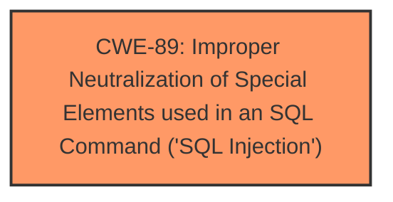

# Analysis for CVE-2024-10808

# Summary
| CWE ID | CWE Name | Confidence | CWE Abstraction Level | CWE Vulnerability Mapping Label | CWE-Vulnerability Mapping Notes |
|---|---|---|---|---|---|
| CWE-89 | Improper Neutralization of Special Elements used in an SQL Command ('SQL Injection') | 1.0 | Base | Allowed | Primary CWE |

## Evidence and Confidence

*   **Confidence Score:** 1.0
*   **Evidence Strength:** HIGH

## Relationship Analysis
The primary relationship impacting the decision is the direct match of the vulnerability description to the definition of CWE-89. The description explicitly states "**sql injection**" vulnerability, which aligns perfectly with CWE-89's focus on improper neutralization of special elements in SQL commands. Other CWEs were considered but deemed less relevant due to the clear indication of SQL injection.

## Vulnerability Chain
The vulnerability chain is direct:
1.  **Root Cause:** Improper neutralization of special elements in SQL commands (CWE-89).
2.  **Impact:** SQL Injection vulnerability allowing attackers to manipulate SQL queries.

## Summary of Analysis
The analysis is based on the vulnerability description, which explicitly states that the vulnerability is an "**sql injection**" affecting the `id` parameter in the `Admin/req_detail.php` file. This provides strong evidence for CWE-89 as the primary weakness.

The retriever results also strongly support CWE-89 as the top candidate.

The selected CWE is at the optimal level of specificity (Base) because it directly represents the root cause of the vulnerability, which is the **improper neutralization** of SQL special elements.

Relevant CWE Information:

# Enhanced Context (25 CWEs)
The following CWEs were identified as potentially relevant to this vulnerability:

## CWE-89: Improper Neutralization of Special Elements used in an SQL Command ('SQL Injection')
**Abstraction Level**: Base
**Similarity Score**: 1.00
**Source**: dense

**Description**:
The product constructs all or part of an SQL command using externally-influenced input from an upstream component, but it does not neutralize or incorrectly neutralizes special elements that could modify the intended SQL command when it is sent to a downstream component. Without sufficient removal or quoting of SQL syntax in user-controllable inputs, the generated SQL query can cause those inputs to be interpreted as SQL instead of ordinary user data.

**Mapping Guidance**:
- Usage: Allowed
- Rationale: This CWE entry is at the Base level of abstraction, which is a preferred level of abstraction for mapping to the root causes of vulnerabilities.

## CWE-79: Improper Neutralization of Input During Web Page Generation ('Cross-site Scripting')
**Abstraction Level**: Base
**Similarity Score**: 0.398
**Source**: sparse

**Description**:
The product does not neutralize or incorrectly neutralizes user-controllable input before it is placed in output that is used as a web page that is served to other users.

**Mapping Guidance**:
- Usage: Allowed
- Rationale: This CWE entry is at the Base level of abstraction, which is a preferred level of abstraction for mapping to the root causes of vulnerabilities.

*Explanation for not selecting other CWEs:*

*   **CWE-79 (Improper Neutralization of Input During Web Page Generation ('Cross-site Scripting'))**: While listed as a Top CWE for similar CVE descriptions, the description specifically mentions "sql injection," making CWE-79 less relevant.
*   **CWE-434 (Unrestricted Upload of File with Dangerous Type)**: This CWE is not relevant as the vulnerability is related to SQL injection, not file uploads.
*   **CWE-117 (Improper Output Neutralization for Logs)**: This CWE is not relevant as the vulnerability is related to SQL injection, not logging.
*   **CWE-1336 (Improper Neutralization of Special Elements Used in a Template Engine)**: This CWE is not relevant as the vulnerability is related to SQL injection, not template engines.
*   **CWE-99 (Improper Control of Resource Identifiers ('Resource Injection'))**: This CWE is not relevant as the vulnerability is related to SQL injection, not resource injection.
*   **CWE-1391 (Use of Weak Credentials)**: This CWE is not relevant as the vulnerability is related to SQL injection, not weak credentials.
*   **CWE-352 (Cross-Site Request Forgery (CSRF))**: This CWE is not relevant as the vulnerability is related to SQL injection, not CSRF.
*   **CWE-96 (Improper Neutralization of Directives in Statically Saved Code ('Static Code Injection'))**: This CWE is not relevant as the vulnerability is related to SQL injection, not static code injection.
*   **CWE-73 (External Control of File Name or Path)**: This CWE is not relevant as the vulnerability is related to SQL injection, not file path manipulation.