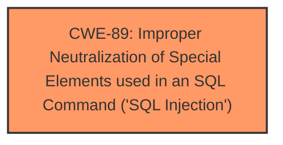

# Raw Analyzer Response for CVE-2024-10809

# Summary
| CWE ID | CWE Name | Confidence | CWE Abstraction Level | CWE Vulnerability Mapping Label | CWE-Vulnerability Mapping Notes |
|---|---|---|---|---|---|
| CWE-89 | Improper Neutralization of Special Elements used in an SQL Command ('SQL Injection') | 1.0 | Base | Allowed | Primary CWE: The root cause is **SQL injection** due to **improper neutralization** of special elements in an SQL command. |

## Evidence and Confidence

*   **Confidence Score:** 1.0
*   **Evidence Strength:** HIGH

## Relationship Analysis
The primary relationship that influenced the decision was the direct match of the vulnerability description to the definition of CWE-89. While other CWEs were considered, none provided as direct a link to the **SQL injection** vulnerability detailed in the description.

## Vulnerability Chain
The vulnerability chain is direct:
1.  **Root Cause:** **Improper neutralization** of special elements in SQL commands (CWE-89) in the `chat.php` file.
2.  **Impact:** **SQL Injection** leading to potential database compromise, data breach, or arbitrary code execution.

## Summary of Analysis
The analysis is based on the provided evidence, which explicitly states that the vulnerability is an **SQL injection** due to the **improper neutralization** of the `name` and `message` parameters in the SQL query within the `chat.php` file.

The `Vulnerability Description Key Phrases` section calls out the **weakness** as **sql injection**. The `CVE Reference Links Content Summary` section further reinforces this by stating the "root cause is the lack of proper input sanitization" and identifies the primary vulnerability as a "classic SQL injection."

The retriever results also strongly support this, with CWE-89 having the highest similarity score.

CWE-89 is the optimal level of specificity as it directly addresses the root cause of the vulnerability, which is the **improper neutralization** of special elements used in an SQL command.

Relevant CWE Information:

# Enhanced Context (25 CWEs)
The following CWEs were identified as potentially relevant to this vulnerability:

## CWE-89: Improper Neutralization of Special Elements used in an SQL Command ('SQL Injection')
**Abstraction Level**: Base
**Similarity Score**: 0.79
**Source**: dense

**Description**:
The product constructs all or part of an SQL command using externally-influenced input from an upstream component, but it does not neutralize or incorrectly neutralizes special elements that could modify the intended SQL command when it is sent to a downstream component. Without sufficient removal or quoting of SQL syntax in user-controllable inputs, the generated SQL query can cause those inputs to be interpreted as SQL instead of ordinary user data.

**Mapping Guidance**:
- Usage: Allowed
- Rationale: This CWE entry is at the Base level of abstraction, which is a preferred level of abstraction for mapping to the root causes of vulnerabilities.

## CWE-472: External Control of Assumed-Immutable Web Parameter
This CWE was considered but not selected because the vulnerability isn't about the external control of assumed-immutable parameters, but directly about **SQL injection**.

## CWE-80: Improper Neutralization of Script-Related HTML Tags in a Web Page (Basic XSS)
This CWE was considered but not selected because the vulnerability is about **SQL injection**, not Cross-Site Scripting (XSS).

## CWE-434: Unrestricted Upload of File with Dangerous Type
This CWE was considered but not selected because the vulnerability is about **SQL injection**, not about file uploads.

## CWE-74: Improper Neutralization of Special Elements in Output Used by a Downstream Component ('Injection')
This CWE was considered but not selected because it is a high-level class, and CWE-89 is a more specific base class that directly addresses the **SQL injection**.

## CWE-79: Improper Neutralization of Input During Web Page Generation ('Cross-site Scripting')
This CWE was considered but not selected because the vulnerability is about **SQL injection**, not Cross-Site Scripting (XSS).

## CWE-116: Improper Encoding or Escaping of Output
This CWE was considered but not selected because, while encoding/escaping issues can contribute to injection vulnerabilities, the core issue here is the **improper neutralization** leading directly to **SQL injection**.

## CWE-425: Direct Request ('Forced Browsing')
This CWE was considered but not selected because the vulnerability is about **SQL injection**, not about authorization issues.

## CWE-96: Improper Neutralization of Directives in Statically Saved Code ('Static Code Injection')
This CWE was considered but not selected because the vulnerability is about **SQL injection**, not static code injection.

## CWE-790: Improper Filtering of Special Elements
This CWE was considered but not selected because it is a class-level CWE.

## CWE-89: Improper Neutralization of Special Elements used in an SQL Command ('SQL Injection')
**Abstraction Level**: Base
**Similarity Score**: 1495.63
**Source**: sparse

**Description**:
The product constructs all or part of an SQL command using externally-influenced input from an upstream component, but it does not neutralize or incorrectly neutralizes special elements that could modify the intended SQL command when it is sent to a downstream component. Without sufficient removal or quoting of SQL syntax in user-controllable inputs, the generated SQL query can cause those inputs to be interpreted as SQL instead of ordinary user data.

**Mapping Guidance**:
- Usage: Allowed
- Rationale: This CWE entry is at the Base level of abstraction, which is a preferred level of abstraction for mapping to the root causes of vulnerabilities.

## CWE-116: Improper Encoding or Escaping of Output
This CWE was considered but not selected because, while encoding/escaping issues can contribute to injection vulnerabilities, the core issue here is the **improper neutralization** leading directly to **SQL injection**.

## CWE-79: Improper Neutralization of Input During Web Page Generation ('Cross-site Scripting')
This CWE was considered but not selected because the vulnerability is about **SQL injection**, not Cross-Site Scripting (XSS).

## CWE-138: Improper Neutralization of Special Elements
This CWE was considered but not selected because it is a class-level CWE.

## CWE-434: Unrestricted Upload of File with Dangerous Type
This CWE was considered but not selected because the vulnerability is about **SQL injection**, not about file uploads.

## CWE-73: External Control of File Name or Path
This CWE was considered but not selected because the vulnerability is about **SQL injection**, not file path manipulation.

## CWE-79: Improper Neutralization of Input During Web Page Generation ('Cross-site Scripting')
This CWE was considered but not selected because the vulnerability is about **SQL injection**, not Cross-Site Scripting (XSS).

## CWE-434: Unrestricted Upload of File with Dangerous Type
This CWE was considered but not selected because the vulnerability is about **SQL injection**, not about file uploads.

## CWE-352: Cross-Site Request Forgery (CSRF)
This CWE was considered but not selected because the vulnerability is about **SQL injection**, not CSRF.

## CWE-113: Improper Neutralization of CRLF Sequences in HTTP Headers ('HTTP Request/Response Splitting')
This CWE was considered but not selected because the vulnerability is about **SQL injection**, not HTTP request/response splitting.

## CWE-94: Improper Control of Generation of Code ('Code Injection')
This CWE was considered but not selected because CWE-89 is a better fit.

## CWE-78: Improper Neutralization of Special Elements used in an OS Command ('OS Command Injection')
This CWE was considered but not selected because the vulnerability is about **SQL injection**, not OS command injection.

## CWE-1336: Improper Neutralization of Special Elements Used in a Template Engine
This CWE was considered but not selected because the vulnerability is about **SQL injection**, not template engine injection.

## CWE-494: Download of Code Without Integrity Check
This CWE was considered but not selected because the vulnerability is about **SQL injection**, not download of code.

## CWE-22: Improper Limitation of a Pathname to a Restricted Directory ('Path Traversal')
This CWE was considered but not selected because the vulnerability is about **SQL injection**, not path traversal.