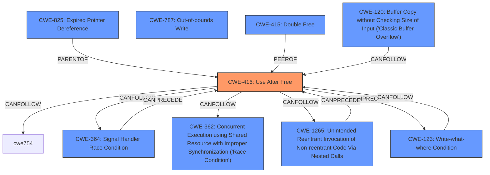

# Raw Analyzer Response for CVE-2024-10827

# Summary

| CWE ID | CWE Name | Confidence | CWE Abstraction Level | CWE Vulnerability Mapping Label | CWE-Vulnerability Mapping Notes |
|---|---|---|---|---|---|
| CWE-416 | Use After Free | 1.0 | Variant |  Primary CWE | Allowed |

## Evidence and Confidence

*   **Confidence Score:** 1.0
*   **Evidence Strength:** HIGH

## Relationship Analysis
The primary relationship that influenced the selection of CWE-416 is its direct applicability to the **use-after-free** vulnerability described. While other CWEs like CWE-415 (Double Free) and CWE-787 (Out-of-bounds Write) are related to memory management issues, CWE-416 specifically addresses the condition where memory is accessed after it has been freed. The Retriever results also support this decision, listing CWE-416 as the top candidate. Other potential CWEs, such as those related to race conditions, are less directly relevant based on the provided information.

## Vulnerability Chain
The vulnerability chain starts with the **use-after-free** condition, where memory is accessed after it has been freed. This can lead to heap corruption. The final impact is the potential to exploit heap corruption via a crafted HTML page, allowing a remote attacker to execute arbitrary code or cause a denial-of-service.

## Summary of Analysis
The analysis is primarily based on the explicit mention of "**use after free**" in both the vulnerability description and the CVE Reference Links Content Summary. The evidence is strong, as the vulnerability description key phrases specifically highlight "**rootcause:** **use after free**". The Retriever results further confirm that CWE-416 is the most appropriate classification. The selection of CWE-416 is at the optimal level of specificity because it directly addresses the core weakness described in the vulnerability.
CWE-416 is a Variant, which is a preferred level of abstraction for mapping to the root causes of vulnerabilities.

Other CWEs Considered:

*   CWE-366 (Race Condition within a Thread), CWE-362 (Concurrent Execution using Shared Resource with Improper Synchronization ('Race Condition')): While concurrency issues can sometimes lead to use-after-free vulnerabilities, there's no explicit mention of concurrency in the provided description. Thus, these are less likely.
*   CWE-415 (Double Free): While related to memory management, it's distinct from use-after-free. Double free involves freeing the same memory twice, whereas use-after-free involves accessing memory after it has already been freed.
*   CWE-787 (Out-of-bounds Write): This describes a different memory corruption issue, where data is written beyond the boundaries of an allocated buffer. While heap corruption is mentioned as an impact, the root cause is specifically a **use after free**.
* CWE-120 (Buffer Copy without Checking Size of Input ('Classic Buffer Overflow')): The description doesn't indicate an overflowing buffer.
* CWE-843 (Access of Resource Using Incompatible Type ('Type Confusion')): The description doesn't indicate that there is **Access of Resource Using Incompatible Type**
* CWE-911 (Improper Update of Reference Count): There is no mention of reference count issue.