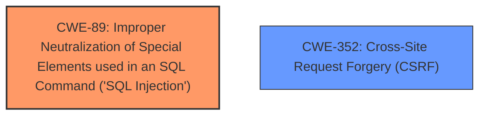

# Raw Analyzer Response for CVE-2024-10862

# Summary
| CWE ID | CWE Name | Confidence | CWE Abstraction Level | CWE Vulnerability Mapping Label | CWE-Vulnerability Mapping Notes |
|---|---|---|---|---|---|
| CWE-89 | Improper Neutralization of Special Elements used in an SQL Command ('SQL Injection') | 1.0 | Base | Primary | Allowed |
| CWE-352 | Cross-Site Request Forgery (CSRF) | 1.0 | Compound | Secondary | Allowed |

## Evidence and Confidence

*   **Confidence Score:** 1.0
*   **Evidence Strength:** HIGH

## Relationship Analysis
The primary weakness is CWE-89, which is a base-level CWE. CWE-352 is a compound CWE. There is no parent-child relationship between these two CWEs.

## Vulnerability Chain
The vulnerability chain starts with **insufficient escaping on the user supplied parameter and lack of sufficient preparation on the existing SQL query** (CWE-89). The lack of nonce validation on the get_table_records AJAX action leads to CSRF (CWE-352). The impact is that an unauthenticated attacker can extract sensitive information from the database and append additional SQL queries.

## Summary of Analysis
The vulnerability is an SQL injection vulnerability (CWE-89) that can be exploited via CSRF (CWE-352) due to a lack of nonce validation.

The vulnerability description clearly states that there is **insufficient escaping on the user supplied parameter and lack of sufficient preparation on the existing SQL query**, which directly maps to CWE-89. "The NEX-Forms plugin is vulnerable to SQL injection due to insufficient escaping of the user-supplied 'search_params' parameter and a **lack of sufficient preparation on the existing SQL query**."

The vulnerability description also states that "This can be exploited via CSRF due to a lack of nonce validation on the get_table_records AJAX action," which directly maps to CWE-352. "The CSRF vulnerability allows them to perform this action on behalf of an authenticated user."

I considered other CWEs from the retriever results, such as CWE-116, CWE-434, CWE-73, and CWE-90, but they were not as relevant as CWE-89 and CWE-352. CWE-89 and CWE-352 are at the optimal level of specificity and accurately represent the vulnerability.

Relevant CWE Information:

# Enhanced Context (25 CWEs)
The following CWEs were identified as potentially relevant to this vulnerability:

## CWE-352: Cross-Site Request Forgery (CSRF)
**Abstraction Level**: Compound
**Similarity Score**: 0.72
**Source**: dense

**Description**:
The web application does not, or can not, sufficiently verify whether a well-formed, valid, consistent request was intentionally provided by the user who submitted the request.

**Mapping Guidance**:
- Usage: Allowed
- Rationale: This is a well-known Composite of multiple weaknesses that must all occur simultaneously, although it is attack-oriented in nature.

**Technical Explanation**:
The NEX-Forms Ultimate Form Builder Contact forms and much more plugin for WordPress is vulnerable to SQL Injection via the search_params parameter in all versions up to, and including, 8.7.13 due to **insufficient escaping on the user supplied parameter and lack of sufficient preparation on the existing SQL query**. This makes it possible for unauthenticated attackers to append additional SQL queries into already existing queries that can be used to extract sensitive information from the database. This can be exploited via CSRF due to a lack of nonce validation on the get_table_records AJAX action. The lack of nonce validation allows an attacker to forge requests on behalf of an authenticated user, leading to the CSRF vulnerability.
**Security Implications**:
An attacker can trick an authenticated user into performing actions they did not intend to, such as extracting sensitive information from the database.
**CWE Relationships**:
None
**Mapping Guidance Analysis**:
The usage is ALLOWED, and the rationale states that this is a well-known Composite of multiple weaknesses that must all occur simultaneously.
**Mitigation Analysis**:
Implement proper nonce validation to prevent CSRF attacks.

## CWE-89: Improper Neutralization of Special Elements used in an SQL Command ('SQL Injection')
**Abstraction Level**: Base
**Similarity Score**: 0.68
**Source**: dense

**Description**:
The product constructs all or part of an SQL command using externally-influenced input from an upstream component, but it does not neutralize or incorrectly neutralizes special elements that could modify the intended SQL command when it is sent to a downstream component. Without sufficient removal or quoting of SQL syntax in user-controllable inputs, the generated SQL query can cause those inputs to be interpreted as SQL instead of ordinary user data.

**Mapping Guidance**:
- Usage: Allowed
- Rationale: This CWE entry is at the Base level of abstraction, which is a preferred level of abstraction for mapping to the root causes of vulnerabilities.

**Technical Explanation**:
The NEX-Forms Ultimate Form Builder Contact forms and much more plugin for WordPress is vulnerable to SQL Injection via the search_params parameter in all versions up to, and including, 8.7.13 due to **insufficient escaping on the user supplied parameter and lack of sufficient preparation on the existing SQL query**. This makes it possible for unauthenticated attackers to append additional SQL queries into already existing queries that can be used to extract sensitive information from the database.
**Security Implications**:
An attacker can execute arbitrary SQL commands, potentially leading to data breach, data manipulation, or denial of service.
**CWE Relationships**:
None
**Mapping Guidance Analysis**:
The usage is ALLOWED, and the rationale states that this CWE entry is at the Base level of abstraction, which is a preferred level of abstraction for mapping to the root causes of vulnerabilities.
**Mitigation Analysis**:
Use parameterized queries or prepared statements to prevent SQL injection.