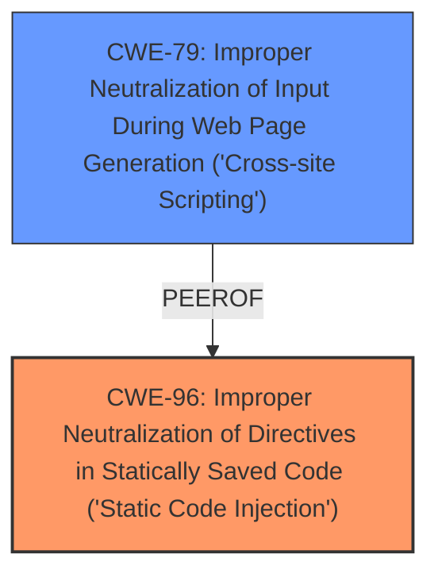

# Analysis Report for CVE-2024-10899

# Vulnerability Analysis Report: CVE-2024-10899

## Description

The The WooCommerce Product Table Lite plugin for WordPress is vulnerable to arbitrary shortcode execution in all versions up to, and including, 3.8.6. This is due to the software **allowing users to execute an action that does not properly validate a value before running do_shortcode**. This makes it possible for unauthenticated attackers to execute arbitrary shortcodes. The same id parameter is vulnerable to Reflected **Cross-Site Scripting** as well.

## Vulnerability Description Key Phrases

- **Rootcause:** allowing users to execute an action that does not properly validate a value before running do_shortcode
- **Weakness:** Cross-Site Scripting
- **Impact:** arbitrary shortcode execution
- **Attacker:** unauthenticated attackers
- **Product:** WooCommerce Product Table Lite plugin for WordPress
- **Version:** all versions up to and including 3.8.6

## Analysis (with Relationship Data)

# Summary

| CWE ID | CWE Name | Confidence | CWE Abstraction Level | CWE Vulnerability Mapping Label | CWE-Vulnerability Mapping Notes |
|---|---|---|---|---|---|
| CWE-96 | Improper Neutralization of Directives in Statically Saved Code ('Static Code Injection') | 0.9 | Base | Allowed | Primary CWE: The root cause is the failure to neutralize directives before including them in code. |
| CWE-79 | Improper Neutralization of Input During Web Page Generation ('Cross-site Scripting') | 0.8 | Base | Allowed | Secondary CWE: The 'id' parameter is also vulnerable to reflected XSS due to a lack of sanitization. |

## Evidence and Confidence

*   **Confidence Score:** 0.85
*   **Evidence Strength:** HIGH

## Relationship Analysis
The primary weakness is CWE-96 Improper Neutralization of Directives in Statically Saved Code ('Static Code Injection'). This leads to the execution of arbitrary shortcodes. A secondary weakness is CWE-79 Improper Neutralization of Input During Web Page Generation ('Cross-site Scripting'), stemming from the same unsanitized input. The vulnerability chain starts with the lack of proper input validation.



## Vulnerability Chain
The vulnerability chain begins with the plugin **allowing users to execute an action that does not properly validate a value before running do_shortcode**. This **root cause** then leads to two weaknesses: arbitrary shortcode execution (CWE-96) and reflected Cross-Site Scripting (CWE-79). The impact is that unauthenticated attackers can exploit these vulnerabilities.

## Summary of Analysis
The initial assessment identified two key weaknesses: the **improper validation** leading to arbitrary shortcode execution and the reflected Cross-Site Scripting vulnerability. The evidence from the vulnerability description, CVE reference links content summary, and retriever results supports this assessment. The retriever results highlighted CWE-79, CWE-96 as strong candidates. The relationship analysis shows that both vulnerabilities stem from the same initial flaw: **allowing users to execute an action that does not properly validate a value before running do_shortcode**.

Relevant CWE Information:

# Enhanced Context (25 CWEs)
The following CWEs were identified as potentially relevant to this vulnerability:

## CWE-352: Cross-Site Request Forgery (CSRF)
**Abstraction Level**: Compound
**Similarity Score**: 0.77
**Source**: dense

**Description**:
The web application does not, or can not, sufficiently verify whether a well-formed, valid, consistent request was intentionally provided by the user who submitted the request.

**Mapping Guidance**:
- Usage: Allowed
- Rationale: This is a well-known Composite of multiple weaknesses that must all occur simultaneously, although it is attack-oriented in nature.

*Not selected because:* CSRF is not the primary issue. The vulnerability stems from the lack of input validation, not from a failure to verify the origin of a request.

## CWE-425: Direct Request ('Forced Browsing')
**Abstraction Level**: Base
**Similarity Score**: 0.73
**Source**: dense

**Description**:
The web application does not adequately enforce appropriate authorization on all restricted URLs, scripts, or files.

**Mapping Guidance**:
- Usage: Allowed
- Rationale: This CWE entry is at the Base level of abstraction, which is a preferred level of abstraction for mapping to the root causes of vulnerabilities.

*Not selected because:* While authorization might be a factor, the core issue is the lack of input validation and sanitization of the 'id' parameter.

## CWE-96: Improper Neutralization of Directives in Statically Saved Code ('Static Code Injection')
**Abstraction Level**: Base
**Similarity Score**: 0.73
**Source**: dense

**Description**:
The product receives input from an upstream component, but it does not neutralize or incorrectly neutralizes code syntax before inserting the input into an executable resource, such as a library, configuration file, or template.

**Mapping Guidance**:
- Usage: Allowed
- Rationale: This CWE entry is at the Base level of abstraction, which is a preferred level of abstraction for mapping to the root causes of vulnerabilities.

*Selected because:* This accurately describes the vulnerability where user-supplied input is used to generate shortcodes without proper sanitization. The plugin **allows users to execute an action that does not properly validate a value before running do_shortcode**.

## CWE-472: External Control of Assumed-Immutable Web Parameter
**Abstraction Level**: Base
**Similarity Score**: 0.72
**Source**: dense

**Description**:
The web application does not sufficiently verify inputs that are assumed to be immutable but are actually externally controllable, such as hidden form fields.

**Mapping Guidance**:
- Usage: Allowed
- Rationale: This CWE entry is at the Base level of abstraction, which is a preferred level of abstraction for mapping to the root causes of vulnerabilities.

*Not selected because:* While the 'id' parameter is externally controlled, the core issue is not the immutability assumption but the lack of proper neutralization of the input, which leads to shortcode execution.

## CWE-116: Improper Encoding or Escaping of Output
**Abstraction Level**: Class
**Similarity Score**: 0.72
**Source**: dense

**Description**:
The product prepares a structured message for communication with another component, but encoding or escaping of the data is either missing or done incorrectly. As a result, the intended structure of the message is not preserved.

**Mapping Guidance**:
- Usage: Allowed-with-Review
- Rationale: This CWE entry is a Class and might have Base-level children that would be more appropriate

*Not selected because:* While output encoding is related to XSS (CWE-79), the primary issue is the lack of neutralization before the output is generated.

## CWE-434: Unrestricted Upload of File with Dangerous Type
**Abstraction Level**: Base
**Similarity Score**: 0.72
**Source**: dense

**Description**:
The product allows the upload or transfer of dangerous file types that are automatically processed within its environment.

**Mapping Guidance**:
- Usage: Allowed
- Rationale: This CWE entry is at the Base level of abstraction, which is a preferred level of abstraction for mapping to the root causes of vulnerabilities.

*Not selected because:* This CWE is not relevant to the vulnerability, which involves shortcode execution and XSS, not file uploads.

## CWE-80: Improper Neutralization of Script-Related HTML Tags in a Web Page (Basic XSS)
**Abstraction Level**: Variant
**Similarity Score**: 0.71
**Source**: dense

**Description**:
The product receives input from an upstream component, but it does not neutralize or incorrectly neutralizes special characters such as "<", ">", and "&" that could be interpreted as web-scripting elements when they are sent to a downstream component that processes web pages.

*Not selected because:* While this is a variant of XSS, CWE-79 is more appropriate as it covers the general case of improper neutralization leading to XSS.

## CWE-184: Incomplete List of Disallowed Inputs
**Abstraction Level**: Base
**Similarity Score**: 0.71
**Source**: dense

**Description**:
The product implements a protection mechanism that relies on a list of inputs (or properties of inputs) that are not allowed by policy or otherwise require other action to neutralize before additional processing takes place, but the list is incomplete.

*Not selected because:* The issue is not an incomplete list of disallowed inputs, but rather the complete lack of input validation and sanitization.

## CWE-639: Authorization Bypass Through User-Controlled Key
**Abstraction Level**: Base
**Similarity Score**: 0.71
**Source**: dense

**Description**:
The system's authorization functionality does not prevent one user from gaining access to another user's data or record by modifying the key value identifying the data.

*Not selected because:* Authorization bypass is not the primary issue. The vulnerability is due to the lack of input validation.

## CWE-79: Improper Neutralization of Input During Web Page Generation ('Cross-site Scripting')
**Abstraction Level**: Base
**Similarity Score**: 0.70
**Source**: dense

**Description**:
The product does not neutralize or incorrectly neutralizes user-controllable input before it is placed in output that is used as a web page that is served to other users.

*Selected because:* The 'id' parameter is vulnerable to reflected XSS because the plugin echoes user-controlled input without sanitization.

## CWE-116: Improper Encoding or Escaping of Output
**Abstraction Level**: Class
**Similarity Score**: 1536.00
**Source**: sparse

**Description**:
The product prepares a structured message for communication with another component, but encoding or escaping


## CWE Relationship Analysis

Current CWEs represent these abstraction levels: .


### Vulnerability Chain Analysis

**Chain starting from CWE-116:**
- 116 (Improper Encoding or Escaping of Output) - ROOT


**Chain starting from CWE-80:**
- 80 (Improper Neutralization of Script-Related HTML Tags in a Web Page (Basic XSS)) - ROOT


### CWE Relationship Diagram

```mermaid
graph TD
    classDef primary fill:#f96,stroke:#333,stroke-width:2px
    classDef secondary fill:#69f,stroke:#333
    classDef tertiary fill:#9e9,stroke:#333
```


*Report generated on 2025-07-13 00:33:39*
