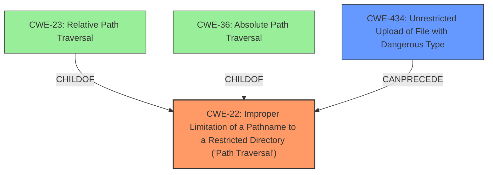

# Raw Analyzer Response for CVE-2024-10902

# Summary
| CWE ID | CWE Name | Confidence | CWE Abstraction Level | CWE Vulnerability Mapping Label | CWE-Vulnerability Mapping Notes |
|---|---|---|---|---|---|
| CWE-22 | Improper Limitation of a Pathname to a Restricted Directory ('Path Traversal') | 1.0 | Base | Allowed | Primary CWE: This CWE directly addresses the **path traversal** vulnerability described. |
| CWE-434 | Unrestricted Upload of File with Dangerous Type | 0.9 | Base | Allowed | Secondary CWE: This CWE covers the **unrestricted upload of arbitrary files**, which is a key component of the vulnerability. |

## Evidence and Confidence

*   **Confidence Score:** 0.95
*   **Evidence Strength:** HIGH

## Relationship Analysis
The primary weakness is CWE-22, Improper Limitation of a Pathname to a Restricted Directory ('Path Traversal'), which allows an attacker to write files outside the intended directory. This can be achieved via CWE-434, Unrestricted Upload of File with Dangerous Type, which allows the attacker to upload arbitrary files in the first place. CWE-22 is a parent of CWE-23 (Relative Path Traversal) and CWE-36 (Absolute Path Traversal), providing more specific classifications if the path traversal is relative or absolute, respectively. However, CWE-22 is sufficient since the description does not specify the type of path traversal.

## Vulnerability Chain
The vulnerability chain starts with:
1.  **CWE-434: Unrestricted Upload of File with Dangerous Type**: An attacker uploads a malicious file without restrictions on the file type.
2.  **CWE-22: Improper Limitation of a Pathname to a Restricted Directory ('Path Traversal')**: The attacker uses path traversal techniques to write the file to an arbitrary location on the file system.
3.  The impact is Remote Code Execution (RCE) by writing malicious files, such as a malicious `__init__.py` in the Python's `/site-packages/` directory.

## Summary of Analysis
The vulnerability is a combination of **unrestricted file upload** and **path traversal**, leading to potential remote code execution. The primary weakness is CWE-22, as it directly reflects the core issue of writing files outside the intended directory. CWE-434 is a secondary weakness because it enables the path traversal by allowing the upload of arbitrary files in the first place.

The evidence for these mappings is strong: the vulnerability description explicitly mentions "Arbitrary File Upload with Path Traversal." The high retriever scores for CWE-22 and CWE-434 further support these choices.

CWE-23 and CWE-36 were considered as more specific alternatives to CWE-22, but the vulnerability description doesn't specify whether the path traversal is relative or absolute, so CWE-22 is the most appropriate choice.

Other CWEs, such as CWE-79 (Improper Neutralization of Input During Web Page Generation ('Cross-site Scripting')), CWE-95 (Improper Neutralization of Directives in Dynamically Evaluated Code ('Eval Injection')), and CWE-78 (Improper Neutralization of Special Elements used in an OS Command ('OS Command Injection')), were considered but deemed less relevant because the primary issue isn't related to web page generation, dynamic code evaluation, or OS command execution, respectively. The vulnerability is primarily about writing files to arbitrary locations due to **improper path validation**.