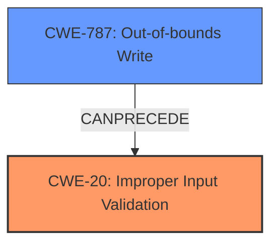

# Analysis Report for CVE-2024-10944

# Vulnerability Analysis Report: CVE-2024-10944

## Description

A Remote Code Execution vulnerability exists in the affected product. The vulnerability requires a high level of permissions and exists due to **improper input validation** resulting in the possibility of a malicious Updated Agent being deployed.

## Vulnerability Description Key Phrases

- **Rootcause:** improper input validation
- **Impact:** Remote Code Execution
- **Vector:** malicious Updated Agent being deployed

## Analysis (with Relationship Data)

# Summary
| CWE ID | CWE Name | Confidence | CWE Abstraction Level | CWE Vulnerability Mapping Label | CWE-Vulnerability Mapping Notes |
|---|---|---|---|---|---|
| CWE-20 | Improper Input Validation | 0.9 | Class | Primary | Discouraged |
| CWE-787 | Out-of-bounds Write | 0.5 | Base | Secondary | Allowed |

## Evidence and Confidence

*   **Confidence Score:** 0.7
*   **Evidence Strength:** MEDIUM

## Relationship Analysis
The primary relationship influencing the selection is the parent-child relationship where CWE-20 is a class-level CWE. The retriever results suggested more specific CWEs, but the provided information lacks the specificity to confidently choose a base or variant level CWE related to input validation.
CWE-787 is included as a secondary weakness because **improper input validation** may lead to an out-of-bounds write.



## Vulnerability Chain
The vulnerability chain starts with **improper input validation** (CWE-20), which leads to the potential deployment of a malicious updated agent, which could then lead to out-of-bounds write (CWE-787), and finally to remote code execution.

## Summary of Analysis
The primary weakness is **improper input validation** (CWE-20) because that is the root cause of the vulnerability. The description states that the vulnerability exists due to **improper input validation**. The provided evidence is: "The vulnerability requires a high level of permissions and exists due to **improper input validation** resulting in the possibility of a malicious Updated Agent being deployed."

CWE-20 is a class-level CWE and is generally discouraged. However, without more details about *how* the input validation is improper, it is difficult to select a more specific base or variant CWE.

CWE-787 is added as a secondary weakness because the malicious agent deployment *could* lead to an out-of-bounds write condition, potentially enabling remote code execution. While not explicitly stated, this is a reasonable potential consequence of deploying a malicious agent.

Relevant CWE Information:

# Enhanced Context (25 CWEs)
The following CWEs were identified as potentially relevant to this vulnerability:

## CWE-280: Improper Handling of Insufficient Permissions or Privileges
**Abstraction Level**: Base
**Similarity Score**: 0.79

## CWE-266: Incorrect Privilege Assignment
**Abstraction Level**: Base
**Similarity Score**: 0.78

## CWE-274: Improper Handling of Insufficient Privileges
**Abstraction Level**: Base
**Similarity Score**: 0.78

## CWE-267: Privilege Defined With Unsafe Actions
**Abstraction Level**: Base
**Similarity Score**: 0.78

## CWE-807: Reliance on Untrusted Inputs in a Security Decision
**Abstraction Level**: Base
**Similarity Score**: 0.78

## CWE-1289: Improper Validation of Unsafe Equivalence in Input
**Abstraction Level**: Base
**Similarity Score**: 0.77

## CWE-472: External Control of Assumed-Immutable Web Parameter
**Abstraction Level**: Base
**Similarity Score**: 0.76

## CWE-41: Improper Resolution of Path Equivalence
**Abstraction Level**: Base
**Similarity Score**: 0.76

## CWE-276: Incorrect Default Permissions
**Abstraction Level**: Base
**Similarity Score**: 0.76

## CWE-183: Permissive List of Allowed Inputs
**Abstraction Level**: Base
**Similarity Score**: 0.76

## CWE-269: Improper Privilege Management
**Abstraction Level**: Class
**Similarity Score**: 1388.45

## CWE-863: Incorrect Authorization
**Abstraction Level**: Class
**Similarity Score**: 1367.49

## CWE-285: Improper Authorization
**Abstraction Level**: Class
**Similarity Score**: 1325.92

## CWE-267: Privilege Defined With Unsafe Actions
**Abstraction Level**: Base
**Similarity Score**: 1312.11

## CWE-732: Incorrect Permission Assignment for Critical Resource
**Abstraction Level**: Class
**Similarity Score**: 1260.83

## CWE-190: Integer Overflow or Wraparound
**Abstraction Level**: base
**Similarity Score**: 3.80

## CWE-129: Improper Validation of Array Index
**Abstraction Level**: variant
**Similarity Score**: 3.47

## CWE-787: Out-of-bounds Write
**Abstraction Level**: base
**Similarity Score**: 3.23

## CWE-1284: Improper Validation of Specified Quantity in Input
**Abstraction Level**: base
**Similarity Score**: 3.22

## CWE-73: External Control of File Name or Path
**Abstraction Level**: Base
**Similarity Score**: 2.58

## CWE-280: Improper Handling of Insufficient Permissions or Privileges
**Abstraction Level**: Base
**Similarity Score**: 2.50

## CWE-274: Improper Handling of Insufficient Privileges
**Abstraction Level**: Base
**Similarity Score**: 2.50

## CWE-250: Execution with Unnecessary Privileges
**Abstraction Level**: base
**Similarity Score**: 2.47

## CWE-306: Missing Authentication for Critical Function
**Abstraction Level**: base
**Similarity Score**: 2.47

## CWE-128: Wrap-around Error
**Abstraction Level**: base
**Similarity Score**: 2.39

CWEs Considered but Not Used:

*   CWE-269: Improper Privilege Management - While high privileges are required, the root cause is not directly related to privilege management but to input validation.
*   CWE-285: Improper Authorization - Similar to CWE-269, authorization isn't the core issue.
*   CWE-732: Incorrect Permission Assignment for Critical Resource - Not directly related to permission assignment.
*   CWE-1284: Improper Validation of Specified Quantity in Input - There is no information to suggest that a quantity is involved in this vulnerability.
*   CWE-190: Integer Overflow or Wraparound, CWE-129: Improper Validation of Array Index, CWE-73: External Control of File Name or Path - These CWEs are not supported by any evidence in the vulnerability description.


## CWE Relationship Analysis

Current CWEs represent these abstraction levels: .


### Vulnerability Chain Analysis

**Chain starting from CWE-274:**
- 274 (Improper Handling of Insufficient Privileges) - ROOT


**Chain starting from CWE-787:**
- 787 (Out-of-bounds Write) - ROOT


### CWE Relationship Diagram

```mermaid
graph TD
    classDef primary fill:#f96,stroke:#333,stroke-width:2px
    classDef secondary fill:#69f,stroke:#333
    classDef tertiary fill:#9e9,stroke:#333
```


*Report generated on 2025-07-13 00:38:39*
