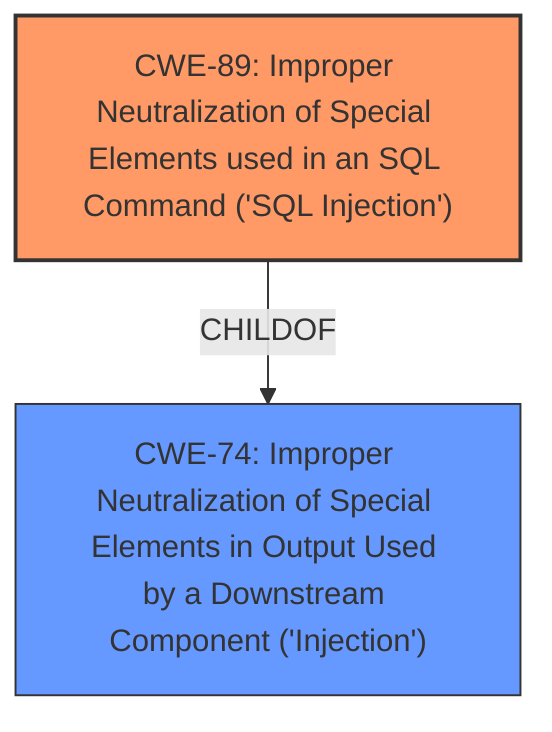

# Analysis for CVE-2024-10946

# Summary

| CWE ID  | CWE Name                                                                                | Confidence | CWE Abstraction Level | CWE Vulnerability Mapping Label | CWE-Vulnerability Mapping Notes |
| :-------- | :--------------------------------------------------------------------------------------- | :---------- | :----------------------- | :------------------------------ | :--------------------------------- |
| CWE-89 | Improper Neutralization of Special Elements used in an SQL Command ('SQL Injection') | 1         | Base                     | Primary                         | Allowed                             |

## Evidence and Confidence

*   **Confidence Score:** 1
*   **Evidence Strength:** HIGH

## Relationship Analysis

The primary relationship that influenced the decision was the direct match of the vulnerability to the description of CWE-89, further supported by the retriever results. While other CWEs were considered due to their relationships with injection vulnerabilities, the evidence strongly pointed towards SQL Injection as the root cause. The base level of abstraction is appropriate as it directly describes the **improper neutralization** leading to the vulnerability.

## Vulnerability Chain

The vulnerability chain is straightforward:

1.  **Root Cause:** **Improper neutralization** of SQL special elements in user-supplied input (`sql` parameter). (CWE-89)
2.  **Impact:** Execution of arbitrary SQL queries, leading to unauthorized data access and potential data manipulation.

## Summary of Analysis

The initial analysis immediately pointed towards SQL Injection due to the explicit mention of "**sql injection**" in the vulnerability description. The CVE Reference Links Content Summary confirmed the **lack of proper input sanitization** as the root cause. The retriever results also strongly suggested CWE-89 as the primary candidate. The final decision was based on the direct match between the vulnerability description and the CWE-89 definition, supported by the provided evidence and retriever results. CWE-89 is at the optimal level of specificity as it directly addresses the root cause.

Relevant CWE Information:

# Enhanced Context (25 CWEs)

## CWE-89: Improper Neutralization of Special Elements used in an SQL Command ('SQL Injection')
**Abstraction Level**: Base
**Similarity Score**: 0.77
**Source**: dense

**Description**:
The product constructs all or part of an SQL command using externally-influenced input from an upstream component, but it does not neutralize or incorrectly neutralizes special elements that could modify the intended SQL command when it is sent to a downstream component. Without sufficient removal or quoting of SQL syntax in user-controllable inputs, the generated SQL query can cause those inputs to be interpreted as SQL instead of ordinary user data.

**Mapping Guidance**:
- Usage: Allowed
- Rationale: This CWE entry is at the Base level of abstraction, which is a preferred level of abstraction for mapping to the root causes of vulnerabilities.

## CWE-89: Improper Neutralization of Special Elements used in an SQL Command ('SQL Injection')
**Abstraction Level**: Base
**Similarity Score**: 1300.00
**Source**: sparse

**Description**:
The product constructs all or part of an SQL command using externally-influenced input from an upstream component, but it does not neutralize or incorrectly neutralizes special elements that could modify the intended SQL command when it is sent to a downstream component. Without sufficient removal or quoting of SQL syntax in user-controllable inputs, the generated SQL query can cause those inputs to be interpreted as SQL instead of ordinary user data.

**Mapping Guidance**:
- Usage: Allowed
- Rationale: This CWE entry is at the Base level of abstraction, which is a preferred level of abstraction for mapping to the root causes of vulnerabilities.

CWE-89: Improper Neutralization of Special Elements used in an SQL Command ('SQL Injection')

The product constructs all or part of an SQL command using externally-influenced input from an upstream component, but it does not neutralize or incorrectly neutralizes special elements that could modify the intended SQL command when it is sent to a downstream component. Without sufficient removal or quoting of SQL syntax in user-controllable inputs, the generated SQL query can cause those inputs to be interpreted as SQL instead of ordinary user data.

This aligns directly with the vulnerability description, which states that manipulation of the `sql` argument leads to **SQL Injection**. The product **does not neutralize** special elements.

*   **Security Implications:** Allows attackers to execute arbitrary SQL queries, potentially leading to data breaches, modification, or deletion.
*   **Relationship to other CWEs:** CWE-89 is a specific type of CWE-74 (Improper Neutralization of Special Elements in Output Used by a Downstream Component ('Injection')).
*   **Mapping Guidance:** The usage is "ALLOWED" and the rationale is that it is at the base level of abstraction.
*   **Confidence:** 1

**Other CWEs Considered and Rejected:**

*   CWE-74: Improper Neutralization of Special Elements in Output Used by a Downstream Component ('Injection'): This is a broader category that encompasses various types of injection vulnerabilities. While technically applicable, CWE-89 is more specific and accurately reflects the nature of the vulnerability.
*   CWE-79: Improper Neutralization of Input During Web Page Generation ('Cross-site Scripting'): This CWE is related to Cross-Site Scripting vulnerabilities, which is not the case in this scenario. The vulnerability is specifically related to SQL injection.
*   CWE-78: Improper Neutralization of Special Elements used in an OS Command ('OS Command Injection'): This CWE is related to OS Command Injection vulnerabilities, which is not the case in this scenario. The vulnerability is specifically related to SQL injection.
*   CWE-434: Unrestricted Upload of File with Dangerous Type: This CWE is related to unrestricted file uploads, which is not the case in this scenario. The vulnerability is specifically related to SQL injection.