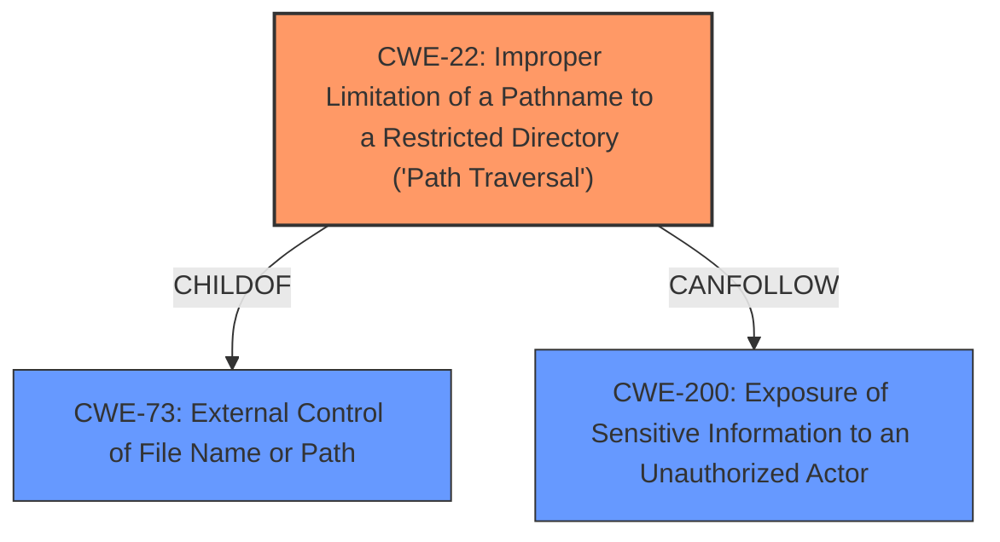

# Raw Analyzer Response for CVE-2024-10965

# Summary
| CWE ID  | CWE Name | Confidence | CWE Abstraction Level | CWE Vulnerability Mapping Label | CWE-Vulnerability Mapping Notes |
|----------------|--------------------------------------------------------------------------------------------------|------------|-----------------------|-----------------------------------|------------------------------------|
| CWE-22 | Improper Limitation of a Pathname to a Restricted Directory ('Path Traversal') | 0.9 | Base | Allowed | Primary CWE. The application fails to properly restrict pathnames, allowing access to files outside the intended directory.|
| CWE-200 | Exposure of Sensitive Information to an Unauthorized Actor | 0.7 | Class | Discouraged | Secondary candidate. The vulnerability leads to information disclosure, but the root cause is path traversal. |
| CWE-73 | External Control of File Name or Path | 0.6 | Base | Allowed | Secondary candidate. The file path is externally controlled, which leads to path traversal. |

## Evidence and Confidence

*   **Confidence Score:** 0.8
*   **Evidence Strength:** HIGH

## Relationship Analysis
The primary relationship that influenced the CWE selection is the parent-child relationship between CWE-73 (External Control of File Name or Path) and CWE-22 (Improper Limitation of a Pathname to a Restricted Directory ('Path Traversal')). CWE-22 is a specific type of CWE-73, where the external control leads to path traversal. Additionally, CWE-22 can lead to CWE-200 (Exposure of Sensitive Information to an Unauthorized Actor), as the attacker can read sensitive files. The abstraction levels were considered to ensure the most specific CWE was selected.

## Vulnerability Chain
The vulnerability chain starts with the external control of the file name via the `plugin_name` parameter. This leads to improper limitation of the pathname, allowing the attacker to traverse the file system. Finally, this results in the exposure of sensitive information.

External Control of Filename (CWE-73) -> Path Traversal (CWE-22) -> Information Disclosure (CWE-200)

## Summary of Analysis
The initial analysis focused on identifying the root cause of the vulnerability, which is the **lack of proper validation on the input** `plugin_name` parameter, allowing path traversal. The **impact** is **information disclosure**. The CWE retriever suggested several CWEs related to input validation and information disclosure. However, after reviewing the details of the vulnerability and the CWE specifications, CWE-22 (Improper Limitation of a Pathname to a Restricted Directory ('Path Traversal')) was selected as the primary CWE because it accurately describes the root cause of the vulnerability.

The vulnerability description states: "The vulnerability stems from the `/api/v2/schema` endpoint which allows reading arbitrary JSON files on the system by providing a `plugin_name` parameter. This is due to the **lack of proper validation** on the input, allowing an attacker to specify the path of the json file."

The graph relationships influenced the selection by highlighting the connection between external control of the filename (CWE-73) and path traversal (CWE-22). CWE-22 is more specific and accurately captures the vulnerability's nature, where the lack of restriction on the pathname leads to traversal outside the intended directory.

The selected CWEs are at the optimal level of specificity because CWE-22 is a base-level CWE that directly addresses the root cause of the vulnerability. While information disclosure (CWE-200) is a consequence, the primary issue is the path traversal that enables the disclosure.

Relevant CWE Information:

# Enhanced Context (25 CWEs)
The following CWEs were identified as potentially relevant to this vulnerability:

## CWE-80: Improper Neutralization of Script-Related HTML Tags in a Web Page (Basic XSS)
**Abstraction Level**: Variant
**Similarity Score**: 0.78
**Source**: dense

**Description**:
The product receives input from an upstream component, but it does not neutralize or incorrectly neutralizes special characters such as "<", ">", and "&" that could be interpreted as web-scripting elements when they are sent to a downstream component that processes web pages.

**Mapping Guidance**:
- Usage: Allowed
- Rationale: This CWE entry is at the Variant level of abstraction, which is a preferred level of abstraction for mapping to the root causes of vulnerabilities.

## CWE-116: Improper Encoding or Escaping of Output
**Abstraction Level**: Class
**Similarity Score**: 0.77
**Source**: dense

**Description**:
The product prepares a structured message for communication with another component, but encoding or escaping of the data is either missing or done incorrectly. As a result, the intended structure of the message is not preserved.

**Mapping Guidance**:
- Usage: Allowed-with-Review
- Rationale: This CWE entry is a Class and might have Base-level children that would be more appropriate

## CWE-79: Improper Neutralization of Input During Web Page Generation ('Cross-site Scripting')
**Abstraction Level**: Base
**Similarity Score**: 0.77
**Source**: dense

**Description**:
The product does not neutralize or incorrectly neutralizes user-controllable input before it is placed in output that is used as a web page that is served to other users.

**Mapping Guidance**:
- Usage: Allowed
- Rationale: This CWE entry is at the Base level of abstraction, which is a preferred level of abstraction for mapping to the root causes of vulnerabilities.

## CWE-212: Improper Removal of Sensitive Information Before Storage or Transfer
**Abstraction Level**: Base
**Similarity Score**: 0.77
**Source**: dense

**Description**:
The product stores, transfers, or shares a resource that contains sensitive information, but it does not properly remove that information before the product makes the resource available to unauthorized actors.

**Mapping Guidance**:
- Usage: Allowed
- Rationale: This CWE entry is at the Base level of abstraction, which is a preferred level of abstraction for mapping to the root causes of vulnerabilities.

## CWE-74: Improper Neutralization of Special Elements in Output Used by a Downstream Component ('Injection')
**Abstraction Level**: Class
**Similarity Score**: 0.77
**Source**: dense

**Description**:
The product constructs all or part of a command, data structure, or record using externally-influenced input from an upstream component, but it does not neutralize or incorrectly neutralizes special elements that could modify how it is parsed or interpreted when it is sent to a downstream component.

**Mapping Guidance**:
- Usage: Discouraged
- Rationale: CWE-74 is high-level and often misused when lower-level weaknesses are more appropriate.

## CWE-203: Observable Discrepancy
**Abstraction Level**: Base
**Similarity Score**: 0.76
**Source**: dense

**Description**:
The product behaves differently or sends different responses under different circumstances in a way that is observable to an unauthorized actor, which exposes security-relevant information about the state of the product, such as whether a particular operation was successful or not.

**Mapping Guidance**:
- Usage: Allowed
- Rationale: This CWE entry is at the Base level of abstraction, which is a preferred level of abstraction for mapping to the root causes of vulnerabilities.

## CWE-1286: Improper Validation of Syntactic Correctness of Input
**Abstraction Level**: Base
**Similarity Score**: 0.76
**Source**: dense

**Description**:
The product receives input that is expected to be well-formed - i.e., to comply with a certain syntax - but it does not validate or incorrectly validates that the input complies with the syntax.

**Mapping Guidance**:
- Usage: Allowed
- Rationale: This CWE entry is at the Base level of abstraction, which is a preferred level of abstraction for mapping to the root causes of vulnerabilities.

## CWE-755: Improper Handling of Exceptional Conditions
**Abstraction Level**: Class
**Similarity Score**: 0.76
**Source**: dense

**Description**:
The product does not handle or incorrectly handles an exceptional condition.

**Mapping Guidance**:
- Usage: Discouraged
- Rationale: This CWE entry is a level-1 Class (i.e., a child of a Pillar). It might have lower-level children that would be more appropriate

## CWE-497: Exposure of Sensitive System Information to an Unauthorized Control Sphere
**Abstraction Level**: Base
**Similarity Score**: 0.76
**Source**: dense

**Description**:
The product does not properly prevent sensitive system-level information from being accessed by unauthorized actors who do not have the same level of access to the underlying system as the