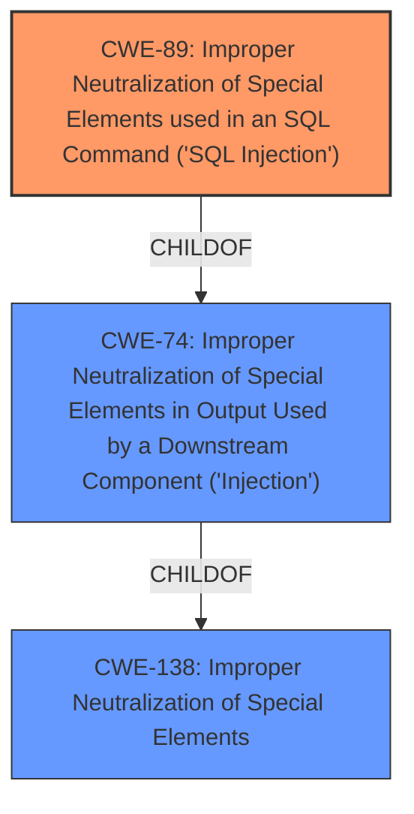

# Raw Analyzer Response for CVE-2024-10967

# Summary
| CWE ID | CWE Name | Confidence | CWE Abstraction Level | CWE Vulnerability Mapping Label | CWE-Vulnerability Mapping Notes |
|---|---|---|---|---|---|
| CWE-89 | Improper Neutralization of Special Elements used in an SQL Command ('SQL Injection') | 1.0 | Base | Allowed | Primary CWE. The vulnerability is due to the lack of proper sanitization of input used in an SQL query. |

## Evidence and Confidence

*   **Confidence Score:** 1.0
*   **Evidence Strength:** HIGH

## Relationship Analysis
The primary relationship that impacted my decision was the parent-child relationship. CWE-89 is a base CWE, which is the preferred level of abstraction. Other CWEs considered were broader classes like CWE-74 (Improper Neutralization of Special Elements in Output Used by a Downstream Component ('Injection')) and CWE-138 (Improper Neutralization of Special Elements) but these are too general.

## Vulnerability Chain
The vulnerability chain consists of a single step: the **improper neutralization** of the `id` parameter leading directly to **SQL Injection**.

## Summary of Analysis
The analysis is based on the provided vulnerability description and CVE reference links content summary, both of which strongly suggest **SQL Injection** as the root cause. The vulnerability description key phrases explicitly mention **sql injection**. The CVE reference links content summary confirms that unfiltered user-supplied input is directly incorporated into an SQL query, leading to the vulnerability.

The graph relationships helped to narrow down the selection to the most specific CWE. While broader CWEs like CWE-74 (Improper Neutralization of Special Elements in Output Used by a Downstream Component ('Injection')) could apply, CWE-89 provides a more precise classification of the vulnerability.

The selected CWE is at the optimal level of specificity because it directly addresses the root cause of the vulnerability, which is the lack of proper sanitization of input used in an SQL query. This is a base-level CWE, which is the preferred level of abstraction for mapping to the root causes of vulnerabilities.

# Enhanced Context (25 CWEs)
The following CWEs were identified as potentially relevant to this vulnerability:

## CWE-89: Improper Neutralization of Special Elements used in an SQL Command ('SQL Injection')
**Abstraction Level**: Base
**Similarity Score**: 0.80
**Source**: dense

**Description**:
The product constructs all or part of an SQL command using externally-influenced input from an upstream component, but it does not neutralize or incorrectly neutralizes special elements that could modify the intended SQL command when it is sent to a downstream component. Without sufficient removal or quoting of SQL syntax in user-controllable inputs, the generated SQL query can cause those inputs to be interpreted as SQL instead of ordinary user data.

**Mapping Guidance**:
- Usage: Allowed
- Rationale: This CWE entry is at the Base level of abstraction, which is a preferred level of abstraction for mapping to the root causes of vulnerabilities.

## CWE-74: Improper Neutralization of Special Elements in Output Used by a Downstream Component ('Injection')
**Abstraction Level**: Class
**Similarity Score**: 0.76
**Source**: dense

**Description**:
The product constructs all or part of a command, data structure, or record using externally-influenced input from an upstream component, but it does not neutralize or incorrectly neutralizes special elements that could modify how it is parsed or interpreted when it is sent to a downstream component.

**Mapping Guidance**:
- Usage: Discouraged
- Rationale: CWE-74 is high-level and often misused when lower-level weaknesses are more appropriate.

## CWE-138: Improper Neutralization of Special Elements
**Abstraction Level**: Class
**Similarity Score**: 895.75
**Source**: sparse

**Description**:
The product receives input from an upstream component, but it does not neutralize or incorrectly neutralizes special elements that could be interpreted as control elements or syntactic markers when they are sent to a downstream component.

**Mapping Guidance**:
- Usage: Discouraged
- Rationale: This CWE entry is a level-1 Class (i.e., a child of a Pillar). It might have lower-level children that would be more appropriate

## Other CWEs Considered but Not Used:
- CWE-74, CWE-79, CWE-138, CWE-434, CWE-1336, CWE-705, CWE-117, CWE-99, CWE-93, CWE-639, CWE-73, CWE-425, CWE-94, CWE-78, CWE-471, CWE-113, CWE-472, CWE-80, CWE-96, CWE-116
These CWEs were considered but ultimately not selected because they were either too general, focused on different types of vulnerabilities (e.g., Cross-site Scripting, File Upload), or at a higher level of abstraction than CWE-89. The evidence clearly points to an **SQL Injection** vulnerability due to the **improper neutralization** of input within an SQL query.