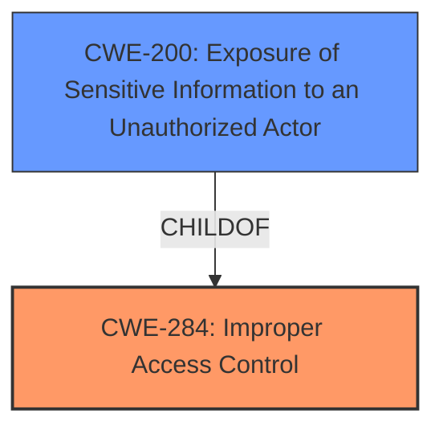

# Raw Analyzer Response for CVE-2024-10971

# Summary
| CWE ID | CWE Name | Confidence | CWE Abstraction Level | CWE Vulnerability Mapping Label | CWE-Vulnerability Mapping Notes |
|---|---|---|---|---|---|
| CWE-284 | Improper Access Control | 0.8 | Pillar | Primary | Discouraged |
| CWE-200 | Exposure of Sensitive Information to an Unauthorized Actor | 0.6 | Class | Secondary | Discouraged |

## Evidence and Confidence

*   **Confidence Score:** 0.7
*   **Evidence Strength:** MEDIUM

## Relationship Analysis
The primary relationship to consider is that CWE-284 is a high-level category, while CWE-200 is a child that describes the impact of the **improper access control**. The vulnerability description indicates a failure in controlling access which leads to sensitive data exposure. CWE-284, as a Pillar, is less specific, but appropriate given the high-level description, with CWE-200 capturing the impact.

## Vulnerability Chain
The vulnerability chain starts with **improper access control** (CWE-284), which allows a malicious authenticated user to obtain sensitive data (CWE-200).

## Summary of Analysis
The initial assessment identified CWE-284 as the primary weakness due to the explicit mention of "**improper access control**" in the vulnerability description. The description states that "**improper access control** in the Password History feature in Devolutions DVLS 2024.3.6 and earlier allows a malicious authenticated user to obtain sensitive data via faulty permission." The impact, sensitive data exposure, aligns with CWE-200. CWE-284 is a general category, but the evidence does not provide enough detail to select a more specific authorization related CWE. Therefore, I am selecting CWE-284 as the primary and CWE-200 as a secondary CWE to represent the impact.

Relevant CWE Information:

# Enhanced Context (25 CWEs)
The following CWEs were identified as potentially relevant to this vulnerability:

## CWE Classification Guidance

The following guidance has been automatically included because relevant keywords were detected in the vulnerability description:

### Authentication vs Authorization vs Access Control Guidance

## ===Guidance===

### Level Set – Authentication vs Authorization vs Access Control

**Authentication**:
Determines *who* the actor is (identity validation). This is typically the *first step* in access control.

* Example phrases: "user must log in", "lack of login check", "bypasses login"
* CWE relevance: authentication is usually mapped to CWE-306 or its children.

  * **CWE-306**: *Missing Authentication for Critical Function* – used when no identity validation is enforced for sensitive functionality (e.g., password reset, user deletion).

**Authorization**:
Determines *what* an authenticated actor is allowed to do. It decides access *after* identity is verified.

* Example phrases: "unauthorized access", "regular user can access admin panel", "role checks are missing"
* CWE relevance: use CWEs like 862, 863, 285 for authorization errors:

  * **CWE-862**: *Missing Authorization* – the application doesn't check whether the user is authorized at all.
  * **CWE-863**: *Incorrect Authorization* – the application checks authorization, but does it incorrectly (e.g., flawed logic).
  * **CWE-285**: *Improper Authorization* – general category for any flawed authorization logic or design.

**Access Control**:
A broader term that includes both authentication and authorization. Governs how resources are protected and who can access them under what conditions.

* CWE relevance:

  * **CWE-284**: *Improper Access Control* – top-level category used when access control failure exists but root cause is unclear.
  * This should be avoided **if** a more specific child CWE like 285, 862, 863, or 306 is appropriate.

---

## Mapping Discussion – Common Misclassification Patterns

### 1. **CWE-306 vs CWE-862**:

* **306** is about lack of **authentication** (e.g., *no login required at all*).
* **862** is about lack of **authorization** *after* authentication (e.g., *admin check missing*).
* ✅ Example CWE-306: *“An unauthenticated attacker can invoke the password reset API.”*
* ✅ Example CWE-862: *“An authenticated user without admin privileges can delete any user account.”*

### 2. **CWE-285 vs CWE-284**:

* **285** is specific to authorization flaws – it's a better choice than 284 **if** the issue involves *improper or missing role checks*.
* **284** should be reserved for general access control issues when it’s unclear whether the issue lies in authn or authz.

---

## Technical Impact vs Root Cause Clarification

**Phrase like "unauthorized access" is not enough.**

* If you **cannot determine whether identity was checked**, assume it’s **authorization** and consider 862 or 863.
* If you **know no login happened**, lean toward **authentication** → CWE-306.
* If the **access control policy is unclear or inconsistently enforced**, but it's not due to missing checks, consider **CWE-284**.

---

## Good Mapping Examples

* ✅ **CWE-306**: “The endpoint `/admin/deleteUser` does not require any authentication.”
* ✅ **CWE-862**: “Any logged-in user can change any other user's email without being an admin.”
* ✅ **CWE-863**: “An admin check exists but incorrectly grants access to non-admin users.”
* ✅ **CWE-285**: “Application uses a static role check that fails when roles change dynamically.”
* ✅ **CWE-284**: “Inconsistent enforcement of access rules across services with unclear policy source.”

---

## Summary – Quick LLM Rules of Thumb

| **Indicator**                                              | **Likely CWE** |
| ---------------------------------------------------------- | -------------- |
| No identity check (no login)                               | CWE-306        |
| No role/privilege check after login                        | CWE-862        |
| Role check is present but flawed                           | CWE-863        |
| General or ambiguous authorization failure                 | CWE-285        |
| High-level access control problem with no clear root cause | CWE-284        |

### Privileges vs Permissions Guidance

## ===Guidance===

### Level Set – Privileges vs Permissions (in Access Control Context)

**Privileges**

* Represents the *actor's identity level* or capabilities (e.g., root, admin, regular user, guest).
* Commonly defined by roles or security contexts assigned during session creation or login.
* Often involved in **privilege escalation** (e.g., a regular user gaining admin rights).
* 🔍 *Who* the user is and *what they are supposed to be able to do.*

**Permissions**

* Represents *what actions are allowed* on specific resources (files, services, APIs).
* Usually attached to *resources*, not people.
* Permissions can be affected dynamically by changes in role or context.
* 🔍 *What* the user is allowed to do to *which resource.*

#### Short Rule:

> **Privileges** = rights assigned to a user role
> **Permissions** = access rules applied to specific objects/resources

---

### Mapping Discussion – CWE Usage for Privileges vs Permissions

#### 🔸 CWE-266: **Incorrect Privilege Assignment**

* The system assigns incorrect privileges to a user (e.g., admin instead of guest).
* Often the result of misconfigured roles or faulty logic during account provisioning.
* ✅ *“A user created with the ‘guest’ role was assigned admin privileges due to a logic flaw.”*

#### 🔸 CWE-250: **Execution with Unnecessary Privileges**

* Code runs with higher privileges than needed to complete its function.
* Often found in daemons, services, or mobile apps that don't drop privileges.
* ✅ *“The backup service runs as root but only needs read access.”*

#### 🔸 CWE-284: **Improper Access Control** (Parent/Generic)

* Used when the system fails to enforce restrictions on access to resources.
* If no specific privilege or permission mistake is identifiable, use this.
* ⚠️ This is **often overused**. Only default to 2