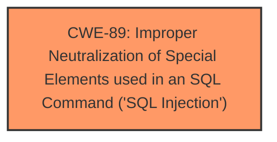

# Raw Analyzer Response for CVE-2024-10988

# Summary

| CWE ID | CWE Name | Confidence | CWE Abstraction Level | CWE Vulnerability Mapping Label | CWE-Vulnerability Mapping Notes |
|---|---|---|---|---|---|
| CWE-89 | Improper Neutralization of Special Elements used in an SQL Command ('SQL Injection') | 1.0 | Base | Allowed | Primary CWE |

## Evidence and Confidence

*   **Confidence Score:** 1.0
*   **Evidence Strength:** HIGH

## Relationship Analysis
The primary relationship considered was the direct match of the vulnerability description to the definition of CWE-89. While other CWEs were suggested, none matched the **SQL Injection** root cause as directly.

## Vulnerability Chain
The vulnerability chain is straightforward:
1.  **Root Cause:** Improper neutralization of special elements used in an SQL command (**CWE-89**) due to lack of input sanitization.
2.  **Impact:** Data breach, login bypass, and database manipulation.

## Summary of Analysis
The analysis is based on the explicit mention of **SQL Injection** in the vulnerability description and the CVE Reference Links Content Summary, which details the lack of input sanitization of the `email` parameter. The vulnerability description states: "The manipulation of the argument email leads to **sql injection**." The CVE Reference Links Content Summary states "The vulnerability stems from the lack of input sanitization and direct use of the `email` parameter in the `doctor_login.php` file within an SQL query" This direct evidence makes CWE-89 the most appropriate and specific classification.

Relevant CWE Information:

# Enhanced Context (25 CWEs)
The following CWEs were identified as potentially relevant to this vulnerability:

## CWE-89: Improper Neutralization of Special Elements used in an SQL Command ('SQL Injection')
**Abstraction Level**: Base
**Similarity Score**: 0.78
**Source**: dense

**Description**:
The product constructs all or part of an SQL command using externally-influenced input from an upstream component, but it does not neutralize or incorrectly neutralizes special elements that could modify the intended SQL command when it is sent to a downstream component. Without sufficient removal or quoting of SQL syntax in user-controllable inputs, the generated SQL query can cause those inputs to be interpreted as SQL instead of ordinary user data.

**Mapping Guidance**:
- Usage: Allowed
- Rationale: This CWE entry is at the Base level of abstraction, which is a preferred level of abstraction for mapping to the root causes of vulnerabilities.

## CWE-89: Improper Neutralization of Special Elements used in an SQL Command ('SQL Injection')
**Abstraction Level**: Base
**Similarity Score**: 1216.60
**Source**: sparse

**Description**:
The product constructs all or part of an SQL command using externally-influenced input from an upstream component, but it does not neutralize or incorrectly neutralizes special elements that could modify the intended SQL command when it is sent to a downstream component. Without sufficient removal or quoting of SQL syntax in user-controllable inputs, the generated SQL query can cause those inputs to be interpreted as SQL instead of ordinary user data.

**Mapping Guidance**:
- Usage: Allowed
- Rationale: This CWE entry is at the Base level of abstraction, which is a preferred level of abstraction for mapping to the root causes of vulnerabilities.

### Other CWEs Considered But Not Used:

*   **CWE-79: Improper Neutralization of Input During Web Page Generation ('Cross-site Scripting')**: While input is involved, the core issue is related to SQL commands, not web page generation.
*   **CWE-1336: Improper Neutralization of Special Elements Used in a Template Engine**: This is not related to template engine usage.
*   **CWE-434: Unrestricted Upload of File with Dangerous Type**: This is not related to file uploads.
*   **CWE-117: Improper Output Neutralization for Logs**: This is not related to logging.
*   **CWE-352: Cross-Site Request Forgery (CSRF)**: This is not related to CSRF.
*   **CWE-285: Improper Authorization**: While the **SQL Injection** could lead to authorization bypass, the primary weakness is the injection itself.
*   **CWE-116: Improper Encoding or Escaping of Output**: The core issue is not about encoding or escaping of output.
*   **CWE-472: External Control of Assumed-Immutable Web Parameter**: While the email parameter is externally controlled, the root cause is the **SQL Injection**.
*   **CWE-73: External Control of File Name or Path**: This is not related to file name or path control.