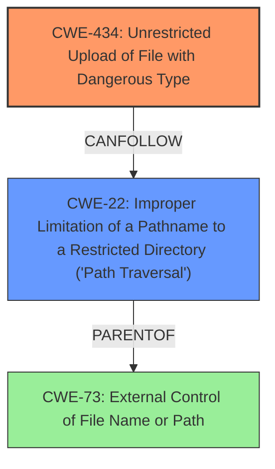

# Raw Analyzer Response for CVE-2024-11000

# Summary

| CWE ID  | CWE Name                                                                  | Confidence | CWE Abstraction Level | CWE Vulnerability Mapping Label | CWE-Vulnerability Mapping Notes |
| ------- | ------------------------------------------------------------------------- | ---------- | ----------------------- | ------------------------------- | ------------------------------- |
| CWE-434 | Unrestricted Upload of File with Dangerous Type                           | 1          | Base                    | Primary                         | Allowed                       |
| CWE-22  | Improper Limitation of a Pathname to a Restricted Directory ('Path Traversal') | 0.75       | Base                    | Secondary                       | Allowed                       |

## Evidence and Confidence

*   **Confidence Score:** 0.9
*   **Evidence Strength:** HIGH

## Relationship Analysis

The primary CWE is CWE-434, representing the **unrestricted file upload** vulnerability. CWE-22 is considered as a secondary weakness because the unrestricted upload combined with **improper pathname limitation** can lead to path traversal if the uploaded file's name or path is not properly validated.

## Vulnerability Chain

The vulnerability chain starts with an **unrestricted file upload** (CWE-434). If the uploaded file can overwrite existing files or be placed in arbitrary directories due to an **improper pathname limitation** (CWE-22), this can lead to remote code execution or other malicious activities.

## Summary of Analysis

The analysis is based on the provided vulnerability description and the CVE reference content summary. The primary weakness identified is CWE-434, as the system allows **unrestricted upload** of files with dangerous types. The evidence from the CVE reference summary, specifically the code snippet, confirms the absence of file type validation. The secondary weakness, CWE-22, is considered because there's a risk of path traversal if the filename is not sanitized, even though the primary problem is the ability to upload dangerous files in the first place.

Relevant CWE Information:

# Enhanced Context (25 CWEs)
The following CWEs were identified as potentially relevant to this vulnerability:

## CWE-434: Unrestricted Upload of File with Dangerous Type

**CWE-434** is the most appropriate because the vulnerability description and CVE reference links directly mention **unrestricted file upload** as the root cause. The provided code snippet `move_uploaded_file($temp_name1,"upload/$aimage");` in `/aboutedit.php` clearly shows that there is no check on the file type being uploaded. This matches the CWE description: "The product allows the upload or transfer of dangerous file types that are automatically processed within its environment." The impact described in the CVE reference link content summary (Remote Code Execution, System Compromise) is consistent with this weakness.

## CWE-22: Improper Limitation of a Pathname to a Restricted Directory ('Path Traversal')

**CWE-22** is a secondary consideration. While the primary issue is the ability to upload any file type, if the application doesn't properly sanitize the filename provided by the user (`$aimage`), it could lead to a path traversal vulnerability, where an attacker could upload files to arbitrary locations on the server.
"The product uses external input to construct a pathname...but the product does not properly neutralize special elements within the pathname that can cause the pathname to resolve to a location that is outside of the restricted directory."

## Other CWEs Considered and Rejected:

*   **CWE-79 (Improper Neutralization of Input During Web Page Generation ('Cross-site Scripting')) and CWE-89 (Improper Neutralization of Special Elements used in an SQL Command ('SQL Injection'))**: These were considered due to their high scores in the Retriever results. However, the vulnerability description and CVE summary focus on the file upload issue, not on input being displayed on a web page or used in SQL queries without proper neutralization.
*   **CWE-306 (Missing Authentication for Critical Function)**: While the CVE summary mentions that the attacker needs to be an authenticated administrator, the root cause of the vulnerability is the **unrestricted file upload**, not the missing authentication. Authentication is a prerequisite, not the cause.
*   **CWE-73 (External Control of File Name or Path)**: This CWE is related to path traversal. While a path traversal *could* result from the **unrestricted upload** and **improper handling of the file name**, the primary issue is the unrestricted upload itself (CWE-434), which can lead to more severe consequences such as remote code execution if a malicious file is uploaded.
*   **CWE-94 (Improper Control of Generation of Code ('Code Injection'))**: Considered but rejected. While the impact of uploading a malicious file *could* lead to code execution, the root cause is the **unrestricted upload** not the improper generation of code. The code is generated because of the uploaded file.
*   **CWE-352 (Cross-Site Request Forgery (CSRF))**: CSRF is not applicable, as there's no indication of the application being vulnerable to CSRF attacks in the provided description.

My assessment is highly based on the evidence provided, particularly the vulnerability description and the CVE Reference Links Content Summary. The selection of CWE-434 is at the optimal level of specificity because it directly describes the **unrestricted file upload**, which is the root cause of the vulnerability.