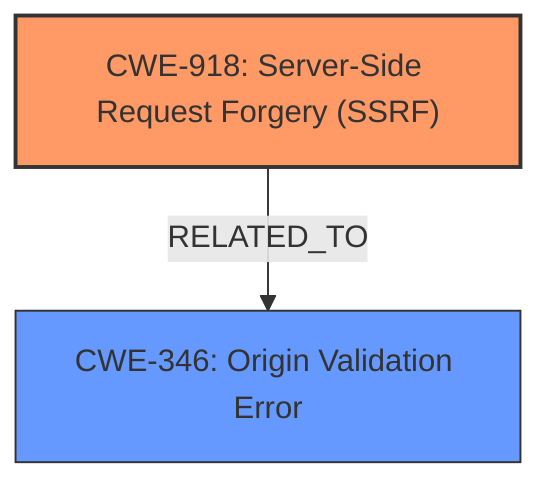

# Analysis for CVE-2024-11031

# Summary
| CWE ID | CWE Name | Confidence | CWE Abstraction Level | CWE Vulnerability Mapping Label | CWE-Vulnerability Mapping Notes |
|---|---|---|---|---|---|
| CWE-918 | Server-Side Request Forgery (SSRF) | 1.0 | Base | Allowed | Primary CWE: The **root cause** is **improper URL validation** leading to SSRF. |
| CWE-346 | Origin Validation Error | 0.6 | Class | Allowed-with-Review | Secondary Candidate: Due to **improper URL validation**. |

## Evidence and Confidence

*   **Confidence Score:** 0.9
*   **Evidence Strength:** HIGH

## Relationship Analysis
The primary relationship impacting the decision is the direct match of the vulnerability description to CWE-918, further supported by the description explicitly mentioning Server-Side Request Forgery. The relationship between CWE-918 and potential causes like **improper URL validation**, relates to origin validation, which suggests CWE-346 as a secondary consideration.

## Vulnerability Chain
The vulnerability chain starts with **improper URL validation** which leads to the SSRF vulnerability. The attacker exploits this to download arbitrary web hosts and access unauthorized web resources.

**Chain:** **Improper URL validation** -> SSRF -> Download arbitrary web hosts and access unauthorized web resources.

## Summary of Analysis
The analysis strongly points to CWE-918 as the primary CWE due to the explicit mention of "Server-Side Request Forgery" in the vulnerability description. The **root cause** is **improper URL validation**, which aligns with the nature of SSRF vulnerabilities. The retriever results also list CWE-918 as the top candidate.

The evidence from the vulnerability description is:
"In version 3.83 of binary-husky/gpt_academic, a **Server-Side Request Forgery** (SSRF) vulnerability exists in the Markdown_Translate.get_files_from_everything() API. This vulnerability is exploited through the HotReload(Markdown) plugin function, which allows downloading arbitrary web hosts by only checking if the link starts with http. Attackers can exploit this vulnerability to abuse the victim GPT Academics Gradio Web servers credentials to access unauthorized web resources."

CWE-346 is considered as a secondary CWE because the **improper URL validation** can be seen as a failure to properly validate the origin of the request.

The selection of CWE-918 and CWE-346 is at the optimal level of specificity, as they are base and class level CWEs respectively, directly related to the vulnerability's **root cause** and mechanism.

Relevant CWE Information:

# Enhanced Context (25 CWEs)
The following CWEs were identified as potentially relevant to this vulnerability:

## CWE-918: Server-Side Request Forgery (SSRF)
**Abstraction Level**: Base
**Similarity Score**: 0.72
**Source**: dense

**Description**:
The web server receives a URL or similar request from an upstream component and retrieves the contents of this URL, but it does not sufficiently ensure that the request is being sent to the expected destination.

**Mapping Guidance**:
- Usage: Allowed
- Rationale: This CWE entry is at the Base level of abstraction, which is a preferred level of abstraction for mapping to the root causes of vulnerabilities.

## CWE-346: Origin Validation Error
**Abstraction Level**: Class
**Similarity Score**: 0.70
**Source**: dense

**Description**:
The product does not properly verify that the source of data or communication is valid.

**Mapping Guidance**:
- Usage: Allowed-with-Review
- Rationale: This CWE entry is a Class and might have Base-level children that would be more appropriate

## CWE-918: Server-Side Request Forgery (SSRF)
CWE-918 (Server-Side Request Forgery (SSRF)) is the primary CWE. The vulnerability description explicitly states "Server-Side Request Forgery (SSRF) vulnerability exists". The description of CWE-918 "The web server receives a URL or similar request from an upstream component and retrieves the contents of this URL, but it does not sufficiently ensure that the request is being sent to the expected destination" accurately describes the vulnerability. The security implication is that attackers can exploit this vulnerability to abuse the victim GPT Academics Gradio Web servers credentials to access unauthorized web resources.
CWE-346 (Origin Validation Error) is a secondary CWE. The vulnerability is caused by **improper URL validation**, which means the source of the request is not properly verified. The description of CWE-346 "The product does not properly verify that the source of data or communication is valid" matches the root cause of the vulnerability. The security implication is that attackers can bypass the origin validation and access unauthorized web resources.

Other CWEs Considered but Not Used:

*   CWE-611 (Improper Restriction of XML External Entity Reference): While this CWE also deals with external entity references, it's specific to XML and doesn't fit the general SSRF scenario described.
*   CWE-306 (Missing Authentication for Critical Function): This CWE is related to missing authentication, which isn't the primary issue here. The vulnerability is about **improper URL validation**, not a lack of authentication.
*   CWE-79 (Improper Neutralization of Input During Web Page Generation ('Cross-site Scripting')): This CWE is related to Cross-site Scripting, which isn't relevant to the described vulnerability.
*   CWE-434 (Unrestricted Upload of File with Dangerous Type): This CWE is related to unrestricted file uploads, which is not part of this vulnerability.