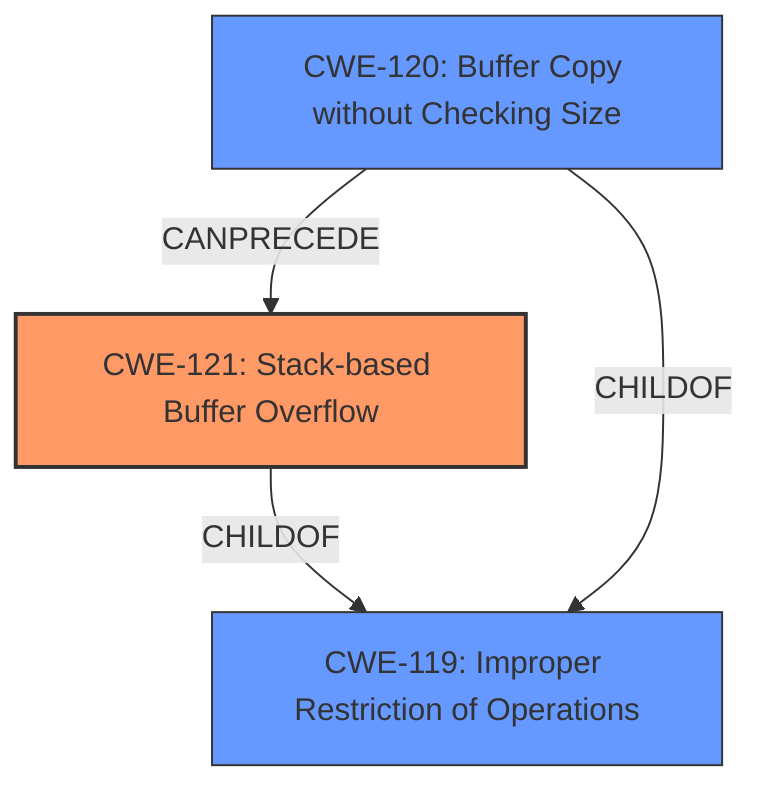

# Enhanced Analysis for CVE-2024-11047

# Summary

| CWE ID | CWE Name | Confidence | CWE Abstraction Level | CWE Vulnerability Mapping Label | CWE-Vulnerability Mapping Notes |
|---|---|---|---|---|---|
| CWE-121 | Stack-based Buffer Overflow | 1.0 | Variant | Primary | Allowed |
| CWE-120 | Buffer Copy without Checking Size of Input ('Classic Buffer Overflow') | 0.7 | Base | Secondary Candidate | Allowed-with-Review |
| CWE-119 | Improper Restriction of Operations within the Bounds of a Memory Buffer | 0.6 | Class | Secondary Candidate | Discouraged |

## Evidence and Confidence

*   **Confidence Score:** 0.9
*   **Evidence Strength:** HIGH

## Relationship Analysis

The primary CWE is CWE-121 (Stack-based Buffer Overflow), which is a variant of the more general CWE-119 (Improper Restriction of Operations within the Bounds of a Memory Buffer). CWE-120 (Buffer Copy without Checking Size of Input) is also related as a potential cause of buffer overflows. The relationships are hierarchical, with CWE-121 being a specific type of CWE-119 and CWE-120 potentially leading to CWE-121. The selection of CWE-121 is based on the specific mention of a stack-based buffer overflow in the vulnerability description.



## Vulnerability Chain

The vulnerability chain starts with the **improper** handling of the `path` argument. The `strcpy` function is then used to copy this **unvalidated** input into a fixed-size buffer on the stack, resulting in a **stack-based buffer overflow**. This overflow can then lead to arbitrary code execution and device control.

Improper Input Handling -> Buffer Copy without Size Check (CWE-120) -> Stack-based Buffer Overflow (CWE-121) -> Arbitrary Code Execution

## Summary of Analysis

The analysis is based on the explicit mention of a **stack-based buffer overflow** vulnerability in the description and CVE details. The vulnerability is triggered by manipulating the `path` argument, which is then copied using `strcpy` without proper bounds checking. This leads to an overflow on the stack, potentially allowing for arbitrary code execution.

The selection of CWE-121 is based on the following evidence:

*   **Vulnerability Description:** "Affected by this vulnerability is the function upgrade_filter_asp of the file /upgrade_filter.asp. The manipulation of the argument path leads to **stack-based buffer overflow**."
*   **CVE Reference Links Content Summary:** "The root cause is a stack-based buffer overflow vulnerability... The code uses `strcpy` to copy data from a user-controlled `path` parameter into a fixed-size buffer on the stack. If the `path` parameter is larger than the buffer, it overwrites adjacent memory on the stack..."

CWE-121 is the most specific and accurate representation of the vulnerability, as it explicitly describes a stack-based buffer overflow. While CWE-119 is a broader category, CWE-121 provides a more precise classification. CWE-120 is also considered because the **lack of input size checking** during the buffer copy operation with `strcpy` is a direct cause of the overflow.

Other CWEs Considered but Not Used:

*   CWE-190 (Integer Overflow or Wraparound): While integer overflows can sometimes lead to buffer overflows, this vulnerability is directly caused by a lack of bounds checking during the buffer copy operation, not an integer overflow.
*   CWE-89 (Improper Neutralization of Special Elements used in an SQL Command ('SQL Injection')) and CWE-79 (Improper Neutralization of Input During Web Page Generation ('Cross-site Scripting')): These are injection vulnerabilities, which are not relevant to this buffer overflow.

Relevant CWE Information:

## Enhanced Context (25 CWEs)
The following CWEs were identified as potentially relevant to this vulnerability:

## CWE-134: Use of Externally-Controlled Format String
**Abstraction Level**: Base
**Similarity Score**: 0.75
**Source**: dense

**Description**:
The product uses a function that accepts a format string as an argument, but the format string originates from an external source.

**Mapping Guidance**:
- Usage: Allowed
- Rationale: This CWE entry is at the Base level of abstraction, which is a preferred level of abstraction for mapping to the root causes of vulnerabilities.
*Not Used:* This CWE is not relevant because the vulnerability does not involve format string usage.

## CWE-121: Stack-based Buffer Overflow
**Abstraction Level**: Variant
**Similarity Score**: 0.74
**Source**: dense

**Description**:
A stack-based buffer overflow condition is a condition where the buffer being overwritten is allocated on the stack (i.e., is a local variable or, rarely, a parameter to a function).

**Mapping Guidance**:
- Usage: Allowed
- Rationale: This CWE entry is at the Variant level of abstraction, which is a preferred level of abstraction for mapping to the root causes of vulnerabilities.

*Used:* This is the primary CWE for the vulnerability.

## CWE-425: Direct Request ('Forced Browsing')
**Abstraction Level**: Base
**Similarity Score**: 0.74
**Source**: dense

**Description**:
The web application does not adequately enforce appropriate authorization on all restricted URLs, scripts, or files.

**Mapping Guidance**:
- Usage: Allowed
- Rationale: This CWE entry is at the Base level of abstraction, which is a preferred level of abstraction for mapping to the root causes of vulnerabilities.

*Not Used:* Authorization issues are not part of this vulnerability.

## CWE-755: Improper Handling of Exceptional Conditions
**Abstraction Level**: Class
**Similarity Score**: 0.74
**Source**: dense

**Description**:
The product does not handle or incorrectly handles an exceptional condition.

**Mapping Guidance**:
- Usage: Discouraged
- Rationale: This CWE entry is a level-1 Class (i.e., a child of a Pillar). It might have lower-level children that would be more appropriate

*Not Used:* This CWE is too generic. The vulnerability is more specifically a buffer overflow.

## CWE-790: Improper Filtering of Special Elements
**Abstraction Level**: Class
**Similarity Score**: 0.74
**Source**: dense

**Description**:
The product receives data from an upstream component, but does not filter or incorrectly filters special elements before sending it to a downstream component.

**Mapping Guidance**:
- Usage: Allowed-with-Review
- Rationale: This CWE entry is a Class and might have Base-level children that would be more appropriate

*Not Used:* Special element filtering is not the issue.

## CWE-119: Improper Restriction of Operations within the Bounds of a Memory Buffer
**Abstraction Level**: Class
**Similarity Score**: 0.73
**Source**: dense

**Description**:
The product performs operations on a memory buffer, but it reads from or writes to a memory location outside the buffer's intended boundary. This may result in read or write operations on unexpected memory locations that could be linked to other variables, data structures, or internal program data.

**Mapping Guidance**:
- Usage: Discouraged
- Rationale: CWE-119 is commonly misused in low-information vulnerability reports when lower-level CWEs could be used instead, or when more details about the vulnerability are available.

*Used as Secondary:* While a parent of CWE-121, it is less specific.

## CWE-41: Improper Resolution of Path Equivalence
**Abstraction Level**: Base
**Similarity Score**: 0.73
**Source**: dense

**Description**:
The product is vulnerable to file system contents disclosure through path equivalence. Path equivalence involves the use of special characters in file and directory names. The associated manipulations are intended to generate multiple names for the same object.

**Mapping Guidance**:
- Usage: Allowed
- Rationale: This CWE entry is at the Base level of abstraction, which is a preferred level of abstraction for mapping to the root causes of vulnerabilities.

*Not Used:* Path equivalence is unrelated.

## CWE-131: Incorrect Calculation of Buffer Size
**Abstraction Level**: Base
**Similarity Score**: 0.73
**Source**: dense

**Description**:
The product does not correctly calculate the size to be used when allocating a buffer, which could lead to a buffer overflow.

**Mapping Guidance**:
- Usage: Allowed
- Rationale: This


## CWE Relationship Analysis

Current CWEs represent these abstraction levels: .


### Vulnerability Chain Analysis

**Chain starting from CWE-89:**
- 89 (Improper Neutralization of Special Elements used in an SQL Command ('SQL Injection')) - ROOT


**Chain starting from CWE-121:**
- 121 (Stack-based Buffer Overflow) - ROOT


### CWE Relationship Diagram

```mermaid
graph TD
    classDef primary fill:#f96,stroke:#333,stroke-width:2px
    classDef secondary fill:#69f,stroke:#333
    classDef tertiary fill:#9e9,stroke:#333
```