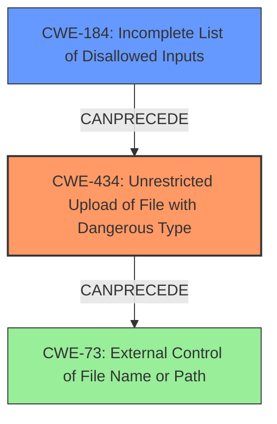

# Enhanced Analysis for CVE-2024-11054

# Summary
| CWE ID | CWE Name | Confidence | CWE Abstraction Level | CWE Vulnerability Mapping Label | CWE-Vulnerability Mapping Notes |
|---|---|---|---|---|---|
| CWE-434 | Unrestricted Upload of File with Dangerous Type | 0.9 | Base | Allowed | Primary CWE |
| CWE-184 | Incomplete List of Disallowed Inputs | 0.6 | Base | Allowed | Secondary Candidate |

## Evidence and Confidence

*   **Confidence Score:** 0.75
*   **Evidence Strength:** MEDIUM

## Relationship Analysis
The primary relationship considered was that between CWE-434 and other input validation CWEs like CWE-184. CWE-434 is a base-level CWE that directly describes the vulnerability, while CWE-184 offers a possible perspective on the incomplete validation of file types. The parent-child relationships of other CWEs considered did not directly influence the final decision, as CWE-434 directly addresses the **unrestricted upload** issue.



## Vulnerability Chain
The vulnerability chain starts with the **unrestricted upload** functionality, which allows an attacker to upload dangerous file types. The absence of proper input validation for the file upload leads to potential exploitation of the system.

Root Cause: CWE-434: Unrestricted Upload of File with Dangerous Type
Impact: System compromise, arbitrary code execution

## Summary of Analysis
The primary focus of the analysis was to identify the root cause of the vulnerability described in the provided text. The description clearly states that the vulnerability involves an **unrestricted upload**, making CWE-434 the most relevant and direct classification.

The decision is primarily based on the vulnerability description: "The manipulation of the argument pp leads to **unrestricted upload**."

The graph relationships helped in understanding potential related weaknesses, such as the need for proper input validation and file path control, but the directness of the **unrestricted upload** issue pointed towards CWE-434 as the optimal selection.

The selected CWE, CWE-434, is at the optimal level of specificity because it directly describes the **unrestricted upload** vulnerability.

Relevant CWE Information:

# Enhanced Context (25 CWEs)
The following CWEs were identified as potentially relevant to this vulnerability:

## CWE-434: Unrestricted Upload of File with Dangerous Type
**Abstraction Level**: Base
**Similarity Score**: 0.81
**Source**: dense

**Description**:
The product allows the upload or transfer of dangerous file types that are automatically processed within its environment.

**Mapping Guidance**:
- Usage: Allowed
- Rationale: This CWE entry is at the Base level of abstraction, which is a preferred level of abstraction for mapping to the root causes of vulnerabilities.

## CWE-184: Incomplete List of Disallowed Inputs
**Abstraction Level**: base
**Similarity Score**: 2.21
**Source**: graph

**Description**:
CWE-184: Incomplete List of Disallowed Inputs

**Mapping Guidance**:
- Usage: Allowed
- Rationale: This CWE entry is at the Base level of abstraction, which is a preferred level of abstraction for mapping to the root causes of vulnerabilities.

**Relationships**:
- PARENTOF -> CWE-692
- CANPRECEDE -> CWE-98
- CANPRECEDE -> CWE-434
- CANPRECEDE -> CWE-78
- CANPRECEDE -> CWE-79

---
**CWE-434: Unrestricted Upload of File with Dangerous Type**

*   **Technical Explanation:** CWE-434 directly applies as the vulnerability involves an **unrestricted upload** of files. The system does not properly validate or restrict the types of files that can be uploaded, allowing an attacker to upload potentially dangerous files that could be processed by the server.
*   **Security Implications:** An attacker can upload malicious files (e.g., scripts, executables) and potentially execute arbitrary code on the server, leading to system compromise.
*   **Relationships:** This is a base-level CWE, directly describing the root cause.
*   **Primary/Secondary:** Primary
*   **Mapping Guidance Influence:** The MITRE mapping guidance allows the use of Base level CWEs such as this.
*   **Confidence:** 0.9

**CWE-184: Incomplete List of Disallowed Inputs**

*   **Technical Explanation:** CWE-184 could apply if the file upload functionality has a list of disallowed file types but it is incomplete, allowing certain dangerous file types to bypass the filter. This can be viewed as a more generalized root cause for CWE-434.
*   **Security Implications:** Similar to CWE-434, an attacker can upload malicious files if the list of disallowed inputs is incomplete, potentially leading to code execution or system compromise.
*   **Relationships:** This is a base-level CWE and can precede CWE-434.
*   **Primary/Secondary:** Secondary
*   **Mapping Guidance Influence:** The MITRE mapping guidance allows the use of Base level CWEs such as this.
*   **Confidence:** 0.6

**CWEs Considered but Not Used:**

*   **CWE-79 (Improper Neutralization of Input During Web Page Generation ('Cross-site Scripting')) and CWE-89 (Improper Neutralization of Special Elements used in an SQL Command ('SQL Injection')):** These CWEs relate to input sanitization and injection vulnerabilities. While input validation is generally relevant, the specific vulnerability is about file uploads, not script injection or SQL injection.
*   **CWE-352 (Cross-Site Request Forgery (CSRF)):** This CWE is not directly related to the **unrestricted upload** issue. CSRF involves exploiting the trust between a user and a web application, which is a different type of vulnerability.
*   **CWE-73 (External Control of File Name or Path):** While the file name or path could be externally controlled, the main issue is the **unrestricted upload** of dangerous file types, making CWE-434 more relevant.
*   **CWE-96 (Improper Neutralization of Directives in Statically Saved Code ('Static Code Injection')):** This CWE is about injecting code into static files, which is not the primary issue in this vulnerability. The focus is on the file type itself being dangerous.


## CWE Relationship Analysis

Current CWEs represent these abstraction levels: .


### Vulnerability Chain Analysis

**Chain starting from CWE-89:**
- 89 (Improper Neutralization of Special Elements used in an SQL Command ('SQL Injection')) - ROOT


**Chain starting from CWE-73:**
- 73 (External Control of File Name or Path) - ROOT


### CWE Relationship Diagram

```mermaid
graph TD
    classDef primary fill:#f96,stroke:#333,stroke-width:2px
    classDef secondary fill:#69f,stroke:#333
    classDef tertiary fill:#9e9,stroke:#333
```