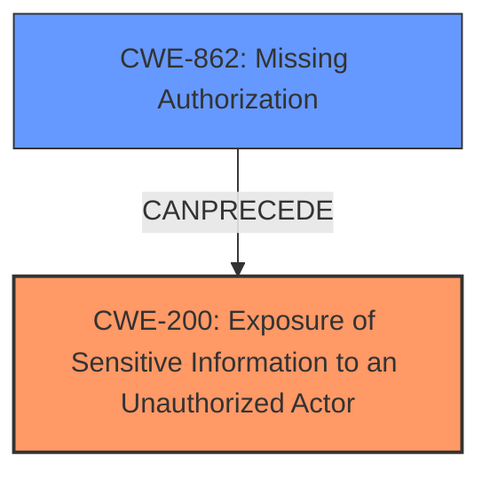

# Analysis Report for CVE-2024-11083

# Vulnerability Analysis Report: CVE-2024-11083

## Description

The ProfilePress plugin for WordPress is vulnerable to Sensitive Information Exposure in all versions up to, and including, 4.15.18 via the WordPress core search feature. This makes it possible for unauthenticated attackers to extract sensitive data from posts that have been restricted to higher-level roles such as administrator.

## Vulnerability Description Key Phrases

- **Weakness:** sensitive information exposure
- **Impact:** extract sensitive data from restricted posts
- **Attacker:** unauthenticated attackers
- **Product:** ProfilePress WordPress plugin
- **Version:** up to and including 4.15.18
- **Component:** WordPress core search feature

## Analysis (with Relationship Data)

# Summary
| CWE ID | CWE Name | Confidence | CWE Abstraction Level | CWE Vulnerability Mapping Label | CWE-Vulnerability Mapping Notes |
|---|---|---|---|---|---|
| CWE-200 | Exposure of Sensitive Information to an Unauthorized Actor | 0.9 | Class | Primary | Allowed. Though discouraged as a root cause, in this case the **sensitive information exposure** is the direct result of the plugin's failure to properly restrict access via the search function. |
| CWE-862 | Missing Authorization | 0.7 | Class | Secondary | Allowed-with-Review. Represents the **missing** authorization check that led to the exposure. |

## Evidence and Confidence

*   **Confidence Score:** 0.8
*   **Evidence Strength:** HIGH

## Relationship Analysis
The primary relationship influencing the decision is that CWE-862 **Missing Authorization** can lead to CWE-200 **Exposure of Sensitive Information to an Unauthorized Actor**. While CWE-200 is discouraged as a root cause, the specific vulnerability description highlights the direct exposure of sensitive data as the most prominent weakness. The retriever results also suggest CWE-862 and CWE-200 as relevant candidates.



## Vulnerability Chain
The vulnerability chain starts with a **missing authorization** check (CWE-862) when the WordPress core search feature accesses restricted posts. This **missing authorization** leads directly to the **exposure of sensitive information** (CWE-200) to unauthenticated attackers.

## Summary of Analysis
The initial analysis focused on identifying the root cause and the resulting impact. The vulnerability description explicitly mentions **sensitive information exposure** as a key aspect. The retriever results and similar CVE descriptions also pointed towards CWE-200. While CWE-200 is generally discouraged as a primary mapping due to its focus on impact rather than root cause, the specific context of this vulnerability makes it the most fitting primary CWE. The plugin **fails to properly prevent the exposure of restricted content through search results**. This aligns directly with CWE-200. The **missing authorization** (CWE-862) is a prerequisite weakness that leads to the exposure.

The evidence supporting this decision is:
- **Vulnerability Description Key Phrases:** "**weakness:** **sensitive information exposure**"
- **CVE Reference Links Content Summary:** "The plugin fails to properly prevent the exposure of restricted content through search results."
- **CVE Reference Links Content Summary:** "Due to the bypass, content intended for higher-level roles (e.g., administrators) becomes accessible to unauthenticated users through search."

CWE-200 is selected as the primary CWE because the vulnerability description explicitly emphasizes the exposure of sensitive information as the main concern. CWE-862 is chosen as a secondary CWE to highlight the root cause.

Other CWEs Considered:
- CWE-863 Incorrect Authorization: Considered but not used because the primary issue is a **missing** authorization check, not an incorrect one.
- CWE-639 Authorization Bypass Through User-Controlled Key: Not applicable as there's no user-controlled key involved in the bypass.
- CWE-425 Direct Request ('Forced Browsing'): Not applicable as the vulnerability is exploited through the WordPress search feature, not direct requests.

Relevant CWE Information:

# Enhanced Context (25 CWEs)
The following CWEs were identified as potentially relevant to this vulnerability:

## CWE-352: Cross-Site Request Forgery (CSRF)
**Abstraction Level**: Compound
**Similarity Score**: 0.71
**Source**: dense

**Description**:
The web application does not, or can not, sufficiently verify whether a well-formed, valid, consistent request was intentionally provided by the user who submitted the request.

**Mapping Guidance**:
- Usage: Allowed
- Rationale: This is a well-known Composite of multiple weaknesses that must all occur simultaneously, although it is attack-oriented in nature.

## CWE-472: External Control of Assumed-Immutable Web Parameter
**Abstraction Level**: Base
**Similarity Score**: 0.71
**Source**: dense

**Description**:
The web application does not sufficiently verify inputs that are assumed to be immutable but are actually externally controllable, such as hidden form fields.

**Mapping Guidance**:
- Usage: Allowed
- Rationale: This CWE entry is at the Base level of abstraction, which is a preferred level of abstraction for mapping to the root causes of vulnerabilities.

## CWE-425: Direct Request ('Forced Browsing')
**Abstraction Level**: Base
**Similarity Score**: 0.71
**Source**: dense

**Description**:
The web application does not adequately enforce appropriate authorization on all restricted URLs, scripts, or files.

**Mapping Guidance**:
- Usage: Allowed
- Rationale: This CWE entry is at the Base level of abstraction, which is a preferred level of abstraction for mapping to the root causes of vulnerabilities.

## CWE-434: Unrestricted Upload of File with Dangerous Type
**Abstraction Level**: Base
**Similarity Score**: 0.70
**Source**: dense

**Description**:
The product allows the upload or transfer of dangerous file types that are automatically processed within its environment.

**Mapping Guidance**:
- Usage: Allowed
- Rationale: This CWE entry is at the Base level of abstraction, which is a preferred level of abstraction for mapping to the root causes of vulnerabilities.

## CWE-359: Exposure of Private Personal Information to an Unauthorized Actor
**Abstraction Level**: Base
**Similarity Score**: 0.70
**Source**: dense

**Description**:
The product does not properly prevent a person's private, personal information from being accessed by actors who either (1) are not explicitly authorized to access the information or (2) do not have the implicit consent of the person about whom the information is collected.

**Mapping Guidance**:
- Usage: Allowed
- Rationale: This CWE entry is at the Base level of abstraction, which is a preferred level of abstraction for mapping to the root causes of vulnerabilities.

## CWE-639: Authorization Bypass Through User-Controlled Key
**Abstraction Level**: Base
**Similarity Score**: 0.70
**Source**: dense

**Description**:
The system's authorization functionality does not prevent one user from gaining access to another user's data or record by modifying the key value identifying the data.

**Mapping Guidance**:
- Usage: Allowed
- Rationale: This CWE entry is at the Base level of abstraction, which is a preferred level of abstraction for mapping to the root causes of vulnerabilities.

## CWE-538: Insertion of Sensitive Information into Externally-Accessible File or Directory
**Abstraction Level**: Base
**Similarity Score**: 0.69
**Source**: dense

**Description**:
The product places sensitive information into files or directories that are accessible to actors who are allowed to have access to the files, but not to the sensitive information.

**Mapping Guidance**:
- Usage: Allowed
- Rationale: This CWE entry is at the Base level of abstraction, which is a preferred level of abstraction for mapping to the root causes of vulnerabilities.

## CWE-201: Insertion of Sensitive Information Into Sent Data
**Abstraction Level**: Base
**Similarity Score**: 0.69
**Source**: dense

**Description**:
The code transmits data to another actor, but a portion of the data includes sensitive information that should not be accessible to that actor.

**Mapping Guidance**:
- Usage: Allowed
- Rationale: This CWE entry is at the Base level of abstraction, which is a preferred level of abstraction for mapping to the root causes of vulnerabilities.

## CWE-497: Exposure of Sensitive System Information to an Unauthorized Control Sphere
**Abstraction Level**: Base
**Similarity Score**: 0.68
**Source**: dense

**Description**:
The product does not properly prevent sensitive system-level information from being accessed by unauthorized actors who do not have the same level of access to the underlying system as the product does.

**Mapping Guidance**:
- Usage: Allowed
- Rationale: This CWE entry is at the Base level of abstraction, which is a preferred level of abstraction for mapping to the root causes of vulnerabilities.

## CWE-862: Missing Authorization
**Abstraction Level**: Class
**Similarity Score**: 0.68
**Source**: dense

**Description**:
The product does not perform an authorization check when an actor attempts to access a resource or perform an action.

**Mapping Guidance**:
- Usage: Allowed-with-Review
- Rationale: This CWE entry is a Class and might have Base-level children that would be more appropriate

## CWE-425: Direct Request ('Forced Browsing')
**Abstraction Level**: Base
**Similarity Score**: 908.92
**Source**: sparse

**Description**:
The web application does not adequately enforce appropriate authorization on all restricted URLs, scripts, or files.

**Mapping Guidance**:


## CWE Relationship Analysis

Current CWEs represent these abstraction levels: .


### Vulnerability Chain Analysis

**Chain starting from CWE-863:**
- 863 (Incorrect Authorization) - ROOT


**Chain starting from CWE-359:**
- 359 (Exposure of Private Personal Information to an Unauthorized Actor) - ROOT


### CWE Relationship Diagram

```mermaid
graph TD
    classDef primary fill:#f96,stroke:#333,stroke-width:2px
    classDef secondary fill:#69f,stroke:#333
    classDef tertiary fill:#9e9,stroke:#333
```


*Report generated on 2025-07-13 00:57:15*
