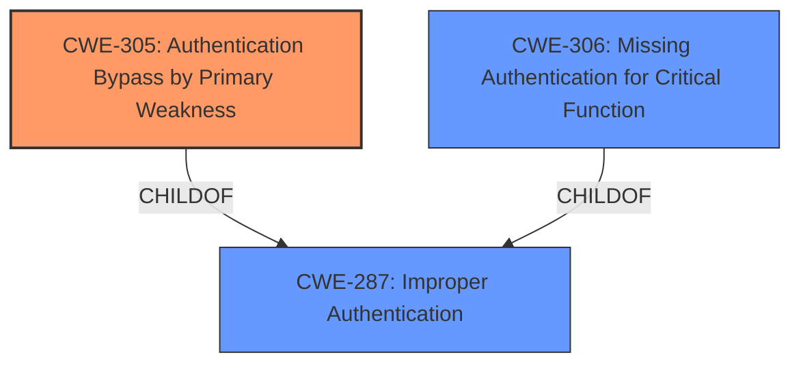

# Raw Analyzer Response for CVE-2024-11087

# Summary
| CWE ID | CWE Name | Confidence | CWE Abstraction Level | CWE Vulnerability Mapping Label | CWE-Vulnerability Mapping Notes |
|---|---|---|---|---|---|
| CWE-305 | Authentication Bypass by Primary Weakness | 0.9 | Base | Allowed | Primary CWE. The vulnerability is due to a separate weakness (insufficient verification) that bypasses authentication. |
| CWE-287 | Improper Authentication | 0.7 | Class | Discouraged | Secondary candidate. It could apply, but CWE-305 is more specific. |
| CWE-306 | Missing Authentication for Critical Function | 0.6 | Base | Allowed | Secondary candidate. It could apply, but CWE-305 is more specific. |

## Evidence and Confidence

*   **Confidence Score:** 0.9
*   **Evidence Strength:** MEDIUM

## Relationship Analysis
The primary relationship that influenced the decision was the parent-child relationship between CWE-287 (Improper Authentication) and CWE-305 (Authentication Bypass by Primary Weakness), and the relationship between CWE-287 and CWE-306 (Missing Authentication for Critical Function). CWE-305 is more specific than CWE-287, as it explicitly states that the authentication bypass occurs due to a separate, primary weakness, which aligns with the **insufficient verification** of the social login token.

## Vulnerability Chain
The vulnerability chain starts with the **insufficient verification** of the user being returned by the social login token (the primary weakness). This leads to an **authentication bypass**, allowing unauthenticated attackers to log in as any existing user on the site.
  - **Root Cause:** **Insufficient Verification**
  - **Weakness:** **Authentication Bypass**
  - **Impact:** Unauthorized access to user accounts

## Summary of Analysis
The initial analysis focused on identifying the root cause of the vulnerability, which is the **insufficient verification** of the social login token. The retriever results suggested several CWEs related to authentication and authorization, including CWE-863 (Incorrect Authorization), CWE-287 (Improper Authentication), and CWE-306 (Missing Authentication for Critical Function).

However, after carefully reviewing the vulnerability description and the CWE specifications, it became clear that CWE-305 (Authentication Bypass by Primary Weakness) is the most appropriate choice. This is because the vulnerability involves an **authentication bypass** that is caused by a separate, primary weakness (**insufficient verification**). The vulnerability description explicitly states that the **insufficient verification** makes it possible for attackers to bypass authentication and log in as any existing user.

The choice of CWE-305 is further supported by the MITRE mapping guidance, which emphasizes the importance of identifying the root cause of the vulnerability and selecting the most specific CWE. CWE-305 is a more specific child of CWE-287, which makes it a better fit for this vulnerability.

The assessment is primarily based on the vulnerability description, which clearly identifies the **insufficient verification** as the root cause of the **authentication bypass**. The retriever results and the MITRE mapping guidance were used to confirm this assessment and to select the most appropriate CWE.

Relevant CWE Information:

CWE-305: Authentication Bypass by Primary Weakness
The authentication algorithm is sound, but the implemented mechanism can be bypassed as the result of a separate weakness that is primary to the authentication error.

CWE-287: Improper Authentication
The product does not adequately authenticate actors trying to access a resource, functionality, or data.

CWE-306: Missing Authentication for Critical Function
The product does not perform any authentication for functionality that requires a provable user identity or consumes a significant amount of resources.