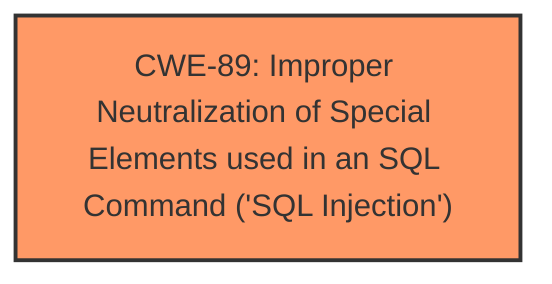

# Raw Analyzer Response for CVE-2024-11127

# Summary
| CWE ID | CWE Name | Confidence | CWE Abstraction Level | CWE Vulnerability Mapping Label | CWE-Vulnerability Mapping Notes |
|---|---|---|---|---|---|
| CWE-89 | Improper Neutralization of Special Elements used in an SQL Command ('SQL Injection') | 1.0 | Base | Primary | Allowed |

## Evidence and Confidence

*   **Confidence Score:** 1.0
*   **Evidence Strength:** HIGH

## Relationship Analysis
The primary identified weakness is CWE-89, which is a Base level CWE. There are no direct parent or child relationships significantly impacting this decision, as the description clearly points to an SQL Injection vulnerability. The retriever results also strongly suggest CWE-89 as the most appropriate mapping.

## Vulnerability Chain
The vulnerability chain consists of a single step:

1.  Improper handling of user-provided input in the `userid` argument leads to **SQL Injection** (CWE-89).

## Summary of Analysis
The vulnerability description explicitly states that the `userid` argument in `admin.php` is vulnerable to **SQL injection**. This directly corresponds to CWE-89: Improper Neutralization of Special Elements used in an SQL Command ('SQL Injection'). The provided "CWE for similar CVE Descriptions" section also lists CWE-89 as the primary CWE match. The retriever results confirm this assessment, with CWE-89 having a score of 1.0.

The evidence supporting this classification is the vulnerability description itself, which clearly identifies the presence of **SQL injection** due to improper handling of the `userid` argument. The CWE description for CWE-89 perfectly aligns with this vulnerability: "The product constructs all or part of an SQL command using externally-influenced input... but it does not neutralize or incorrectly neutralizes special elements that could modify the intended SQL command."

I considered other CWEs like CWE-79 (Improper Neutralization of Input During Web Page Generation ('Cross-site Scripting')), CWE-434 (Unrestricted Upload of File with Dangerous Type), and CWE-74 (Improper Neutralization of Special Elements in Output Used by a Downstream Component ('Injection')), but these are not as specific as CWE-89 and do not accurately represent the **SQL injection** vulnerability. CWE-74 is also discouraged.