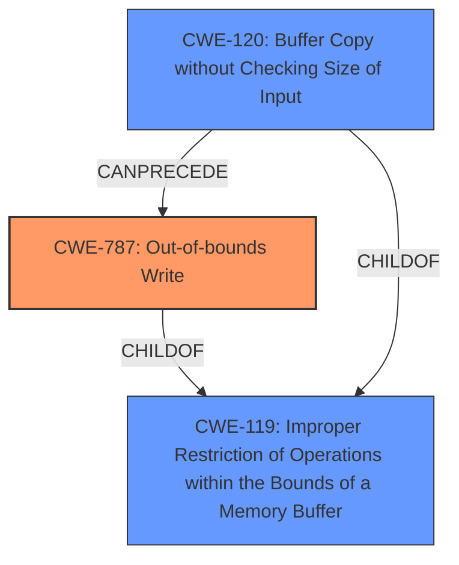

# Raw Analyzer Response for CVE-2024-11139

# Summary
| CWE ID | CWE Name | Confidence | CWE Abstraction Level | CWE Vulnerability Mapping Label | CWE-Vulnerability Mapping Notes |
|---|---|---|---|---|---|
| CWE-787 | Out-of-bounds Write | 0.9 | Base | Primary | Allowed |
| CWE-120 | Buffer Copy without Checking Size of Input ('Classic Buffer Overflow') | 0.7 | Base | Secondary | Allowed-with-Review |
| CWE-119 | Improper Restriction of Operations within the Bounds of a Memory Buffer | 0.6 | Class | Secondary | Discouraged |

## Evidence and Confidence

*   **Confidence Score:** 0.9
*   **Evidence Strength:** HIGH

## Relationship Analysis
The primary CWE is CWE-787 (Out-of-bounds Write), a base-level CWE, indicating a write operation outside the intended buffer. CWE-119 (Improper Restriction of Operations within the Bounds of a Memory Buffer) is a broader, class-level CWE, and is a parent of CWE-787. CWE-120 (Buffer Copy without Checking Size of Input ('Classic Buffer Overflow')) is also related, as unchecked buffer copies can lead to out-of-bounds writes. CWE-120 can precede CWE-787. The abstraction levels influenced the decision to choose CWE-787 as primary because it is more specific than CWE-119 and directly indicates the nature of the write operation.

## Vulnerability Chain
The vulnerability chain starts with a **CWE-119 Improper Restriction of Operations within the Bounds of a Memory Buffer**, leading to **CWE-120 Buffer Copy without Checking Size of Input**, ultimately resulting in **CWE-787 Out-of-bounds Write**. This allows for arbitrary code execution by local attackers through a malicious project file. The root cause is the **improper restriction**, which leads to the **out-of-bounds write** and the impact of code execution.

## Summary of Analysis
The initial analysis focused on the provided **CWE-119 Improper Restriction of Operations within the Bounds of a Memory Buffer** as indicated in the vulnerability description. However, the content summary specifies memory corruption, heap and stack based buffer overflows that can lead to arbitrary code execution.
The graph relationships show that **CWE-787 Out-of-bounds Write** is a child of **CWE-119 Improper Restriction of Operations within the Bounds of a Memory Buffer**, making it more specific. The vulnerability description mentions arbitrary code execution, which aligns with the consequences of an out-of-bounds write. Therefore, **CWE-787 Out-of-bounds Write** is the primary CWE, representing the root cause, while **CWE-119 Improper Restriction of Operations within the Bounds of a Memory Buffer** remains relevant as a broader categorization and a parent of **CWE-787 Out-of-bounds Write**.
**CWE-120 Buffer Copy without Checking Size of Input** is considered as a secondary CWE because the vulnerability description mentions the usage of a malicious project file, implying the copy of unchecked input. This is further supported by the CVE Reference Links Content Summary, which mentions memory corruption, heap-based buffer overflow, and stack-based buffer overflow.
The selected CWEs are at the optimal level of specificity, with **CWE-787 Out-of-bounds Write** providing the most accurate representation of the **root cause** and **CWE-119 Improper Restriction of Operations within the Bounds of a Memory Buffer** giving a broader context. The evidence directly supports these classifications, increasing confidence in the assessment.

Relevant CWE Information:

# Enhanced Context (25 CWEs)
The following CWEs were identified as potentially relevant to this vulnerability:

## CWE-824: Access of Uninitialized Pointer
**Abstraction Level**: Base
**Similarity Score**: 0.77
**Source**: dense

**Description**:
The product accesses or uses a pointer that has not been initialized.

**Mapping Guidance**:
- Usage: Allowed
- Rationale: This CWE entry is at the Base level of abstraction, which is a preferred level of abstraction for mapping to the root causes of vulnerabilities.

*Not Selected:* While an uninitialized pointer could lead to memory corruption, it is not the primary cause described in the vulnerability.

## CWE-119: Improper Restriction of Operations within the Bounds of a Memory Buffer
**Abstraction Level**: Class
**Similarity Score**: 0.77
**Source**: dense

**Description**:
The product performs operations on a memory buffer, but it reads from or writes to a memory location outside the buffer's intended boundary. This may result in read or write operations on unexpected memory locations that could be linked to other variables, data structures, or internal program data.

**Mapping Guidance**:
- Usage: Discouraged
- Rationale: CWE-119 is commonly misused in low-information vulnerability reports when lower-level CWEs could be used instead, or when more details about the vulnerability are available.

*Selected as Secondary:* This is the **rootcause** indicated in the Vulnerability Description. It is a parent of **CWE-787 Out-of-bounds Write**, and the description notes it is often misused when more specific CWEs are available.

## CWE-755: Improper Handling of Exceptional Conditions
**Abstraction Level**: Class
**Similarity Score**: 0.76
**Source**: dense

**Description**:
The product does not handle or incorrectly handles an exceptional condition.

**Mapping Guidance**:
- Usage: Discouraged
- Rationale: This CWE entry is a level-1 Class (i.e., a child of a Pillar). It might have lower-level children that would be more appropriate

*Not Selected:* Improper handling of exceptional conditions is not directly indicated in the vulnerability description.

## CWE-131: Incorrect Calculation of Buffer Size
**Abstraction Level**: Base
**Similarity Score**: 0.76
**Source**: dense

**Description**:
The product does not correctly calculate the size to be used when allocating a buffer, which could lead to a buffer overflow.

**Mapping Guidance**:
- Usage: Allowed
- Rationale: This CWE entry is at the Base level of abstraction, which is a preferred level of abstraction for mapping to the root causes of vulnerabilities.

*Not Selected:* Incorrect buffer size calculation could lead to a buffer overflow, but there is no explicit mention of incorrect calculation in the description.

## CWE-668: Exposure of Resource to Wrong Sphere
**Abstraction Level**: Class
**Similarity Score**: 0.75
**Source**: dense

**Description**:
The product exposes a resource to the wrong control sphere, providing unintended actors with inappropriate access to the resource.

**Mapping Guidance**:
- Usage: Discouraged
- Rationale: CWE-668 is high-level and is often misused as a catch-all when lower-level CWE IDs might be applicable. It is sometimes used for low-information vulnerability reports [REF-1287]. It is a level-1 Class (i.e., a child of a Pillar). It is not useful for trend analysis.

*Not Selected:* This CWE is too general and does not accurately represent the specific vulnerability.

## CWE-125: Out-of-bounds Read
**Abstraction Level**: Base
**Similarity Score**: 0.75
**Source**: dense

**Description**:
The product reads data past the end, or before the beginning, of the intended buffer.

**Mapping Guidance**:
- Usage: Allowed
- Rationale: This CWE entry is at the Base level of abstraction, which is a preferred level of abstraction for mapping to the root causes of vulnerabilities.

*Not Selected:* The primary issue is a write, not a read, operation.

## CWE-130: Improper Handling of Length Parameter Inconsistency
**Abstraction Level**: Base
**Similarity Score**: 0.75
**Source**: dense

**Description**:
The product parses a formatted message or structure, but it does not handle or incorrectly handles a length field that is inconsistent with the actual length of the associated data.

**Mapping Guidance**:
- Usage: Allowed
- Rationale: This CWE entry is at the Base level of abstraction, which is a preferred level of abstraction for mapping to the root causes of vulnerabilities.

*Not Selected:* There is no mention of length parameter inconsistency in the vulnerability description.

## CWE-73: External Control of File Name or Path
**Abstraction Level**: Base
**Similarity