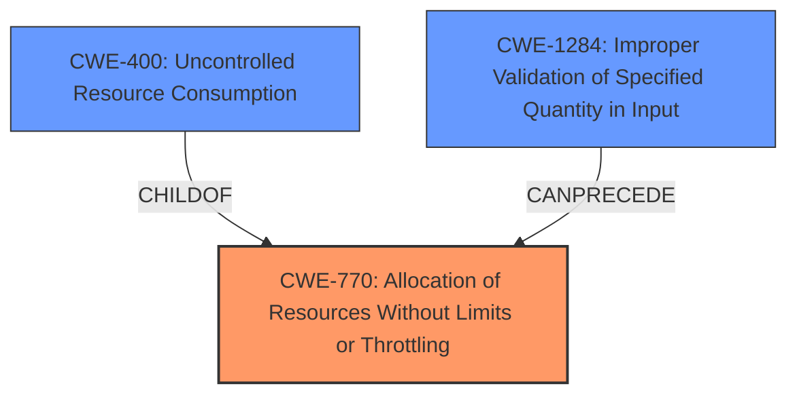

# Enhanced Analysis for CVE-2024-11171

# Summary
| CWE ID    | CWE Name                                                                   | Confidence | CWE Abstraction Level | CWE Vulnerability Mapping Label | CWE-Vulnerability Mapping Notes |
| :---------- | :------------------------------------------------------------------------- | :--------- | :---------------------- | :------------------------------ | :------------------------------ |
| CWE-770     | Allocation of Resources Without Limits or Throttling                     | 0.90       | Base                    | Primary                         | Allowed                         |
| CWE-400     | Uncontrolled Resource Consumption                                        | 0.70       | Base                    | Secondary                       | Allowed                         |
| CWE-1284    | Improper Validation of Specified Quantity in Input                     | 0.60       | Base                    | Secondary                       | Allowed                         |

## Evidence and Confidence

*   **Confidence Score:** 0.80
*   **Evidence Strength:** HIGH

## Relationship Analysis
The primary weakness is CWE-770 Allocation of Resources Without Limits or Throttling. This is a base-level CWE that accurately describes the **lack of limits** on file upload size, leading to excessive resource allocation. The relationship between CWE-770 and CWE-400 Uncontrolled Resource Consumption is a parent-child relationship, as CWE-400 is a child of CWE-770. This means that CWE-770 can lead to CWE-400. Also, CWE-1284 Improper Validation of Specified Quantity in Input can precede CWE-770. The relationship is a CANPRECEDE.



## Vulnerability Chain
The vulnerability chain starts with **improper input validation** (specifically, a **lack of validation** on the file size). This leads to **uncontrolled resource allocation**, which then results in **out-of-memory errors** and ultimately a **denial of service** (server crash).

The chain is as follows:
1.  **Improper Input Validation** (Lack of file size limit)
2.  **Allocation of Resources Without Limits or Throttling** (CWE-770)
3.  **Uncontrolled Resource Consumption** (CWE-400)
4.  **Out-of-Memory Errors**
5.  **Denial of Service**

## Summary of Analysis
The initial analysis identified several potential CWEs, including CWE-1284, CWE-20, CWE-770, and CWE-789. After carefully reviewing the vulnerability description and the CWE specifications, I have concluded that CWE-770 best represents the root cause of the vulnerability. The application **fails to limit the allocation of memory** for uploaded files, leading to resource exhaustion and a denial-of-service condition.

The evidence from the vulnerability description: "When using in-memory storage (the default setting for multer), there is **no limit on the upload file size.** This can lead to a server crash due to **out-of-memory errors** when handling large files."

CWE-770 is at the optimal level of specificity because it directly addresses the **unrestricted allocation of resources**, which is the root cause of the problem. While CWE-400 is a valid secondary CWE, it represents the impact of the vulnerability rather than the underlying cause. CWE-1284 is considered because the **lack of file size validation** is a form of improper input validation, but CWE-770 is more specific to the resource allocation issue.

**CWE Considered But Not Used:**

*   **CWE-20: Improper Input Validation:** While the vulnerability involves **improper input validation**, CWE-20 is too generic. The more specific CWE-770 and CWE-1284 are more appropriate.
*   **CWE-789: Memory Allocation with Excessive Size Value:** This CWE is similar to CWE-770, but CWE-770 focuses on the **lack of limits**, which is more precise in this case.
*   **CWE-190: Integer Overflow or Wraparound:** This CWE is not relevant as there is no mention of integer overflow or wraparound in the vulnerability description.
*   **CWE-125: Out-of-bounds Read:** This CWE is not relevant as there is no mention of out-of-bounds read in the vulnerability description.
*   **CWE-754: Improper Check for Unusual or Exceptional Conditions:** This CWE is not the best fit, as the core issue is the **absence of a file size limit** rather than a failure to check for unusual conditions.
*   **CWE-378: Creation of Temporary File With Insecure Permissions:** Not relevant as the vulnerability description doesn't mention insecure permissions for temporary files.
*   **CWE-799: Improper Control of Interaction Frequency:** Not relevant as the vulnerability description is about the size of the upload not the frequency.


## CWE Relationship Analysis

Current CWEs represent these abstraction levels: .


### Vulnerability Chain Analysis

**Chain starting from CWE-1284:**
- 1284 (Improper Validation of Specified Quantity in Input) - ROOT


**Chain starting from CWE-400:**
- 400 (Uncontrolled Resource Consumption) - ROOT


### CWE Relationship Diagram

```mermaid
graph TD
    classDef primary fill:#f96,stroke:#333,stroke-width:2px
    classDef secondary fill:#69f,stroke:#333
    classDef tertiary fill:#9e9,stroke:#333
```