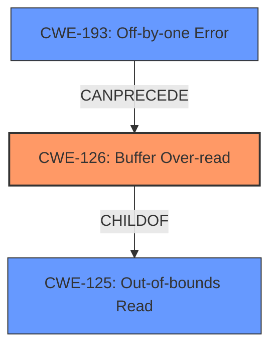

# Analysis for CVE-2024-11233

# Summary
| CWE ID | CWE Name | Confidence | CWE Abstraction Level | CWE Vulnerability Mapping Label | CWE-Vulnerability Mapping Notes |
|---|---|---|---|---|---|
| CWE-126 | Buffer Over-read | 1.0 | Variant | Primary | Allowed |
| CWE-125 | Out-of-bounds Read | 0.7 | Base | Secondary | Allowed |
| CWE-193 | Off-by-one Error | 0.6 | Base | Secondary | Allowed |

## Evidence and Confidence

*   **Confidence Score:** 0.8
*   **Evidence Strength:** HIGH

## Relationship Analysis
The primary weakness is **CWE-126 Buffer Over-read**, which is a variant of **CWE-125 Out-of-bounds Read**. The vulnerability description and CVE summary clearly indicate a single byte over-read, which aligns with the characteristics of **CWE-126**. **CWE-193 Off-by-one Error** is considered as a contributing factor leading to the buffer over-read. **CWE-125 Out-of-bounds Read** is a more general case, and while applicable, **CWE-126** is more specific.

## Vulnerability Chain
The vulnerability chain starts with an **error in the `convert.quoted-printable-decode` filter**. This **error** leads to an **CWE-193 Off-by-one Error** which subsequently results in a **CWE-126 Buffer Over-read**, ultimately causing crashes or disclosing memory content.

## Summary of Analysis
The initial analysis identified several candidate CWEs, including **CWE-126 Buffer Over-read**, **CWE-1284 Improper Validation of Specified Quantity in Input**, and **CWE-193 Off-by-one Error**. After reviewing the vulnerability description and CVE summary, it became clear that the core issue is a single-byte **buffer over-read** due to a missing bounds check in the `convert.quoted-printable-decode` filter. This directly corresponds to **CWE-126**. While **CWE-125 Out-of-bounds Read** is a broader category, **CWE-126** provides a more precise description of the vulnerability.

The vulnerability description key phrases include "**buffer overread**" and the CVE summary mentions "single byte over-read" and "out-of-bounds read". The root cause is the "**error in `convert.quoted-printable-decode` filter**" that leads to "**missing bounds check**".

The retriever results listed **CWE-126 Buffer Over-read** as the top combined result. The graph relationships and mapping guidance further support this selection. **CWE-126** is a variant of **CWE-125**, providing a more specific classification.

Other considered CWEs:

*   **CWE-1284 Improper Validation of Specified Quantity in Input:** While the vulnerability involves processing input, the primary issue is not the validation of the quantity but rather the over-read of the buffer. Therefore, this CWE is not the most appropriate.
*   **CWE-193 Off-by-one Error:** This CWE could be a contributing factor, but it's not the primary weakness. The over-read is the direct result of the **error** in the filter, making **CWE-126** more suitable.
*   **CWE-125 Out-of-bounds Read:** This is a more general case that includes both over-reads and under-reads. Since the vulnerability is specifically an over-read, **CWE-126** is preferred.

The final decision is based on the evidence from the vulnerability description, the CVE summary, and the retriever results, along with the relationship analysis and mapping guidance provided by MITRE. **CWE-126 Buffer Over-read** is the most accurate and specific classification for this vulnerability.