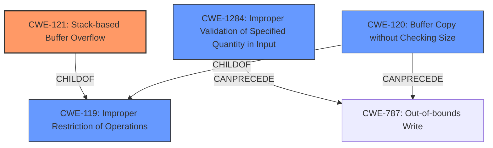

# Analysis Report for CVE-2024-11237

# Vulnerability Analysis Report: CVE-2024-11237

## Description

A vulnerability, which was classified as critical, has been found in TP-Link VN020 F3v(T) TT_V6.2.1021. Affected by this issue is some unknown functionality of the component DHCP DISCOVER Packet Parser. The manipulation of the argument hostname leads to **stack-based buffer overflow**. The attack may be launched remotely. The exploit has been disclosed to the public and may be used.

## Vulnerability Description Key Phrases

- **Weakness:** stack-based buffer overflow
- **Vector:** manipulation of hostname argument
- **Product:** TP-Link VN020 F3v(T)
- **Version:** TT_V6.2.1021
- **Component:** DHCP DISCOVER Packet Parser

## Analysis (with Relationship Data)

# Summary
| CWE ID | CWE Name | Confidence | CWE Abstraction Level | CWE Vulnerability Mapping Label | CWE-Vulnerability Mapping Notes |
|---|---|---|---|---|---|
| CWE-121 | Stack-based Buffer Overflow | 1.0 | Variant | Allowed | Primary CWE. The vulnerability description explicitly states "stack-based buffer overflow" and the CVE summary confirms this. |
| CWE-1284 | Improper Validation of Specified Quantity in Input | 0.7 | Base | Allowed | Secondary candidate. The CVE summary indicates that the router does not properly validate length fields in DHCP options. |
| CWE-120 | Buffer Copy without Checking Size of Input ('Classic Buffer Overflow') | 0.6 | Base | Allowed-with-Review | Secondary candidate. While less specific than CWE-121, the CVE summary describes a scenario where an oversized hostname is copied without checking the buffer size. |

## Evidence and Confidence

*   **Confidence Score:** 0.9
*   **Evidence Strength:** HIGH

## Relationship Analysis
The primary CWE is CWE-121 (Stack-based Buffer Overflow), which is a variant of CWE-119 (Improper Restriction of Operations within the Bounds of a Memory Buffer). CWE-1284 (Improper Validation of Specified Quantity in Input) can precede CWE-787 (Out-of-bounds Write) as the improper validation leads to the write. CWE-120 (Buffer Copy without Checking Size of Input) is also a child of CWE-119 and can precede CWE-787. Choosing CWE-121 as the primary weakness is appropriate because the vulnerability description explicitly mentions "stack-based buffer overflow," making it a more specific and accurate classification than its parents or related peers.



## Vulnerability Chain
The vulnerability chain starts with **improper input validation (CWE-1284)**, leading to a **buffer copy without checking size (CWE-120)** and ultimately results in a **stack-based buffer overflow (CWE-121)** which leads to an **out-of-bounds write (CWE-787)**.

## Summary of Analysis
The initial assessment strongly pointed to **CWE-121 (Stack-based Buffer Overflow)** as the primary weakness, supported by the vulnerability description and CVE summary. The CVE summary also provided details about **improper input validation (CWE-1284)** regarding DHCP option lengths.

The final decision focused on the explicit mention of "stack-based buffer overflow" in the vulnerability description, making CWE-121 the most accurate and specific choice. The vulnerability description says "The manipulation of the argument hostname leads to **stack-based buffer overflow**". The CVE summary confirms this rootcause "Stack-based buffer overflow: The router's DHCP server allocates a fixed-size buffer (64 bytes) on the stack for storing the hostname from the DHCP DISCOVER packet. By sending a hostname longer than this (127 bytes in the exploit), a stack-based buffer overflow occurs."

CWE-1284 and CWE-120 were considered as contributing factors, and while they are present, the explicit buffer overflow on the stack makes CWE-121 the primary weakness. These other CWEs may be present in other similar vulnerabilties but are secondary here.

Relevant CWE Information:

# Enhanced Context (25 CWEs)
The following CWEs were identified as potentially relevant to this vulnerability:

## CWE-121: Stack-based Buffer Overflow
**Abstraction Level**: Variant
**Similarity Score**: 0.75
**Source**: dense

**Description**:
A stack-based buffer overflow condition is a condition where the buffer being overwritten is allocated on the stack (i.e., is a local variable or, rarely, a parameter to a function).

**Mapping Guidance**:
- Usage: Allowed
- Rationale: This CWE entry is at the Variant level of abstraction, which is a preferred level of abstraction for mapping to the root causes of vulnerabilities.

## CWE-1284: Improper Validation of Specified Quantity in Input
**Abstraction Level**: Base
**Similarity Score**: 1459.04
**Source**: sparse

**Description**:
The product receives input that is expected to specify a quantity (such as size or length), but it does not validate or incorrectly validates that the quantity has the required properties.

**Mapping Guidance**:
- Usage: Allowed
- Rationale: This CWE entry is at the Base level of abstraction, which is a preferred level of abstraction for mapping to the root causes of vulnerabilities.

## CWE-120: Buffer Copy without Checking Size of Input ('Classic Buffer Overflow')
**Abstraction Level**: Base
**Similarity Score**: 1450.55
**Source**: sparse

**Description**:
The product copies an input buffer to an output buffer without verifying that the size of the input buffer is less than the size of the output buffer, leading to a buffer overflow.

**Mapping Guidance**:
- Usage: Allowed-with-Review
- Rationale: There are some indications that this CWE ID might be misused and selected simply because it mentions "buffer overflow" - an increasingly vague term. This CWE entry is only appropriate for "Buffer Copy" operations (not buffer reads), in which where there is no "Checking [the] Size of Input", and (by implication of the copy) writing past the end of the buffer.


## CWE Relationship Analysis

Current CWEs represent these abstraction levels: .


### Vulnerability Chain Analysis

**Chain starting from CWE-121:**
- 121 (Stack-based Buffer Overflow) - ROOT


**Chain starting from CWE-1284:**
- 1284 (Improper Validation of Specified Quantity in Input) - ROOT


### CWE Relationship Diagram

```mermaid
graph TD
    classDef primary fill:#f96,stroke:#333,stroke-width:2px
    classDef secondary fill:#69f,stroke:#333
    classDef tertiary fill:#9e9,stroke:#333
```


*Report generated on 2025-07-13 01:11:02*
