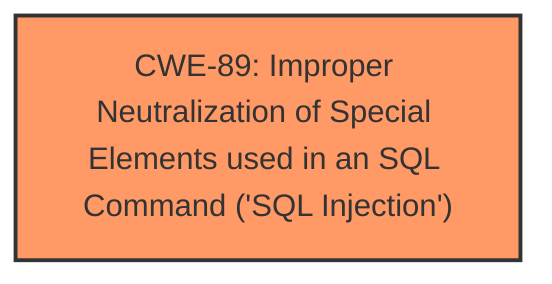

# Analysis Report for CVE-2024-11244

# Vulnerability Analysis Report: CVE-2024-11244

## Description

A vulnerability classified as critical was found in code-projects Farmacia 1.0. This vulnerability affects unknown code of the file /editar-cliente.php. The manipulation of the argument id leads to **sql injection**. The attack can be initiated remotely. The exploit has been disclosed to the public and may be used.

## Vulnerability Description Key Phrases

- **Weakness:** sql injection
- **Product:** code-projects Farmacia
- **Version:** 1
- **Component:** /editar-cliente.php

## Analysis (with Relationship Data)

# Summary
| CWE ID | CWE Name | Confidence | CWE Abstraction Level | CWE Vulnerability Mapping Label | CWE-Vulnerability Mapping Notes |
|---|---|---|---|---|---|
| CWE-89 | Improper Neutralization of Special Elements used in an SQL Command ('SQL Injection') | 1.0 | Base | Primary | Allowed |

## Evidence and Confidence

*   **Confidence Score:** 1.0
*   **Evidence Strength:** HIGH

## Relationship Analysis
The primary relationship is that CWE-89 [Improper Neutralization of Special Elements used in an SQL Command ('SQL Injection')] is a base-level weakness. There are no direct parent or child relationships significantly impacting the decision, as the description clearly points to SQL injection due to **improper neutralization** of input.



## Vulnerability Chain
The vulnerability chain starts with the **improper neutralization** of the `id` parameter, leading directly to SQL injection.

Improper Input Handling -> SQL Injection

## Summary of Analysis
The analysis strongly supports CWE-89 [Improper Neutralization of Special Elements used in an SQL Command ('SQL Injection')] as the primary CWE. The vulnerability description explicitly states that the manipulation of the `id` argument leads to **SQL injection**. The CVE Reference Links Content Summary confirms that the `$id` parameter is directly concatenated into an SQL query without sanitization.

The selection is based on direct evidence from the vulnerability description and the CVE Reference Links Content Summary. The retriever results also list CWE-89 as the top candidate. The base level of abstraction is appropriate as it directly represents the **root cause**.

CWE-79 [Improper Neutralization of Input During Web Page Generation ('Cross-site Scripting')] was considered but not selected because the vulnerability is specifically related to SQL injection, not cross-site scripting. Similarly, other CWEs like CWE-434 [Unrestricted Upload of File with Dangerous Type], CWE-1336 [Improper Neutralization of Special Elements Used in a Template Engine], CWE-74 [Improper Neutralization of Special Elements in Output Used by a Downstream Component ('Injection')], CWE-96 [Improper Neutralization of Directives in Statically Saved Code ('Static Code Injection')], and CWE-73 [External Control of File Name or Path] were not selected as they do not align with the specific nature of the SQL injection vulnerability described.


## CWE Relationship Analysis

Current CWEs represent these abstraction levels: .


### Vulnerability Chain Analysis

**Chain starting from CWE-89:**
- 89 (Improper Neutralization of Special Elements used in an SQL Command ('SQL Injection')) - ROOT


**Chain starting from CWE-79:**
- 79 (Improper Neutralization of Input During Web Page Generation ('Cross-site Scripting')) - ROOT


### CWE Relationship Diagram

```mermaid
graph TD
    classDef primary fill:#f96,stroke:#333,stroke-width:2px
    classDef secondary fill:#69f,stroke:#333
    classDef tertiary fill:#9e9,stroke:#333
```


*Report generated on 2025-07-13 01:11:48*
