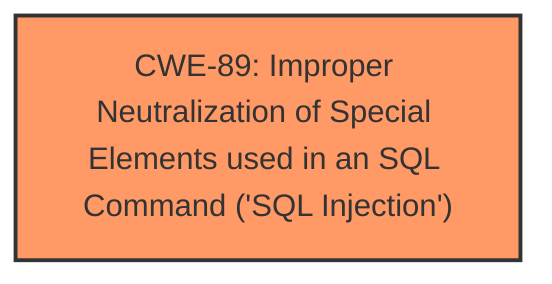

# Analysis Report for CVE-2024-11245

# Vulnerability Analysis Report: CVE-2024-11245

## Description

A vulnerability, which was classified as critical, has been found in code-projects Farmacia 1.0. This issue affects some unknown processing of the file /editar-produto.php. The manipulation of the argument id leads to **sql injection**. The attack may be initiated remotely. The exploit has been disclosed to the public and may be used.

## Vulnerability Description Key Phrases

- **Weakness:** sql injection
- **Product:** Farmacia
- **Version:** 1
- **Component:** /editar-produto.php

## Analysis (with Relationship Data)

# Summary
| CWE ID | CWE Name | Confidence | CWE Abstraction Level | CWE Vulnerability Mapping Label | CWE-Vulnerability Mapping Notes |
|---|---|---|---|---|---|
| CWE-89 | Improper Neutralization of Special Elements used in an SQL Command ('SQL Injection') | 1.0 | Base | Allowed | Primary CWE |

## Evidence and Confidence

*   **Confidence Score:** 1.0
*   **Evidence Strength:** HIGH

## Relationship Analysis
The primary relationship that influenced the decision was the direct match of the vulnerability description to the characteristics of CWE-89. The vulnerability involves the manipulation of an argument leading to **SQL injection**, which aligns perfectly with the description of CWE-89 as it involves **improper neutralization** of special elements used in an SQL command. There are no other specific parent-child or peer relationships significantly affecting this clear-cut case.



## Vulnerability Chain
The vulnerability chain is straightforward:

1.  **Root Cause:** **Improper neutralization** of the 'id' parameter in `/editar-produto.php` before its inclusion in an SQL query. (CWE-89)
2.  **Impact:** **SQL Injection**, leading to potential data breach, modification, or deletion.

## Summary of Analysis
The vulnerability description clearly indicates a **SQL injection** vulnerability due to **improper neutralization** of the `id` parameter. The CVE Reference Links Content Summary confirms this, stating, "The root cause of the vulnerability is the direct inclusion of the user-controlled `id` parameter from the HTTP request into an SQL query without proper sanitization or parameterization."

The retriever results also strongly support CWE-89 as the primary CWE, with a score of 1.0. The relationship analysis doesn't offer further refinement, as this is a base-level weakness directly reflecting the described issue.

CWE-79, CWE-117, CWE-434, and CWE-1336 were considered but rejected. CWE-79 because the vulnerability is not directly related to web page generation or cross-site scripting. CWE-117 because the issue isn't related to logging. CWE-434 is for unrestricted file uploads. CWE-1336 is for problems in template engines. While these might be indirectly related in some scenarios, they don't accurately represent the core weakness, which is the **SQL injection** due to **improper neutralization**.
The selection of CWE-89 is at the optimal level of specificity because it precisely describes the root cause of the vulnerability.

Relevant CWE Information:


## CWE Relationship Analysis

Current CWEs represent these abstraction levels: .


### Vulnerability Chain Analysis

**Chain starting from CWE-89:**
- 89 (Improper Neutralization of Special Elements used in an SQL Command ('SQL Injection')) - ROOT


**Chain starting from CWE-79:**
- 79 (Improper Neutralization of Input During Web Page Generation ('Cross-site Scripting')) - ROOT


### CWE Relationship Diagram

```mermaid
graph TD
    classDef primary fill:#f96,stroke:#333,stroke-width:2px
    classDef secondary fill:#69f,stroke:#333
    classDef tertiary fill:#9e9,stroke:#333
```


*Report generated on 2025-07-13 01:12:01*
