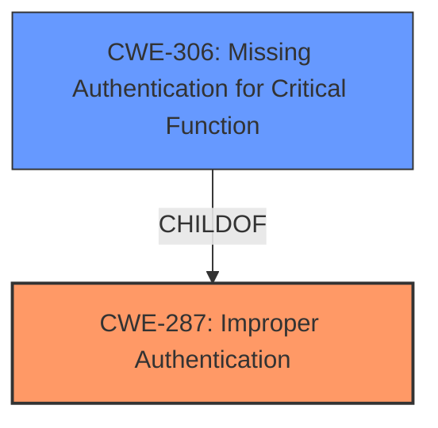

# Analysis for CVE-2024-11293

# Summary
| CWE ID | CWE Name | Confidence | CWE Abstraction Level | CWE Vulnerability Mapping Label | CWE-Vulnerability Mapping Notes |
|---|---|---|---|---|---|
| CWE-287 | Improper Authentication | 1 | Class | Primary | Allowed-with-Review |
| CWE-306 | Missing Authentication for Critical Function | 0.75 | Base | Secondary | Allowed |

## Evidence and Confidence

*   **Confidence Score:** 0.85
*   **Evidence Strength:** HIGH

## Relationship Analysis
The primary relationship impacting the decision is that CWE-287 is a Class-level CWE and has children that may be more appropriate. However, based on the vulnerability description, the weakness is primarily related to **insufficient verification** which falls under authentication. CWE-306 is a child of CWE-287 and represents a more specific scenario where authentication is missing entirely. Since the vulnerability description specifies **insufficient verification**, CWE-287 is more appropriate.

## Vulnerability Chain
The vulnerability chain starts with **insufficient verification on the user being returned by the social login token** (CWE-287), which allows an unauthenticated attacker to log in as any existing user (account takeover).

## Summary of Analysis
The initial assessment focused on the **insufficient verification** aspect of the social login process, leading to the selection of CWE-287 (Improper Authentication). The retriever results also highlighted CWE-287 and CWE-306 (Missing Authentication for Critical Function) as potential candidates.

The vulnerability description explicitly mentions **insufficient verification on the user being returned by the social login token**, which aligns with the definition of CWE-287. The CVE reference links content summary also confirms this, stating: "*The core weakness is an improper authentication mechanism that fails to adequately verify the identity of a user logging in through a social login provider*."

Although CWE-306 was considered, the presence of *some* authentication mechanism (the social login) distinguishes it from a scenario where authentication is entirely missing. The **insufficient verification** within the existing authentication process makes CWE-287 the more fitting choice.

The selection is based on the available evidence and confirmed by the CVE summary. The chosen CWE is at the Class level, but no more specific child CWE accurately captures the essence of **insufficient verification** in this context.

Relevant CWE Information:

# Enhanced Context (25 CWEs)
The following CWEs were identified as potentially relevant to this vulnerability:

## CWE-287: Improper Authentication
**Abstraction Level**: Class
**Similarity Score**: 0.669
**Source**: sparse

**Description**:
The product performs an authentication step, but it contains a design or implementation flaw that makes the authentication unreliable.

**Mapping Guidance**:
- Usage: Allowed-with-Review
- Rationale: This CWE entry is a Class and might have Base-level children that would be more appropriate

## CWE-306: Missing Authentication for Critical Function
**Abstraction Level**: Base
**Similarity Score**: 0.648
**Source**: sparse

**Description**:
The product does not perform any authentication for functionality that requires a provable user identity or consumes a significant amount of resources.

**Mapping Guidance**:
- Usage: Allowed
- Rationale: This CWE entry is at the Base level of abstraction, which is a preferred level of abstraction for mapping to the root causes of vulnerabilities.

# Detailed Analysis
## CWE-287: Improper Authentication
*   **Technical Explanation:** The WordPress plugin uses social login for authentication, but it **does not properly verify the user information** returned by the social login provider. This allows an attacker to bypass authentication by manipulating the social login process.
*   **Security Implications:** An attacker can log in as any existing user, including administrators, leading to account takeover and potential full control of the website.
*   **Relationship Analysis:** CWE-287 is a Class-level CWE. While it has child CWEs, none of them specifically address the scenario of **insufficient verification** in a social login context.
*   **Mapping Guidance:** The MITRE mapping guidance suggests that this CWE is Allowed-with-Review because it is a Class and might have Base-level children that would be more appropriate. However, in this case, the specificity of **insufficient verification** within an existing authentication process makes CWE-287 the most fitting choice.
*   **Evidence:** The vulnerability description states "*This is due to **insufficient verification on the user being returned by the social login token**.*" The CVE reference links content summary also confirms this, stating: "*The core weakness is an improper authentication mechanism that fails to adequately verify the identity of a user logging in through a social login provider*."

## CWE-306: Missing Authentication for Critical Function
*   **Technical Explanation:** While an attacker can bypass the intended authentication, the vulnerability isn't due to a complete lack of authentication but rather **insufficient verification** within the social login process.
*   **Security Implications:** Similar to CWE-287, an attacker can gain unauthorized access to user accounts and potentially the entire website.
*   **Relationship Analysis:** CWE-306 is a child of CWE-287, representing a more specific case where authentication is entirely missing.
*   **Mapping Guidance:** The MITRE mapping guidance suggests that this CWE is Allowed.
*   **Why Not Selected:** This CWE was considered but ultimately rejected because the vulnerability involves **insufficient verification** rather than a complete absence of authentication. The social login mechanism is present, but it **does not adequately verify** the user's identity.

## CWEs Considered but Not Used
*   CWE-863 (Incorrect Authorization), CWE-639 (Authorization Bypass Through User-Controlled Key): These CWEs relate to authorization issues, but the primary problem here is with the authentication process itself, specifically the **insufficient verification** of user identity during social login.
*   CWE-352 (Cross-Site Request Forgery (CSRF)): CSRF is a different type of vulnerability that exploits trust between a user and a website, which is not the case here.
*   CWE-201 (Insertion of Sensitive Information Into Sent Data): This CWE is not relevant as the vulnerability does not involve the insertion of sensitive information into sent data.
*   CWE-472 (External Control of Assumed-Immutable Web Parameter): While the social login token can be seen as an externally controlled parameter, the core issue is the **insufficient verification** of the user data within that token, not the external control itself.