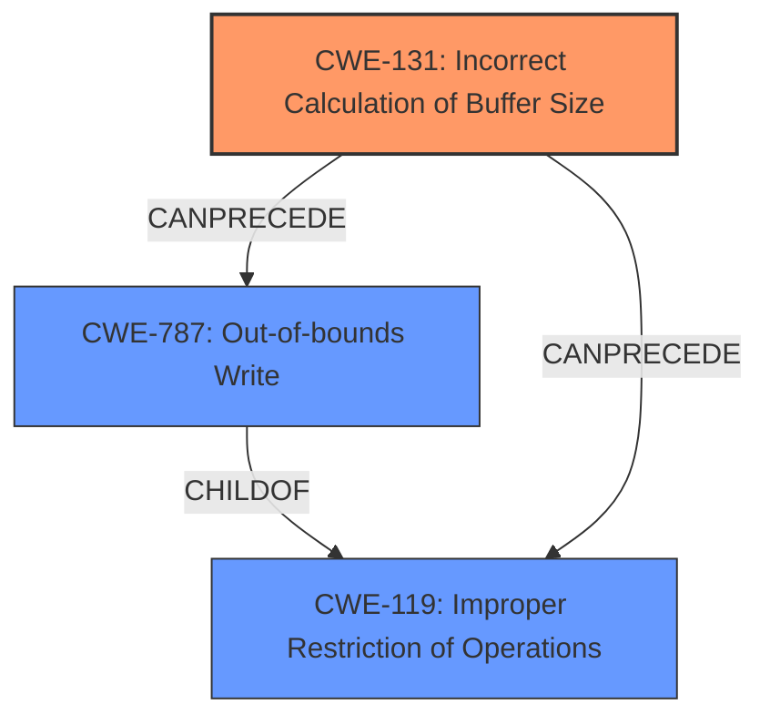

# Enhanced Analysis for CVE-2024-11425

# Summary

| CWE ID  | CWE Name                                    | Confidence | CWE Abstraction Level | CWE Vulnerability Mapping Label | CWE-Vulnerability Mapping Notes |
| :-------- | :------------------------------------------ | :--------- | :-------------------- | :------------------------------ | :------------------------------ |
| CWE-131 | Incorrect Calculation of Buffer Size        | 1          | Base                  | Primary CWE                     | Allowed                       |
| CWE-787 | Out-of-bounds Write                         | 0.7        | Base                  | Secondary Candidate             | Allowed                       |
| CWE-119 | Improper Restriction of Operations within the Bounds of a Memory Buffer | 0.5 | Class | Secondary Candidate | Discouraged |

## Evidence and Confidence

*   **Confidence Score:** 0.9
*   **Evidence Strength:** HIGH

## Relationship Analysis

The primary relationship is that CWE-131 **Incorrect Calculation of Buffer Size** can lead to other weaknesses like CWE-787 **Out-of-bounds Write** and CWE-119 **Improper Restriction of Operations within the Bounds of a Memory Buffer**. CWE-131 is the root cause, directly causing an incorrect buffer allocation. CWE-787 is a more specific consequence of the incorrect buffer size, resulting in writing outside the intended memory region. CWE-119 is a more general class that encompasses both, but CWE-787 is a more precise description of the effect.



## Vulnerability Chain

The vulnerability chain starts with the **Incorrect Calculation of Buffer Size** (CWE-131), which then leads to an **Out-of-bounds Write** (CWE-787). This leads to a Denial-of-Service.

CWE-131 (Root Cause) -> CWE-787 (Out-of-bounds Write) -> Denial-of-Service (Impact)

## Summary of Analysis

The primary weakness is CWE-131 **Incorrect Calculation of Buffer Size**, which is supported by the vulnerability description key phrases and CVE reference links content summary. The vulnerability description clearly states that the root cause is an **Incorrect Calculation of Buffer Size**. This aligns perfectly with CWE-131, which describes a scenario where the product doesn't correctly calculate the size to be used when allocating a buffer, potentially leading to a buffer overflow.

The retriever results also list CWE-131 as the top candidate.
CWE-787 **Out-of-bounds Write** is a secondary candidate as it is a direct consequence of the incorrect calculation, but CWE-131 is the root cause.
CWE-119 **Improper Restriction of Operations within the Bounds of a Memory Buffer** is a general class of error and less specific than CWE-787.

The evidence from the vulnerability description is strong and directly supports the selection of CWE-131 as the primary root cause. The selection of CWE-131 is at the optimal level of specificity because it directly addresses the **incorrect calculation** that leads to the vulnerability, while CWE-787 and CWE-119 are consequences of this error.

Relevant CWE Information:

# Enhanced Context (25 CWEs)
The following CWEs were identified as potentially relevant to this vulnerability:

## CWE-131: Incorrect Calculation of Buffer Size
**Abstraction Level**: Base
**Similarity Score**: 0.80
**Source**: dense

**Description**:
The product does not correctly calculate the size to be used when allocating a buffer, which could lead to a buffer overflow.

**Mapping Guidance**:
- Usage: Allowed
- Rationale: This CWE entry is at the Base level of abstraction, which is a preferred level of abstraction for mapping to the root causes of vulnerabilities.

## CWE-787: Out-of-bounds Write
**Abstraction Level**: base
**Similarity Score**: 4.33
**Source**: graph

**Description**:
CWE-787: Out-of-bounds Write

**Mapping Guidance**:
- Usage: Allowed
- Rationale: This CWE entry is at the Base level of abstraction, which is a preferred level of abstraction for mapping to the root causes of vulnerabilities.


## CWE Relationship Analysis

Current CWEs represent these abstraction levels: .


### Vulnerability Chain Analysis

**Chain starting from CWE-131:**
- 131 (Incorrect Calculation of Buffer Size) - ROOT


**Chain starting from CWE-787:**
- 787 (Out-of-bounds Write) - ROOT


### CWE Relationship Diagram

```mermaid
graph TD
    classDef primary fill:#f96,stroke:#333,stroke-width:2px
    classDef secondary fill:#69f,stroke:#333
    classDef tertiary fill:#9e9,stroke:#333
```