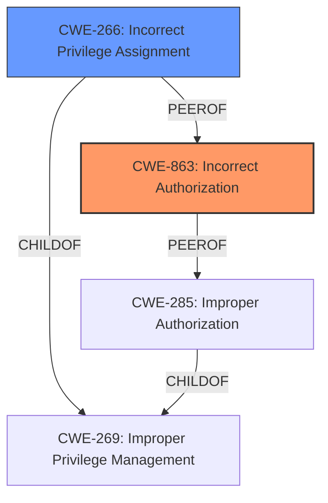

# Analysis Report for CVE-2024-11467

# Vulnerability Analysis Report: CVE-2024-11467

## Description

Omnissa Horizon Client for macOS contains a Local privilege escalation (LPE) Vulnerability due to a **logic flaw**. Successful exploitation of this issue may allow attackers with user privileges to escalate their privileges to root on the system where the Horizon Client for macOS is installed.

## Vulnerability Description Key Phrases

- **Rootcause:** logic flaw
- **Impact:** Local privilege escalation
- **Attacker:** attackers with user privileges
- **Product:** Omnissa Horizon Client for macOS

## Analysis (with Relationship Data)

# Summary
| CWE ID | CWE Name | Confidence | CWE Abstraction Level | CWE Vulnerability Mapping Label | CWE-Vulnerability Mapping Notes |
|---|---|---|---|---|---|
| CWE-863 | Incorrect Authorization | 0.75 | Class | Primary | Allowed-with-Review |
| CWE-266 | Incorrect Privilege Assignment | 0.65 | Base | Secondary Candidate | Allowed |

## Evidence and Confidence

*   **Confidence Score:** 0.70
*   **Evidence Strength:** MEDIUM

## Relationship Analysis
The primary CWE is CWE-863, which represents an authorization issue. The guidance notes that CWE-863 is a Class-level CWE, suggesting looking for more specific Base-level children. CWE-266 is considered as a secondary candidate because it represents a specific type of privilege assignment issue. However, without more specific details about the **logic flaw**, it's hard to determine the exact nature of the authorization issue; therefore, I choose CWE-863 as the primary.



## Vulnerability Chain
The vulnerability chain starts with a **logic flaw** that leads to **incorrect authorization**, ultimately resulting in a Local Privilege Escalation.
  - Root Cause: **logic flaw**
  - Weakness: **Incorrect Authorization** (CWE-863)
  - Impact: Local Privilege Escalation

## Summary of Analysis
The initial assessment pointed to a privilege escalation vulnerability due to a **logic flaw**. The retriever results suggested several CWEs related to privilege management and authorization. The key phrase "logic flaw" suggests a problem in the authorization logic rather than a simple misconfiguration. The guidance specifically mentions that if a role-check bypass occurs via a logic flaw, CWE-863 is a potential candidate. Given that the vulnerability leads to privilege escalation, **Incorrect Authorization** (CWE-863) seems like a reasonable fit, although it is a Class-level CWE.

The final decision is primarily based on the evidence provided in the vulnerability description, which mentions a **logic flaw** leading to privilege escalation. The retriever results and the mapping guidance further support this decision by highlighting the importance of identifying the root cause and selecting the appropriate CWE based on the specific type of privilege or permission issue. Without further information about the **logic flaw**, a more specific CWE cannot be selected.

Relevant CWE Information:

# Enhanced Context (25 CWEs)
The following CWEs were identified as potentially relevant to this vulnerability:

## CWE-863: Incorrect Authorization
**Abstraction Level**: Class
**Similarity Score**: 1496.67
**Source**: sparse

**Description**:
The product performs an authorization check when an actor attempts to access a resource or perform an action, but it does not correctly perform the check.

**Mapping Guidance**:
- Usage: Allowed-with-Review
- Rationale: This CWE entry is a Class and might have Base-level children that would be more appropriate

**Explanation:** This CWE fits the general description of a **logic flaw** causing privilege escalation, as it indicates an issue with the authorization check itself.

## CWE-266: Incorrect Privilege Assignment
**Abstraction Level**: Base
**Similarity Score**: 1433.03
**Source**: sparse

**Description**:
A product incorrectly assigns a privilege to a particular actor, creating an unintended sphere of control for that actor.

**Mapping Guidance**:
- Usage: Allowed
- Rationale: This CWE entry is at the Base level of abstraction, which is a preferred level of abstraction for mapping to the root causes of vulnerabilities.

**Explanation**: This CWE could be applicable if the **logic flaw** results in incorrect assignment of privileges, but the description doesn't provide enough information to confirm this.

### Detailed Analysis of Selected CWEs:

*   **CWE-863: Incorrect Authorization**
    *   **Technical Explanation:** The Omnissa Horizon Client for macOS **incorrectly** performs authorization checks, allowing users with normal privileges to escalate to root. This implies that the authorization mechanism is present but contains a **flaw** in its logic.
    *   **Security Implications:** This vulnerability allows an attacker to gain complete control over the affected system. They could install malicious software, access sensitive data, or disrupt critical services.
    *   **Relationship Analysis:** This is a Class-level CWE. Child CWEs may provide more specific information if the exact nature of the authorization issue was known.
    *   **Mapping Guidance Influence:** The mapping guidance suggests this CWE when authorization logic is present but flawed.
    *   **Confidence:** 0.75
*   **CWE-266: Incorrect Privilege Assignment**
    *   **Technical Explanation:** It is possible the **logic flaw** results in the incorrect assignment of privileges to an actor. An example would be assigning admin privileges when they should be a normal user.
    *   **Security Implications:** This could result in an attacker being assigned roles they were not intended to have allowing them to perform certain actions.
    *   **Relationship Analysis:** This is a base-level CWE, that is the child of CWE-269 Improper Privilege Management.
    *   **Mapping Guidance Influence:** The mapping guidance suggests this CWE when the system assigns incorrect privileges to a user.
    *   **Confidence:** 0.65

### CWEs Considered but Not Used:

*   **CWE-285: Improper Authorization**: Similar to CWE-863, but more generic. CWE-863 is preferred because it explicitly states that the authorization check is performed **incorrectly**, which aligns better with the description.
*   **CWE-269: Improper Privilege Management**: This is a Class-level CWE and is discouraged for use. It is too general and doesn't provide specific information about the nature of the vulnerability.
*   **CWE-250: Execution with Unnecessary Privileges**: This could be relevant if the application was running with elevated privileges, but the description does not mention this.
*   **CWE-732: Incorrect Permission Assignment for Critical Resource**: This is related to permissions rather than privileges, and the vulnerability description focuses on privilege escalation.


## CWE Relationship Analysis

Current CWEs represent these abstraction levels: .


### Vulnerability Chain Analysis

**Chain starting from CWE-863:**
- 863 (Incorrect Authorization) - ROOT


**Chain starting from CWE-732:**
- 732 (Incorrect Permission Assignment for Critical Resource) - ROOT


### CWE Relationship Diagram

```mermaid
graph TD
    classDef primary fill:#f96,stroke:#333,stroke-width:2px
    classDef secondary fill:#69f,stroke:#333
    classDef tertiary fill:#9e9,stroke:#333
```


*Report generated on 2025-07-13 01:26:33*
