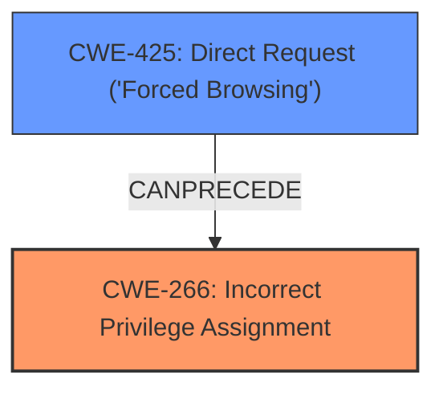

# Enhanced Analysis for CVE-2024-11486

# Summary
| CWE ID | CWE Name | Confidence | CWE Abstraction Level | CWE Vulnerability Mapping Label | CWE-Vulnerability Mapping Notes |
|---|---|---|---|---|---|
| CWE-266 | Incorrect Privilege Assignment | 0.9 | Base | Primary | Allowed |
| CWE-425 | Direct Request ('Forced Browsing') | 0.6 | Base | Secondary | Allowed |

## Evidence and Confidence

*   **Confidence Score:** 0.8
*   **Evidence Strength:** MEDIUM

## Relationship Analysis
The primary relationship influencing the selection was the direct match of the vulnerability description to the characteristics of CWE-266. The guidance on Privileges vs Permissions clearly pointed to CWE-266 given the explicit mention of permission issues being caused by an issue in user permission handling. CWE-425 was chosen as a related weakness because the vulnerability is exposed via a web interface and lacks authorization.



## Vulnerability Chain
The vulnerability chain starts with the **incorrect privilege assignment** (CWE-266) in the User Permission Handler, which is then exploited through a direct request (CWE-425) over the web, leading to permission issues.

## Summary of Analysis
The initial analysis focused on identifying the root cause of the vulnerability. The description explicitly mentions "permission issues" arising from manipulation of the "User Permission Handler." The CWE guidance clearly distinguishes between privileges and permissions, and the fact that the user permission handler is the source of the issue means that an incorrect privilege assignment is the most likely cause. The retriever results also included CWE-266, lending further support to this selection. The choice of CWE-266 is supported by the phrase "The manipulation leads to permission issues." The relationships guided the selection of CWE-425. The selected CWEs are at the optimal level of specificity, as CWE-266 directly addresses the root cause, and CWE-425 captures the web-based exploitation vector.

Relevant CWE Information:

# Enhanced Context (25 CWEs)
The following CWEs were identified as potentially relevant to this vulnerability:

## CWE-266: Incorrect Privilege Assignment
**Abstraction Level**: Base
**Similarity Score**: 0.80
**Source**: dense

**Description**:
A product incorrectly assigns a privilege to a particular actor, creating an unintended sphere of control for that actor.

**Mapping Guidance**:
- Usage: Allowed
- Rationale: This CWE entry is at the Base level of abstraction, which is a preferred level of abstraction for mapping to the root causes of vulnerabilities.


## CWE-425: Direct Request ('Forced Browsing')
**Abstraction Level**: Base
**Similarity Score**: 0.78
**Source**: dense

**Description**:
The web application does not adequately enforce appropriate authorization on all restricted URLs, scripts, or files.

**Mapping Guidance**:
- Usage: Allowed
- Rationale: This CWE entry is at the Base level of abstraction, which is a preferred level of abstraction for mapping to the root causes of vulnerabilities.

### Technical Explanation for CWE-266: Incorrect Privilege Assignment

*   **How the vulnerability's details match the CWE's characteristics:** The vulnerability description states that the manipulation of the User Permission Handler leads to permission issues. This aligns directly with the definition of CWE-266, which involves the incorrect assignment of privileges, resulting in an unintended sphere of control.
*   **The security implications and potential impact:** The security implication is that an attacker can gain unauthorized access to resources or perform actions that they are not intended to, leading to potential data breaches, system compromise, or other malicious activities.
*   **Any parent-child relationships or chain patterns that influenced your mapping:** CWE-266 is a base-level CWE, providing a specific description of the weakness.
*   **Whether the weakness is primary or secondary in the vulnerability:** This is the primary weakness.
*   **How the official MITRE mapping guidance influenced your decision:** The MITRE mapping guidance for CWE-266 states that it is allowed and is at the base level of abstraction, making it a preferred level for mapping to the root causes of vulnerabilities. The privileges vs permissions guidance specifically calls out CWE-266 in the case of misconfigured roles.

### Technical Explanation for CWE-425: Direct Request ('Forced Browsing')

*   **How the vulnerability's details match the CWE's characteristics:** The component `/decoration/admin/user_permission.php` implies the existence of a web interface. If this interface does not adequately enforce authorization, direct requests can be made to it.
*   **The security implications and potential impact:** An attacker can bypass intended access controls by directly requesting resources.
*   **Any parent-child relationships or chain patterns that influenced your mapping:** CWE-425 is a child of CWE-288, which represents Authentication Bypass.
*   **Whether the weakness is primary or secondary in the vulnerability:** This is a secondary weakness.
*   **How the official MITRE mapping guidance influenced your decision:** The MITRE mapping guidance for CWE-425 states that it is allowed and is at the base level of abstraction.

### CWEs Considered but Not Used

*   CWE-79, CWE-89, CWE-434, CWE-352, CWE-705, CWE-306, CWE-285, and CWE-471 were considered based on the retriever results but were not selected because they did not align as directly with the root cause of the vulnerability as CWE-266. They represent different types of vulnerabilities (e.g., XSS, SQL Injection, CSRF) that are not explicitly described in the vulnerability description.
*   CWE-285 was considered because it relates to improper authorization, but the description specifically identifies the issue as being related to user permission handling, which is better captured by CWE-266.


## CWE Relationship Analysis

Current CWEs represent these abstraction levels: .


### Vulnerability Chain Analysis

**Chain starting from CWE-288:**
- 288 (Authentication Bypass Using an Alternate Path or Channel) - ROOT


**Chain starting from CWE-89:**
- 89 (Improper Neutralization of Special Elements used in an SQL Command ('SQL Injection')) - ROOT


### CWE Relationship Diagram

```mermaid
graph TD
    classDef primary fill:#f96,stroke:#333,stroke-width:2px
    classDef secondary fill:#69f,stroke:#333
    classDef tertiary fill:#9e9,stroke:#333
```