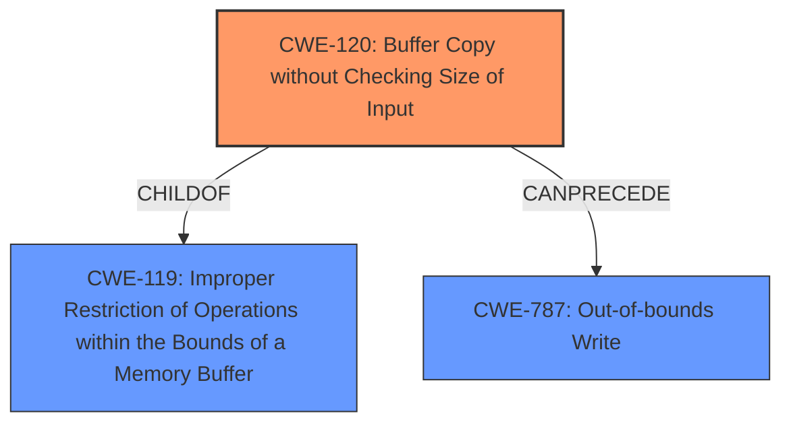

# Analysis for CVE-2024-11495

# Summary
| CWE ID | CWE Name | Confidence | CWE Abstraction Level | CWE Vulnerability Mapping Label | CWE-Vulnerability Mapping Notes |
|---|---|---|---|---|---|
| CWE-120 | Buffer Copy without Checking Size of Input ('Classic Buffer Overflow') | 0.8 | Base |  Primary CWE | Allowed-with-Review |
| CWE-787 | Out-of-bounds Write | 0.6 | Base | Secondary Candidate | Allowed |
| CWE-119 | Improper Restriction of Operations within the Bounds of a Memory Buffer | 0.5 | Class | Secondary Candidate | Discouraged |

## Evidence and Confidence

*   **Confidence Score:** 0.7
*   **Evidence Strength:** HIGH

## Relationship Analysis
The primary relationship is the child-parent relationship where CWE-120 is a more specific type of CWE-119. CWE-787 and CWE-120 can occur in sequence, with CWE-120 potentially leading to CWE-787. The abstraction level guided the choice of CWE-120 as it is a Base CWE which is more specific than the Class CWE-119.

## Vulnerability Chain
The vulnerability chain starts with the **lack of proper bounds checking**, leading to a **buffer overflow**, which allows a local attacker to execute arbitrary code.
  - Root Cause: **Lack of proper bounds checking** (CWE-120)
  - Weakness: **Buffer overflow** (CWE-787)
  - Impact: Execute arbitrary code

## Summary of Analysis
The vulnerability description clearly indicates a **lack of proper bounds checking** which leads to a **buffer overflow**, allowing for arbitrary code execution. The retriever results also list CWE-119, CWE-120 and CWE-787 as relevant.

The evidence from the vulnerability description is: "Buffer overflow vulnerability in OllyDbg, version 1.10, which could allow a local attacker to execute arbitrary code due to **lack of proper bounds checking**." This directly points to the root cause being a **lack of proper bounds checking** during a buffer copy operation.

CWE-120 (Buffer Copy without Checking Size of Input) is the most appropriate primary CWE because the vulnerability is a buffer overflow caused by the **lack of proper bounds checking** during a buffer copy operation. The description aligns perfectly with CWE-120, which involves copying data into a buffer without validating the size of the input, leading to a buffer overflow. CWE-120 is a base level CWE which is preferred over the class level CWE-119.

CWE-787 (Out-of-bounds Write) is a valid secondary CWE as the **buffer overflow** condition can lead to writing data outside the intended buffer boundaries.

CWE-119 (Improper Restriction of Operations within the Bounds of a Memory Buffer) is a more general CWE that describes the condition where operations are performed on a memory buffer without proper boundary checks. While it's related to the vulnerability, CWE-120 provides a more precise description of the root cause, and is therefore the primary CWE.

Other CWEs Considered and Rejected:

*   CWE-190 (Integer Overflow or Wraparound): While integer overflows can sometimes contribute to buffer overflows, there is no specific mention of integer overflow issues in the provided vulnerability description.
*   CWE-125 (Out-of-bounds Read): This CWE is not applicable as the vulnerability is about writing beyond buffer boundaries, not reading.
*   CWE-20 (Improper Input Validation): While input validation is generally important, the specific issue here is the **lack of bounds checking** during buffer copy, making CWE-120 more precise.

The selected CWEs are at the optimal level of specificity because they accurately describe the root cause (CWE-120) and a potential consequence (CWE-787) of the vulnerability, based on the available evidence.