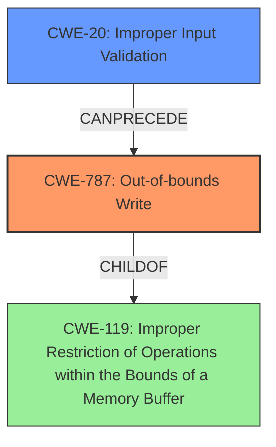

# Enhanced Analysis for CVE-2024-11524

# Summary
| CWE ID  | CWE Name                                                                                                                               | Confidence | CWE Abstraction Level | CWE Vulnerability Mapping Label | CWE-Vulnerability Mapping Notes |
| :-------- | :------------------------------------------------------------------------------------------------------------------------------------- | :---------- | :----------------------- | :-------------------------------- | :-------------------------------- |
| CWE-787 | CWE-787: Out-of-bounds Write                                                                                                          | 0.95       | Base                     | Primary CWE                       | Allowed                           |
| CWE-20  | CWE-20: Improper Input Validation                                                                                                      | 0.75       | Class                    | Secondary Candidate             | Discouraged                      |

## Evidence and Confidence

*   **Confidence Score:** 0.90
*   **Evidence Strength:** HIGH

## Relationship Analysis
The primary weakness identified is CWE-787, which is a base-level CWE. It is related to CWE-119, which is a class-level CWE describing improper restrictions of operations within memory buffers. CWE-20 is also a class-level CWE related to improper input validation. CWE-787 is often a consequence of failing to properly validate input (CWE-20) and can lead to broader memory corruption issues (CWE-119).



## Vulnerability Chain
The vulnerability chain starts with **improper validation of user-supplied data** (CWE-20), leading to a **memory corruption** condition. The specific type of memory corruption is an out-of-bounds write (CWE-787), which then enables remote code execution.

CWE-20 (Improper Input Validation) -> CWE-787 (Out-of-bounds Write) -> Remote Code Execution

## Summary of Analysis
The initial assessment identified **lack of proper validation of user-supplied data** as the root cause, leading to **memory corruption**. The retriever results and similar CVE descriptions strongly suggested CWE-787 (Out-of-bounds Write) as the primary CWE, supported by the evidence of memory corruption due to improper data validation during DXF file parsing. While CWE-20 (Improper Input Validation) is present, it is better to assign CWE-787 as the primary to define the weakness.

- **CWE-787 (Out-of-bounds Write):** This is the most specific CWE that accurately describes the **memory corruption** condition resulting from the **lack of proper validation of user-supplied data**. The description mentions the vulnerability allows remote attackers to execute arbitrary code due to a flaw within the parsing of DXF files, implying data is being written outside the intended buffer. Confidence: 0.95

- **CWE-20 (Improper Input Validation):** The **lack of proper validation of user-supplied data** is a clear indication of improper input validation. This could be considered a contributing factor. However, CWE-20 is a high-level class and the vulnerability description points to a specific memory corruption issue (out-of-bounds write), making CWE-787 a more precise choice. Confidence: 0.75

Other CWEs considered but not used:

- **CWE-119 (Improper Restriction of Operations within the Bounds of a Memory Buffer):** While related, CWE-119 is a more general class. CWE-787 is a specific type of memory buffer issue and thus a better fit.
- **CWE-125 (Out-of-bounds Read):** The vulnerability description explicitly mentions memory corruption, which is more indicative of a write operation (CWE-787) rather than a read operation (CWE-125).
- **CWE-122 (Heap-based Buffer Overflow):** While a heap-based buffer overflow could be possible, the description lacks the specificity to confirm it. The more general "out-of-bounds write" is more appropriate given the available information.


## CWE Relationship Analysis

Current CWEs represent these abstraction levels: .


### Vulnerability Chain Analysis

**Chain starting from CWE-125:**
- 125 (Out-of-bounds Read) - ROOT


**Chain starting from CWE-787:**
- 787 (Out-of-bounds Write) - ROOT


### CWE Relationship Diagram

```mermaid
graph TD
    classDef primary fill:#f96,stroke:#333,stroke-width:2px
    classDef secondary fill:#69f,stroke:#333
    classDef tertiary fill:#9e9,stroke:#333
```